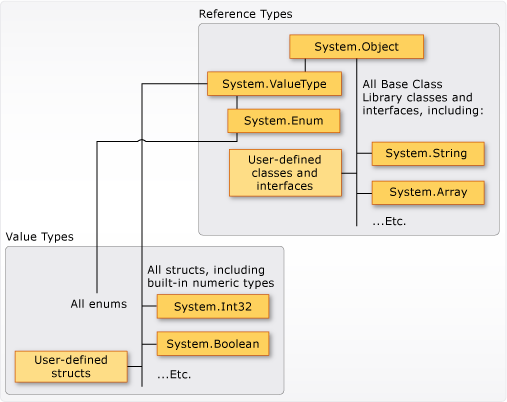

# c#基础

1. C# 语言是适用于.NET平台（免费的跨平台开源开发环境）的最流行语言。
2. C# 在生态系统和所有 .NET 工作负载中具有广泛的支持。
3. 基于面向对象的原则，它融合了其他范例中的许多功能，尤其是函数编程。
4. 大多数 .NET 运行时和库都是用 C# 编写的

```csharp
using System;

class Hello
{
    static void Main()
    {
        // This line prints "Hello, World" 
        Console.WriteLine("Hello, World");
    }
}
```

“Hello, World”程序始于引用 `System` 命名空间的 `using` 指令。由于使用 `using` 指令，因此程序可以使用 `Console.WriteLine` 作为 `System.Console.WriteLine` 的简写，该命名空间是隐式包含的。
当没有顶级语句时，名为 Main 的静态方法将充当 C# 程序的入口点。

LINQ

* 统一了查询内存中集合、结构化数据

```csharp
//查询所有GPA大于3.5的学生
var honorRoll = from student in Students
                where student.GPA > 3.5
                select student;
```

## 程序结构

C# 程序由一个或多个文件组成。 每个文件都包含零个或多个命名空间。 命名空间包含类、结构、接口、枚举和委托或其他命名空间等类型。

只有一个文件可以有顶级语句。 程序的入口点是该文件中的第一行程序文本。还可以创建一个名为 Main 的静态方法作为程序的入口点。

C# 程序中只能有一个入口点。如果多个类包含 Main 方法，必须使用 StartupObject 编译器选项来编译程序，以指定将哪个方法用作入口点。

### main方法

* Main 方法是可执行程序的入口点，也是程序控制开始和结束的位置。
* Main 必须在类或结构中进行声明。 封闭 class 可以是 static。
* Main 必须为 static。
* Main 可以具有任何访问修饰符（file 除外）。
* Main 的返回类型可以是 void、int、Task 或 `Task<int>`。
* 当且仅当 Main 返回 Task 或 `Task<int>` 时，Main 的声明可包括 async 修饰符。 这明确排除了 async void Main 方法。
* 使用或不使用包含命令行自变量的 Main 参数声明 string[] 方法都行。

> 使用 Visual Studio 创建 Windows 应用程序时，可以手动添加此形参，也可以使用 GetCommandLineArgs() 方法来获取命令行实参。 参数被读取为从零开始编制索引的命令行自变量。 与 C 和 C++ 不同，程序的名称不被视为 args 数组中的第一个命令行实参，但它是 GetCommandLineArgs() 方法中的第一个元素。

| 声明                                         | 方法代码                |
| -------------------------------------------- | ----------------------- |
| `static int Main()`                          | 不使用 args 或 await    |
| `static int Main(string[] args)`             | 使用 args，不使用 await |
| `static async Task<int> Main()`              | 不使用 args，使用 await |
| `static async Task<int> Main(string[] args)` | 使用 args 和 await      |

返回 void 或 Task 可使代码变得略微简单

| 声明                                    | 方法代码                |
| --------------------------------------- | ----------------------- |
| `static void Main()`                    | 不使用 args 或 await    |
| `static void Main(string[] args)`       | 使用 args，不使用 await |
| `static async Task Main()`              | 不使用 args，使用 await |
| `static async Task Main(string[] args)` | 使用 args 和 await      |

#### Async Main 返回值

Async 异步

声明 async 的 Main 返回值时，编译器会生成样本代码，用于调用 Main 中的异步方法.

如果未指定 async 关键字，则需要自行编写该代码，如以下示例所示。

```csharp
class AsyncMainReturnValTest
{
    //
    public static int Main()
    {
        return AsyncConsoleWork().GetAwaiter().GetResult();
    }
    //可替换为以下代码
    // static async Task<int> Main(string[] args)
    // {
    //     return await AsyncConsoleWork();
    // }


    private static async Task<int> AsyncConsoleWork()
    {
        return 0;
    }
}
```

将 Main 声明为 async 的优点是，编译器始终生成正确的代码.

#### 命令行自变量

| Main 声明                                    | Main 方法代码          |
| -------------------------------------------- | ---------------------- |
| `static void Main(string[] args)`            | 无返回值，不使用 await |
| `static int Main(string[] args)`             | 返回值，不使用 await   |
| `static async Task Main(string[] args)`      | 无返回值，使用 await   |
| `static async Task<int> Main(string[] args)` | 返回值，使用 await     |

> args 数组不能为 null。 因此，无需进行 null 检查即可放心地访问 Length 属性

Main 方法的参数是一个表示命令行参数的 String 数组。 通常，通过测试 Length 属性来确定参数是否存在,还可以使用 Convert 类或 Parse 方法将字符串参数转换为数字类型

如果不使用参数，可以从方法声明中省略 args

| Main 声明                       | Main 方法代码          |
| ------------------------------- | ---------------------- |
| `static void Main()`            | 无返回值，不使用 await |
| `static int Main()`             | 返回值，不使用 await   |
| `static async Task Main()`      | 无返回值，使用 await   |
| `static async Task<int> Main()` | 返回值，使用 await     |

### 顶级语句

> 无需在控制台应用程序项目中显式包含 Main 方法。 相反，可以使用顶级语句功能最大程度地减少必须编写的代码。

使用顶级语句可直接在文件的根目录中编写可执行代码，而无需在类或方法中包装代码。 这意味着无需使用 Program 类和 Main 方法即可创建程序。

> 一个应用程序只能有一个入口点。 一个项目只能有一个包含顶级语句的文件。

包含 using 指令，这些指令必须先出现在文件中。

具有顶级语句的文件还可以包含命名空间和类型定义，但它们必须位于顶级语句之后

顶级语句可以引用 args 变量来访问输入的任何命令行参数。 args 变量永远不会为 null，但如果未提供任何命令行参数，则其 Length 将为零。

编译器会生成一个方法，作为具有顶级语句的项目的程序入口点。 方法的签名取决于顶级语句是包含 await 关键字还是 return 语句。

| 顶级代码包含       | 隐式 Main 签名                               |
| ------------------ | -------------------------------------------- |
| await 和 return    | `static async Task<int> Main(string[] args)` |
| await              | `static async Task Main(string[] args)`      |
| return             | `static int Main(string[] args)`             |
| 否 await 或 return | `static void Main(string[] args)`            |

## 类型

C# 是一种强类型语言

类型中可存储的信息包括以下项：

* 类型变量所需的存储空间。
* 可以表示的最大值和最小值。
* 包含的成员（方法、字段、事件等）。
* 继承自的基类型。
* 它实现的接口。
* 允许执行的运算种类。

编译器使用类型信息来确保在代码中执行的所有操作都是类型安全的。

> 在 C# 中,bool 不能转换为 int

当在程序中声明变量或常量时，必须指定其类型或使用 var 关键字让编译器推断类型。赋值其他类型，编译器会执行一个不会数据丢失的类型转换。

### C#类型包括

* 内置类型：类型表示整数、浮点值、布尔表达式、文本字符、十进制值和其他数据类型。
* 自定义类型：可以使用 struct、class、interface、enum 和 record 构造来创建自己的自定义类型。
* 通用系统类型：它支持继承原则。类型可以派生自其他类型（称为基类型）。 派生类型继承（有一些限制）基类型的方法、属性和其他成员。
* 值类型分为两类：struct和enum。对于值类型变量，没有单独的堆分配或垃圾回收开销。
* 引用类型：定义为 class、record、delegate、数组或 interface
* 文本类型：文本值从编译器接收类型，可以通过在数字末尾追加一个字母来指定数字文本应采用的类型。
* 泛型类型：可使用一个或多个类型参数声明的类型，用作实际类型（具体类型）的占位符。
* 隐式类型：可以使用 var 关键字隐式键入一个局部变量。
* 匿名类型：不方便为不打算存储或传递外部方法边界的简单相关值集合创建命名类型
* 可以为 null 的值类型：普通值类型不能具有 null 值。可以在类型后面追加 ?，创建可为空的值类型。

> 编译时类型和运行时类型,编译时类型是源代码中变量的声明或推断类型。 运行时类型是该变量所引用的实例的类型。



### 命名空间

```csharp
//System 是一个命名空间
//Console 是该命名空间中的一个类
System.Console.WriteLine("Hello World!");
```

using 关键字,可以将命名空间链接
namespace 关键字可声明命名空间

* 组织大型代码项目。
* 通过使用 . 运算符分隔它们。
* using 指令可免去为每个类指定命名空间的名称。
* global 命名空间是“根”命名空间：global::System 始终引用 .NET System 命名空间。
