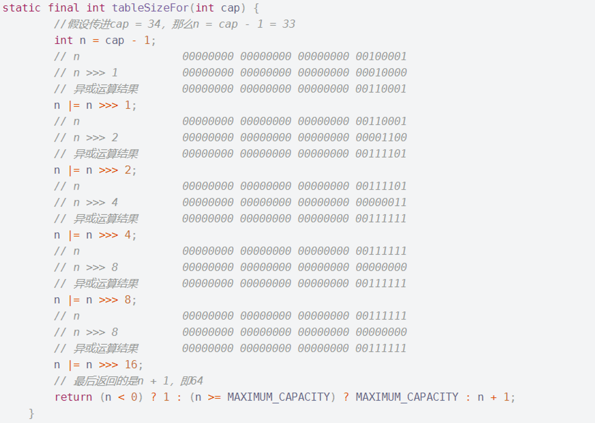

# HashMap

## HashMap解析

基于Hashtable的Map接口，

* 应许存在null值和null建
* 不同步（线程不安全）
* 不保证村出发顺序
* get和put的效率提供恒定的时间性能

影响因素

* 负载系数(load factor)：

是衡量哈希表被允许的满度的指标。在其容量自动增加之前得到。
当条目超过了负载系数和当前容量，哈希表被重洗(即内部数据)结构进行重建），因此，哈希表有大约两倍的桶的数量。

* 容量：默认16，每次增长翻倍

### 1 线程安全方面：

（1）HashMap是线程不安全的。

（2）当多线程同时访问HashMap，且至少有一个线程对HashMap做出了结构性的修改（如新增/删除键值对），必须在外部加同步措施。

（3）可以利用Collections.synchronizedMap()方法来将HashMap包装成为线程安全的容器。

### 2 键值特性方面：

（1）HashMap允许存放null键和null值。

（2）HashMap不保证存放的键值对的顺序，甚至该顺序随着HashMap中键值对的增加/删除可能会发生变化。

（3）HashMap利用哈希函数把键值对元素合理地分布在各个哈希桶中，保证了get和put操作的时间复杂度是O(1)。

（4）当太多键的hashCode()值相同时，会影响HashMap的性能。

（5）当出现太多键有相同的hashCode()值的情况时，如果此时键实现了Comparable接口，那么HashMap会利用这点做一些措施，来提高性能。

### 3 初始容量和负载率方面：

（1）初始哈希桶数量和负载率是影响HashMap性能的两个重要参数。

（2）迭代操作取决于哈希桶的数量和HashMap中键值对的数量。因此，为了良好的迭代性能，不要把哈希桶的初始容量设得太高，也不要把HashMap的负载率设得太低。

（3）当HashMap中的键值对数量超过负载率和当前哈希桶数量的乘积时，HashMap会发生扩容操作（哈希桶数量翻倍）。

（4）将默认负载率设为0.75是时间性能和空间性能上的权衡结果，过高的负载率虽然可以提高空间性能，但会降低时间性能。

（5）当设置初始哈希桶数量时，需要考虑HashMap中准备存放的键值对数目和负载率，以尽量减少扩容操作的发生频率。

### 4 Fail-Fast机制方面：

（1）当用迭代器遍历HashMap时，如果该HashMap发生了结构性的修改，会抛出ConcurrentModificationException异常。

（2）Fail-Fast抛出ConcurrentModificationException异常不是一种可靠的机制，不要让你的程序的运行依赖于该机制。

### 5 节点转化方面：

（1）当某个哈希桶中的键值对过多时，HashMap会将该桶中原来的链式存储的节点转化为红黑树的树节点。

（2）当一个哈希桶中的节点数量过少时，原来的红黑树树节点又会转化为链式存储的普通节点。

（3）同一个哈希桶中的树节点根据hashCode值排序，但当hashCode值相同且键所属的类实现了Comparable接口，会根据Comparable接口定义的compareTo方法来排序。

（4）树节点所占的空间是普通节点的两倍，因此只有在同一个哈希桶中的节点数量大于等于TREEIFY_THRESHOLD时，才会将该桶中原来的链式存储的节点转化为红黑树的树节点。

（5）理论上，在随机生成hashCode的情况下，一个哈希桶中的节点数概率满足泊松分布，其概率如上所示，其中我们可以看到一个桶中有8个节点（转化为红黑树的树节点）的概率只有0.00000006（亿分之六）。

（6）一般来说，树节点的根节点是该哈希桶中的第一个节点（当调用Iterator.remove()方法时不满足该条件），但可通过TreeNode.root()方法恢复。

（7）当节点发生树化、均摊、去树化等操作时，我们保持节点在利用Node.next方式遍历时的相对顺序不变

## hash的两种节点以及各个参数

hashmap常量参数

```java
//默认的初始容量-必须是2的幂。
static final int DEFAULT_INITIAL_CAPACITY = 1 << 4; // aka 16
//最大容量，如果任何一个带参数的构造函数隐式指定了较高的值，则使用该值。必须是2的幂 < = 1 < < 30。
static final int MAXIMUM_CAPACITY = 1 << 30;
//初始负载率
static final float DEFAULT_LOAD_FACTOR = 0.75f;
//当某个哈希桶中节点数量大于等于TREEIFY_THRESHOLD时，转化为树节点
static final int TREEIFY_THRESHOLD = 8;
//当哈希桶中节点数量小于等于UNTREEIFY_THRESHOLD 时，转化为普通节点
static final int UNTREEIFY_THRESHOLD = 6;
//可以树化的箱子的最小桌子容量。(否则，如果一个 bin 中有太多节点，表的大小就会改变。)应该至少为4 * TREEIFY _ THRESHOLD，以避免调整大小和树化阈值之间的冲突。
static final int MIN_TREEIFY_CAPACITY = 64;
//基本散列仓节点，用于大多数条目(参见下面的 TreeNode 子类和 LinkedHashMap 中的 Entry 子类)
```

为什么哈希桶的数量必须是2的幂？

（1）设置为2的幂我们可以通过移位运算提高运算效率。

（2）在介绍putVal()函数时会解释这一点。

某个哈希桶中的普通节点转化为树节点的界限为什么是8？树节点转化为普通节点界限为什么是6？

（1）之前讲的“泊松分布”，树节点的开销比普通节点要大，而根据泊松分布，大于等于8的概率仅有亿分之六，因此选择8作为普通节点转化为树节点的界限。

（2）普通节点转化为树节点的界限是8而树节点转化为普通节点的界限是6，中间差了2，主要是为了防抖动。如果普通节点转化为树节点的界限和树节点转化为普通节点的界限相同，那么一旦插入一个节点达到了这个界限，就需要从普通节点转化为树节点；删除这个新插入的节点后，又要从树节点转化为普通节点，这样频繁的抖动的开销是很大的。

为什么只有当哈希桶的数量大于等于64时，某个哈希桶中的节点才可能因为节点过多而转化为树节点？

按JDK中的说法，树化的桶数量阈值至少是4倍的TREEIFY_THRESHOLD，因此至少因是(8*4)32，否则在树化操作和扩容操作间会产生冲突。

### 常规节点

```java
static class Node<K,V> implements Map.Entry<K,V> {
	//hash值定义为final，不可变，在构造函数中初始化
    	final int hash;
	//key值定义为常量，尽可引用
    	final K key;
	//值
	V value;
	//下一个节点
	Node<K,V> next;
//常量方法
public final int hashCode() {
	//将key的hashcode值和value的hashcode值作异或运算
            return Objects.hashCode(key) ^ Objects.hashCode(value);
        }
}
```

（1）Node节点实现了Map.Entry接口，有4个属性，hash值、key值、value值、next指针。

（2）Node节点的hash值是不可变的。

（3）Node节点的key引用是不可变的，但key指向的对象是可变的。

（4）Node节点的value值、next指针都是可变的

### Tree节点

```java
static final class TreeNode<K,V> extends LinkedHashMap.Entry<K,V> {
    TreeNode<K,V> parent;  // red-black tree links
TreeNode<K,V> left;
TreeNode<K,V> right;
TreeNode<K,V> prev;    // needed to unlink next upon deletion
boolean red;//红黑树颜色节点
TreeNode(int hash, K key, V val, Node<K,V> next) {
        super(hash, key, val, next);
}
//返回红黑树根节点
final TreeNode<K,V> root() {
            for (TreeNode<K,V> r = this, p;;) {
                if ((p = r.parent) == null)
                    return r;
                r = p;
            }
        }
	//调整红黑树的结构，使指定的节点root成为对应哈希桶中的第一个节点
        static <K,V> void moveRootToFront(Node<K,V>[] tab, TreeNode<K,V> root) {
            int n;
            if (root != null && tab != null && (n = tab.length) > 0) {
                int index = (n - 1) & root.hash; //找到桶位
                TreeNode<K,V> first = (TreeNode<K,V>)tab[index];
                if (root != first) {	//当前根不是root元素
                    Node<K,V> rn;
                    tab[index] = root;	//放置到第一位
                    TreeNode<K,V> rp = root.prev;//前一个节点
			//将根节点从双链表中抽出，原来的位置前后链接
                    if ((rn = root.next) != null)
                        ((TreeNode<K,V>)rn).prev = rp;
                    if (rp != null)
                        rp.next = rn;
			//将根节点放在双链表的首位
                    if (first != null)
                        first.prev = root;
                    root.next = first;
                    root.prev = null;
                }
                assert checkInvariants(root);
            }
        }
//从this树节点查找hash值为h，key为k的节点
        final TreeNode<K,V> find(int h, Object k, Class<?> kc) {
            TreeNode<K,V> p = this;
            do {
                int ph, dir; K pk;
                TreeNode<K,V> pl = p.left, pr = p.right, q;//当前节点的左右叶
                if ((ph = p.hash) > h)//hash值小的从左子树迭代查找
                    p = pl;
                else if (ph < h)//hash值大的从右子树迭代查找
                    p = pr;
		//hash值相等，且键地址相等或都为空时，查找成功
                else if ((pk = p.key) == k || (k != null && k.equals(pk)))
                    return p;
		//hash值相等，且键地址不相等，且节点没有左子树，就从右子树查找
                else if (pl == null)
                    p = pr;
		//hash值相等，且键地址不相等，且节点没有右子树，就从左子树查找
                else if (pr == null)
                    p = pl;
		//比较两个key
                else if ((kc != null ||
                          (kc = comparableClassFor(k)) != null) &&
                         (dir = compareComparables(kc, k, pk)) != 0)
                    p = (dir < 0) ? pl : pr;
		//key不可比较或者比较结果为0，先右子树查找
                else if ((q = pr.find(h, k, kc)) != null)
                    return q;
                else
		//右子树找不到时
                    p = pl;
            } while (p != null);
            return null;
        }
```

（1）TreeNode继承了LinkedHashMap.Entry类，而LinkedHashMap.Entry类实际上继承了HashMap.Node类，就是前面提及的Node节点，因此TreeNode是Node的子类。

（2）TreeNode包含4个指针，parent、left、right、prev，其中parent、left和right指针的作用很好理解，分别指向其父节点、左孩子和右孩子，prev指针在删除节点时有用。

## HashMap参数

```java
//哈希桶数组
transient Node<K,V>[] table;
//用于实现抽象类AbstractMap的keySet()和values()方法，存储的是HashMap中的键值对集合
transient Set<Map.Entry<K,V>> entrySet;
//HashMap中的键值对数目
transient int size;
//HashMap发生结构性修改的次数，用于前文提到的迭代操作时的Fail-Fast机制的实现
transient int modCount;
//扩容阈值，当HashMap中的键值对数目超过该值时，发生扩容操作
int threshold;
//负载率
final float loadFactor;
```

## 构造方法

```java
public HashMap(int initialCapacity, float loadFactor) {
	//如果初始桶数量小于0，抛出异常
    if (initialCapacity < 0)
        throw new IllegalArgumentException("Illegal initial capacity: " +
                                           initialCapacity);
	//初始桶数量不能大于最大桶数量，MAXIMUM_CAPACITY
    if (initialCapacity > MAXIMUM_CAPACITY)
        initialCapacity = MAXIMUM_CAPACITY;
	//如果负载率小于等于0，或者说负载不是一个Float数，抛出异常
    if (loadFactor <= 0 || Float.isNaN(loadFactor))
        throw new IllegalArgumentException("Illegal load factor: " +
                                           loadFactor);
	//设定负载
    this.loadFactor = loadFactor;
//设定threshold值，此时table数组还没有被初始化，此时threshold是初始数量
//tableSizeFor方法为将桶数量调整为2的幂
    this.threshold = tableSizeFor(initialCapacity);
}
```

通过定义初始容量和负载来初始化

```java
public HashMap(int initialCapacity) {
    this(initialCapacity, DEFAULT_LOAD_FACTOR);
}
```

通过容量大小和默认负载创建

```java
public HashMap() {
    this.loadFactor = DEFAULT_LOAD_FACTOR; // all other fields defaulted
}
```

默认容量大小和负载创建

```java
public HashMap(Map<? extends K, ? extends V> m) {
    this.loadFactor = DEFAULT_LOAD_FACTOR;
putMapEntries(m, false);
}
```

用Map对象创建，会调用putMapEntries

```java
final void putMapEntries(Map<? extends K, ? extends V> m, boolean evict) {
    int s = m.size();
    if (s > 0) {
        if (table == null) { // pre-size
float ft = ((float)s / loadFactor) + 1.0F;
            int t = ((ft < (float)MAXIMUM_CAPACITY) ?
                     (int)ft : MAXIMUM_CAPACITY);
            if (t > threshold)
                threshold = tableSizeFor(t);
}
        else if (s > threshold)
            resize();
        for (Map.Entry<? extends K, ? extends V> e : m.entrySet()) {
            K key = e.getKey();
V value = e.getValue();
putVal(hash(key), key, value, false, evict);
}
    }
}
```

当table没有值时，初始化扩展阈值，为map数量/初始负载率+1，当超过默认扩充阈值时，将阈值扩大2倍。初始化容量、将m中的键值对依次填充进HashMap里。

## 关键函数

#### tableSizeFor

返回给定目标容量的两倍幂。



其作用是将传进的初始哈希桶数量调整为2的幂。该函数巧妙地利用了位运算实现了这样的功能，提高了效率。

```java
static final int hash(Object key) {
    int h;
    return (key == null) ? 0 : (h = key.hashCode()) ^ (h >>> 16);
}
```

key的哈希值的计算方式如下：

（1）如果key为null，则返回0。

（2）否则，返回key的哈希值和其无符号右移16位的值异或位运算的结果。

降低哈希冲突的概率

因为HashMap中哈希桶的数量是2的幂，其哈希运算是对哈希桶数量的取模运算，即相当于计算机网络中的子网掩码，因此如果不将key的哈希值右移以此来考虑高位的影响，那么哈希运算就仅仅与key值的hashCode函数的低位相关（举个例子，假如key的hashCode值是

00000000 10101010 00000000 10010011，哈希桶的数量是16，将key的hashCode对16取模，相当于

00000000 10101010 00000000 10010011和

00000000 00000000 00000000 00001111做位与运算，我们可以看到，无论高位的值是多少都会成为0，即高位不会对哈希运算的结果产生任何影响）。

#### resize()

函数初始化或增加表大小。如果为空，则根据字段阈值中保持的初始容量目标进行分配。否则，因为我们使用的是2的幂，所以每个bin中的元素必须保持相同的索引，或者在新表中以2的幂偏移。

```java
final Node<K,V>[] resize() {
    Node<K,V>[] oldTab = table; //hash表默认为16
    int oldCap = (oldTab == null) ? 0 : oldTab.length;//hash表长度
    int oldThr = threshold;//获取要调整大小的下一个大小值（增长阈值）
    int newCap, newThr = 0; //初始化
    if (oldCap > 0) {  
        if (oldCap >= MAXIMUM_CAPACITY) { //超出原有最大限度，无法再次扩容
            threshold = Integer.MAX_VALUE;
            return oldTab;
        }//如果oldThr在正常范围，将表容量扩展2倍
        else if ((newCap = oldCap << 1) < MAXIMUM_CAPACITY &&
                 oldCap >= DEFAULT_INITIAL_CAPACITY) 
            newThr = oldThr << 1; // 阈值扩2倍
    }
    else if (oldThr > 0) // 容量未被定义，初始容量处于阈值
        newCap = oldThr;
    else {               // 零初始阈值表示使用默认值
        newCap = DEFAULT_INITIAL_CAPACITY;
        newThr = (int)(DEFAULT_LOAD_FACTOR * DEFAULT_INITIAL_CAPACITY);
    }
  
    if (newThr == 0) { //判断容量和负载是否超过最大值
        float ft = (float)newCap * loadFactor;// 新容量 * 负载率 
        newThr = (newCap < MAXIMUM_CAPACITY && ft < (float)MAXIMUM_CAPACITY ?
                  (int)ft : Integer.MAX_VALUE);//更新最大阈值
    }
    threshold = newThr; //更新阈值
    @SuppressWarnings({"rawtypes","unchecked"})
        Node<K,V>[] newTab = (Node<K,V>[])new Node[newCap];//新建hash表
    table = newTab; //覆盖旧表引用
    if (oldTab != null) { //将旧值迁移到新表中
        for (int j = 0; j < oldCap; ++j) {
            Node<K,V> e;
            if ((e = oldTab[j]) != null) { //迁移j桶
                oldTab[j] = null;  //删除j桶
                if (e.next == null) //当j桶中没有其余元素
                    //用新的哈希桶容量计算e在新表中的位置
                    //这里是真正的哈希运算出现处，HashMap中的哈希运算是和哈希桶数目减
                    //1做位与运算得出的，举个例子，哈希桶数目是16，则和15的二进制表示
                    //00000000 00000000 00000000 00001111做位与运算，相当于对16
                    //取模。结合前文hash的计算方法这就将键值对均匀地分配到了各个哈希桶
                    //中。
                    newTab[e.hash & (newCap - 1)] = e;
                else if (e instanceof TreeNode) //检查e节点是否变为红黑树
                    //进行树节点的转移
                    ((TreeNode<K,V>)e).split(this, newTab, j, oldCap); 
                else { // 不是树且存在多值，则保留
                    Node<K,V> loHead = null, loTail = null;
                    Node<K,V> hiHead = null, hiTail = null;
                    Node<K,V> next;
                    do {
                        //桶的转移过程，重新计算每个节点的hash值，
                        //计算比原容量大,但比现容量小的元素
                        next = e.next;
                        if ((e.hash & oldCap) == 0) {
                            if (loTail == null)
                                loHead = e;
                            else
                                loTail.next = e;
                            loTail = e;
                        }
                        else {
                            if (hiTail == null)
                                hiHead = e;
                            else
                                hiTail.next = e;
                            hiTail = e;
                        }
                    } while ((e = next) != null);
                    if (loTail != null) {
                        loTail.next = null;
                        newTab[j] = loHead;
                    }
                    if (hiTail != null) {
                        hiTail.next = null;
                        newTab[j + oldCap] = hiHead;
                    }
                }
            }
        }
    }
    return newTab;

```

（1）令loHead在新table中的索引和旧table中的索引相同，仅仅是为了避免对其他桶产生影响。理想情况下，如本例，原链表中的节点其key的hash值相差16，因此原链表中的节点分成两半，一半在loHead中，另一半在hiHead中。因此原来在[0,
15]范围内的节点有一半会转移到新区域[16, 31]。

（2）区分loHead中的节点和hiHead中节点的标准是其key的hash值与原table大小做位与运算的结果是否为0，而原table大小必定是2的幂，即其二进制表示中，仅有1个二进制位是1，其余二进制位均是0，因此hiHead在新table中的索引比旧table中的索引大16（即原table的大小）。

#### putVal

该函数是往HashMap中新增节点的函数，输入的参数有5个，onlyAbsent如果为true，表示仅新增节点而不更新节点，evict用于LinkedHashMap的回调方法afterNodeInsertion，该函数会返回旧值（如果没有旧值，则返回null）。

参数：

哈希-密钥哈希

钥匙–钥匙

值–要投入的价值

onlyIfAbsent–如果为true，则不要更改现有值

逐出–如果为false，则表处于创建模式。

返回值：

前一个值；如果没有，则为null

```java
final V putVal(int hash, K key, V value, boolean onlyIfAbsent,
                   boolean evict) {
        //初始化表，节点，长度和临时值
        Node<K,V>[] tab; Node<K,V> p; int n, i;
        //查看表是否为空
        if ((tab = table) == null || (n = tab.length) == 0)
            n = (tab = resize()).length;//重新建新的表
        //这里是真正的哈希运算出现处，HashMap中的哈希运算是和哈希桶数目减
        //1做位与运算得出的，举个例子，哈希桶数目是16，则和15的二进制表示
        //00000000 00000000 00000000 00001111做位与运算，相当于对16
        //取模。结合前文hash的计算方法这就将键值对均匀地分配到了各个哈希桶中 
        if ((p = tab[i = (n - 1) & hash]) == null) //添加为当前桶的第一个结点
            //根据3个属性创建一个新的结点，加入到当前桶中
            tab[i] = newNode(hash, key, value, null);
        else { //该桶上存在其他结点
            Node<K,V> e; K k;
            //p代表该桶的第一个结点
            if (p.hash == hash &&
                ((k = p.key) == key || (key != null && key.equals(k))))
                //如果p的哈希值与hash相同，且p节点的key与key相同，则令e指向p(更新)
                e = p;
            else if (p instanceof TreeNode) //如果是红黑树结点，改为红黑树方法
                e = ((TreeNode<K,V>)p).putTreeVal(this, tab, hash, key, value);
            else { //为该桶中添加新结点
                for (int binCount = 0; ; ++binCount) {
                    if ((e = p.next) == null) { //在尾部添加新结点
                        p.next = newNode(hash, key, value, null); //创建结点并添加
                        //这里binCount没有把新增的节点计算进去，因此这里实际的意义是：
                        //如果哈希桶中的节点数目大于等于TREEIFY_THRESHOLD，树化节点
                        if (binCount >= TREEIFY_THRESHOLD - 1) // -1 for 1st
                            treeifyBin(tab, hash);
                        break;
                    }
                    if (e.hash == hash &&
                        ((k = e.key) == key || (key != null && key.equals(k))))
                        break; // 如果找到相同结点停止
                    p = e; //下一个元素
                }
            }
            if (e != null) {   //修改以存在映射的值
                V oldValue = e.value;
                if (!onlyIfAbsent || oldValue == null) //是否可更新
                    e.value = value;
                afterNodeAccess(e);//这是为LinkedHashMap准备的回调方法
                return oldValue; //返回更新值
            }
        }
        ++modCount; //添加一个结点
        if (++size > threshold) //如果超过负载则扩容
            resize();
        afterNodeInsertion(evict);
        return null;
    }

```

#### getNode

该函数的作用是，根据hash值和key值在HashMap中寻找相应的Node节点,

```java
final Node<K,V> getNode(int hash, Object key) {
    //创建tab,头结点,结点
    Node<K,V>[] tab; Node<K,V> first, e; int n; K k;
    //初始化tab,n和first
    if ((tab = table) != null && (n = tab.length) > 0 &&
        (first = tab[(n - 1) & hash]) != null) {
            //检查第一个结点是否是要查找的
        if (first.hash == hash && // always check first node
            ((k = first.key) == key || (key != null && key.equals(k))))
            return first;
            //在该桶中查找结点
        if ((e = first.next) != null) {
            //如果桶已经树化这调用对应的方法
            if (first instanceof TreeNode)
                return ((TreeNode<K,V>)first).getTreeNode(hash, key);
            do {
                //查找是否为该结点
                if (e.hash == hash &&
                    ((k = e.key) == key || (key != null && key.equals(k))))
                    //找到了
                    return e;
            } while ((e = e.next) != null);
        }
    }
    //没有找到
    return null;
}

```

#### removeNode

该函数的作用是删除某节点，会返回被删除的节点。如果matchValue为true，代表只有node节点的value值和传入的value值相等时才删除node。如果movable为true，代表可以移动其他节点（意思是可以发生去树化操作）。注意：移除节点并不会发生缩容操作。

```java
final Node<K,V> removeNode(int hash, Object key, Object value,
                               boolean matchValue, boolean movable) {
        //定义表,节点,长度,
        Node<K,V>[] tab; Node<K,V> p; int n, index;
        //初始化+判断表是否存在
        if ((tab = table) != null && (n = tab.length) > 0 &&
            (p = tab[index = (n - 1) & hash]) != null) {
                //初始化临时节点和k,v
            Node<K,V> node = null, e; K k; V v;
            // 找到该结点,为第一个
            if (p.hash == hash &&
                ((k = p.key) == key || (key != null && key.equals(k))))
                node = p; //确定删除结点
            else if ((e = p.next) != null) { 
                if (p instanceof TreeNode) // 调用树化后的方法
                    node = ((TreeNode<K,V>)p).getTreeNode(hash, key);
                else {
                    do {
                        //通过key值 查找结点
                        if (e.hash == hash &&
                            ((k = e.key) == key ||
                             (key != null && key.equals(k)))) {
                            node = e; // 确定删除结点
                            break;
                        }
                        p = e;//下一个
                    } while ((e = e.next) != null);
                }
            }
            //现在我们找到了待删除的节点node，接下来我们的任务就是删除该节点
            //删除条件有以下几个：
            //（1）node不能为null。
            //（2）matchValue为false（如果matchValue为true，代表只有node节点的value值和传入的value值相等时才删除node）或
            //node节点的value值和传入的value值相等（这时无论matchValue是否为true都无所谓
            if (node != null && (!matchValue || (v = node.value) == value ||
                                 (value != null && value.equals(v)))) {
                //如果树化,调用树的删除方法
                if (node instanceof TreeNode)
                    ((TreeNode<K,V>)node).removeTreeNode(this, tab, movable);
                // 第一个时,直接跳过
                else if (node == p)
                    tab[index] = node.next;
                else //链表删除
                    p.next = node.next;
                // 发生结构性修改的次数
                ++modCount;
                //k-v的个数
                --size;
                //这是为LinkedHashMap准备的回调方法
                afterNodeRemoval(node);
                return node;
            }
        }
        return null;
    }
```
