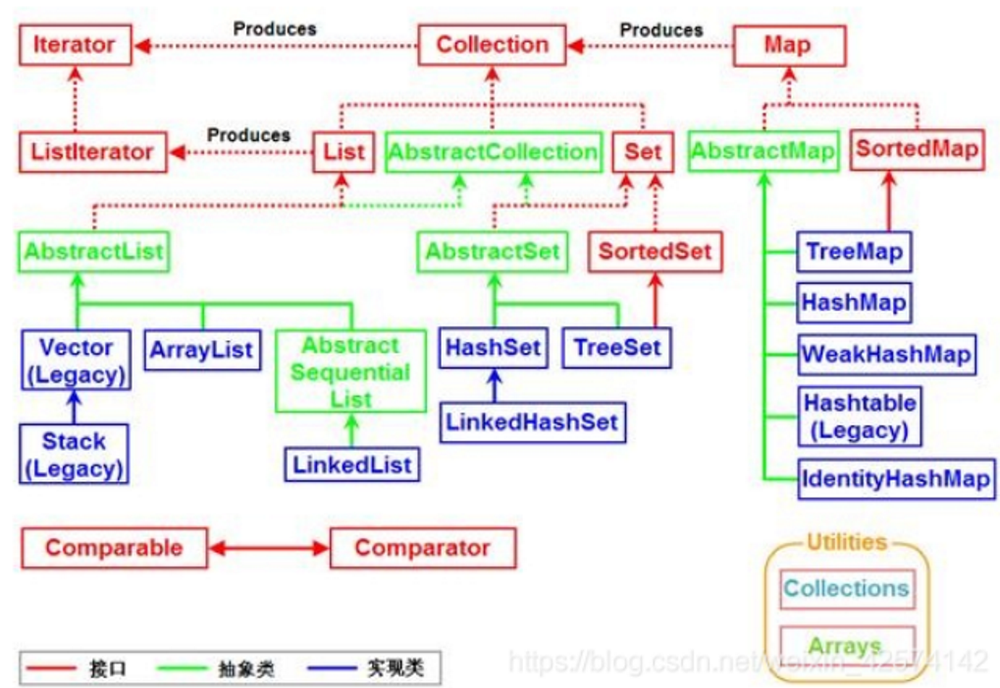

# STL库继承图



# ArrayList和LinkedList

## Arraylist

### 关于Arraylist的源码分析（动态变化数组）

```java
private static final int DEFAULT_CAPACITY = 10;
```

默认空间为10；

数据存放处

```java
transient Object[] elementData;
```

ensureCapacity方法

```java
int minExpand = (elementData != DEFAULTCAPACITY_EMPTY_ELEMENTDATA)
    // any size if not default element table
? 0
// larger than default for default empty table. It's already
    // supposed to be at default size.
: DEFAULT_CAPACITY;
```

当elementData不是默认容量 minExpand = 0:否则 =默认容量

get方法(检查给定索引是否在范围内。如果不是，则引发适当的运行时异常。此方法 * 不 * 检查索引是否为负: 它总是在数组访问之前立即使用，如果索引为负，则抛出 ArrayIndexOutOfBoundsException。)

```java
public E get(int index) {
    rangeCheck(index);
    return elementData(index);
}
```

可动态变化原因ensureCapacityInternal：(将指定的元素追加到此列表的末尾)

```java
public boolean add(E e) {
    ensureCapacityInternal(size + 1);  // Increments modCount!!
	elementData[size++] = e;
    return true;
}
```

当加入超过

```java
private void ensureCapacityInternal(int minCapacity) {
    ensureExplicitCapacity(calculateCapacity(elementData, minCapacity));
}
```

```java
private static int calculateCapacity(Object[] elementData, int minCapacity) {
        if (elementData == DEFAULTCAPACITY_EMPTY_ELEMENTDATA) {
            return Math.max(DEFAULT_CAPACITY, minCapacity);
        }
        return minCapacity;
    }
```

```java
private void ensureExplicitCapacity(int minCapacity) {
    modCount++;

// overflow-conscious code
if (minCapacity - elementData.length > 0)
        grow(minCapacity);
}
```

grow 重新构建copy到newCapacity大小重新赋值elementData

```java
private void grow(int minCapacity) {
    // overflow-conscious code
int oldCapacity = elementData.length;
    int newCapacity = oldCapacity + (oldCapacity >> 1);
    if (newCapacity - minCapacity < 0)
        newCapacity = minCapacity;
    if (newCapacity - MAX_ARRAY_SIZE > 0)
        newCapacity = hugeCapacity(minCapacity);
// minCapacity is usually close to size, so this is a win:
elementData = Arrays.copyOf(elementData, newCapacity);
}
```

minCapacity 扩展到原有大小*2-1

MAX_ARRAY_SIZE：Integer.MAX_ALUE -8

将现在大小+现在大小/2的数作为基础 minCapacity

minCapacity>MAX_ARRAY_SIZE 到达上限，取int型上限

```java
private static int hugeCapacity(int minCapacity) {
    if (minCapacity < 0) // overflow
throw new OutOfMemoryError();
    return (minCapacity > MAX_ARRAY_SIZE) ?
        Integer.MAX_VALUE :
        MAX_ARRAY_SIZE;
}
```

Arrays.copyof()

```java
public static <T,U> T[] copyOf(U[] original, int newLength, Class<? extends T[]> newType) {
    @SuppressWarnings("unchecked")
    T[] copy = ((Object)newType == (Object)Object[].class)
        ? (T[]) new Object[newLength]
        : (T[]) Array.newInstance(newType.getComponentType(), newLength);
System.arraycopy(original, 0, copy, 0,
Math.min(original.length, newLength));
    return copy;
}
```

按传递来数据的类型创建长度为newLength的对象数组，通过arraycopy复制数据

```java
public static native void arraycopy(Object src,  int  srcPos,Object dest, int destPos,int length);
```

将会调用c语言完成高效的数组复制

### 从头构造方法看

构造一个初始容量大小为
initialCapacity 的 ArrayList

```java
public ArrayList(Collection<? extends E> c) {
    Object[] a = c.toArray();
    if ((size = a.length) != 0) {
        if (c.getClass() == ArrayList.class) {
            elementData = a;
} else {
            elementData = Arrays.copyOf(a, size, Object[].class);
}
    } else {
        // replace with empty array.
elementData = EMPTY_ELEMENTDATA;
}
}
```

使用指定Collection 来构造 ArrayList 的构造函数

```java
public ArrayList(int initialCapacity) {
    if (initialCapacity > 0) {
        this.elementData = new Object[initialCapacity];
} else if (initialCapacity == 0) {
        this.elementData = EMPTY_ELEMENTDATA;
} else {
        throw new IllegalArgumentException("Illegal Capacity: "+
                                           initialCapacity);
}
}
```

## LinkedList:数组

linkedlist是由链表组成的Node类组成的

```java
private static class Node<E> {
    E item;
Node<E> next;
Node<E> prev;

Node(Node<E> prev, E element, Node<E> next) {
        this.item = element;
        this.next = next;
        this.prev = prev;
}
}
```

主要元素是

transient序列化

```java
transient int size = 0;

transient Node<E> first;

transient Node<E> last;
```

size 链表长度，first链表头，last链表尾

get方法

```java
public E getFirst() {
    final Node<E> f = first;
    if (f == null)
        throw new NoSuchElementException();
    return f.item;
}
```

```java
public E getLast() {
    final Node<E> l = last;
    if (l == null)
        throw new NoSuchElementException();
    return l.item;
}
```

remove删除方法

```java
public E removeFirst() {
    final Node<E> f = first;
    if (f == null)
        throw new NoSuchElementException();
    return unlinkFirst(f);
}
```

```java
public E removeLast() {
    final Node<E> l = last;
    if (l == null)
        throw new NoSuchElementException();
    return unlinkLast(l);
}
```

add添加

```java
public void addFirst(E e) {
    linkFirst(e);
}
```

```java
public void addLast(E e) {
    linkLast(e);
}
```

```java
public boolean add(E e) {
    linkLast(e);
    return true;
}
```

# Vector和Stack

## vector

同arraylist可变数组增长原理一样

主要元素

```java
//元素
protected Object[] elementData;
//大小
protected int elementCount;
/**向量的容量在其大小超过其容量时自动增加的数量。如果容量增量小于或等于零，则向量的容量在每次需要增长时都会增加一倍。*/
protected int capacityIncrement;
```

变化方法

```java
private void ensureCapacityHelper(int minCapacity) {
    // overflow-conscious code
if (minCapacity - elementData.length > 0)
        grow(minCapacity);
}
```

```java
private void grow(int minCapacity) {
    // overflow-conscious code
int oldCapacity = elementData.length;
    int newCapacity = oldCapacity + ((capacityIncrement > 0) ?
                                     capacityIncrement : oldCapacity);
    if (newCapacity - minCapacity < 0)
        newCapacity = minCapacity;
    if (newCapacity - MAX_ARRAY_SIZE > 0)
        newCapacity = hugeCapacity(minCapacity);
elementData = Arrays.copyOf(elementData, newCapacity);
}
```

构造函数

```java
public Vector(int initialCapacity, int capacityIncrement) {
    super();
    if (initialCapacity < 0)
        throw new IllegalArgumentException("Illegal Capacity: "+
                                           initialCapacity);
    this.elementData = new Object[initialCapacity];
    this.capacityIncrement = capacityIncrement;
}
```

initialCapacity:表示初始大小

capacityIncrement:表示增长步长，默认值0

capacity:不为0则为原本数的2倍

同步锁 新增

```java
public synchronized void addElement(E obj) {
    modCount++;
ensureCapacityHelper(elementCount + 1);
elementData[elementCount++] = obj;
}
```

同步锁 删除

```java
    public synchronized void removeElementAt(int index) {
        modCount++;
        if (index >= elementCount) {
            throw new ArrayIndexOutOfBoundsException(index + " >= " +
                                                     elementCount);
        }
        else if (index < 0) {
            throw new ArrayIndexOutOfBoundsException(index);
        }
        int j = elementCount - index - 1;
        if (j > 0) {
            System.arraycopy(elementData, index + 1, elementData, index, j);
        }
        elementCount--;
        elementData[elementCount] = null; /* to let gc do its work */
    }
```

## stack

继承Vector的更改

入栈

```java
public E push(E item) {
    addElement(item);

    return item;
}
```

出栈

```java
public synchronized E pop() {
    E       obj;
    int     len = size();

obj = peek();
removeElementAt(len - 1);

    return obj;
}
```

# [hash](hash.md)

见链接文档
