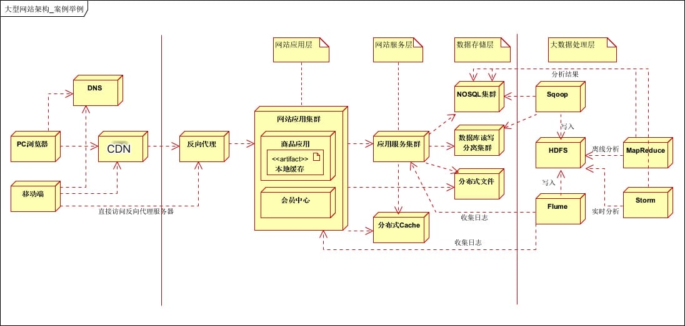

# 架构基础

理解架构视角，从架构上看，每个职位理解架构的方向都是不一样的，开发视角，测试视角，运维视角和产品视角等，

## 业务架构（从产品视角看架构）

1. 核心是解决业务带来的系统复杂性，了解客户/业务方的痛点，项目定义，现有环境；
2. 梳理高阶需求和非功能性需求，进行问题域划分与领域建模等工作；
3. 沟通，方案建议，多次迭代，交付总体架构。

## 应用/技术架构

根据业务场景的需要，设计应用的层次结构，制定应用规范、定义接口和数据交互协议等。并尽量将应用的复杂度控制在一个可以接受的水平，从而在快速的支撑业务发展的同时，在保证系统的可用性和可维护性的同时，确保应用满足非功能属性要求（性能、安全、稳定性等）。技术架构主要考虑系统的非功能性特征，对系统的高可用、高性能、扩展、安全、伸缩性、简洁等做系统级的把握。

#### 功能视角

功能视角和业务视角有重合的地方，主要针对开发而言的服务功能；

#### 技术视角-总体

技术框架（technological Framework）是整个或部分技术系统的可重用设计，表现为一组**抽象构件**及**构件实例间交互**的方法;另一种定义认为，技术框架是**可被技术开发者定制的应用骨架**。前者是从应用方面而后者是从目的方面给出的定义。

从技术层面描述，主要是分层模型，例如持久层、数据层、逻辑层、应用层、表现层等，然后每层使用什么技术框架，例如Spring、hibernate、ioc、MVC、成熟的类库、中间件、WebService等，分别说明，要求这些技术能够将整个系统的主要实现概括。

于开发者而言，实际工作从通常采用的是分层模型，总结下经典的**七层逻辑架构**

以上采用 **七层逻辑架构** ，第一层客户层，第二层前端优化层，第三层应用层，第四层服务层，第五层数据存储层，第六层大数据存储层，第七层大数据处理层。

* **客户层** ：减少Http请求数，浏览器缓存，启用压缩，Js异步，减少Cookie传输；
* **前端层** ：DNS负载均衡，CDN本地加速，反向代理服务；
* **应用层** ：业务拆分；负载均衡，分级管理，应用缓存，服务集群，快速失败，异步调用，服务降级，消息队列，幂等设计等。
* **服务层** ：提供公用服务，比如用户服务，订单服务，支付服务等；
* **数据层** ：分布式, 数据库集群，读写分离，NOSQL集群，文件系统集群；分布式缓存；冗余备份（冷，热备[同步，异步]，温备），失效转移（确认，转移，恢复）。CAP理论，一致性算法。
* **大数据存储层** ：支持应用层和服务层的日志数据收集，关系数据库和NOSQL数据库的结构化和半结构化数据收集；
* **大数据处理层** ：通过Mapreduce进行离线数据分析或Storm实时数据分析，并将处理后的数据存入关系型数据库。（实际使用中，离线数据和实时数据会按照业务要求进行分类处理，并存入不同的数据库中，供应用层或服务层使用）。

#### 技术视角-数据架构

专注于构建数据中台，统一数据定义规范，标准化数据表达，形成有效易维护的数据资产。打造统一的大数据处理平台，包括数据可视化运营平台、数据共享平台、数据权限管理平台等

#### 技术视角-基础架构

PAAS，IAAS

#### 技术视角-运维架构

负责运维系统的规划、选型、部署上线，建立规范化的运维体系。

## 物理架构

物理架构关注软件元件是如何放到硬件上的，专注于基础设施，某种软硬件体系，甚至云平台，包括机房搭建、网络拓扑结构，网络分流器、代理服务器、Web 服务器、应用服务器、报表服务器、整合服务器、存储服务器和主机等。
