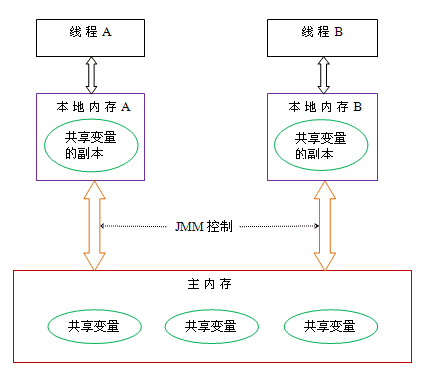
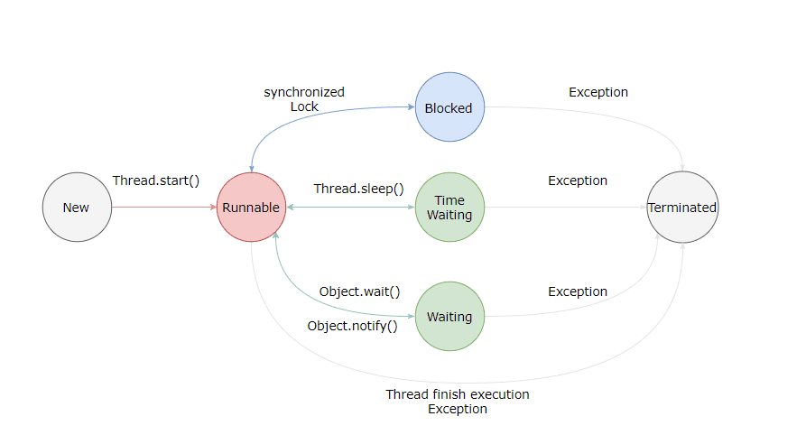
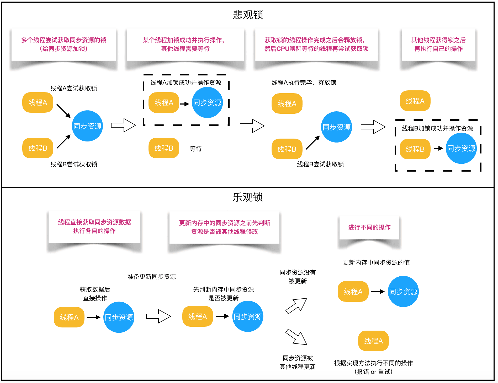
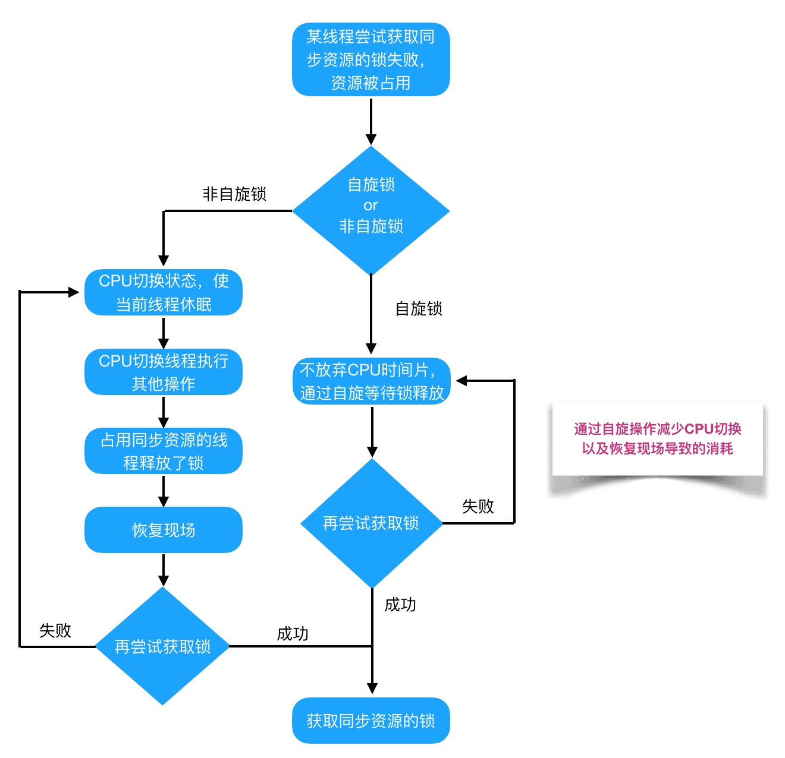
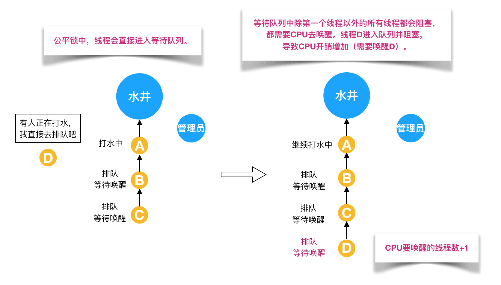
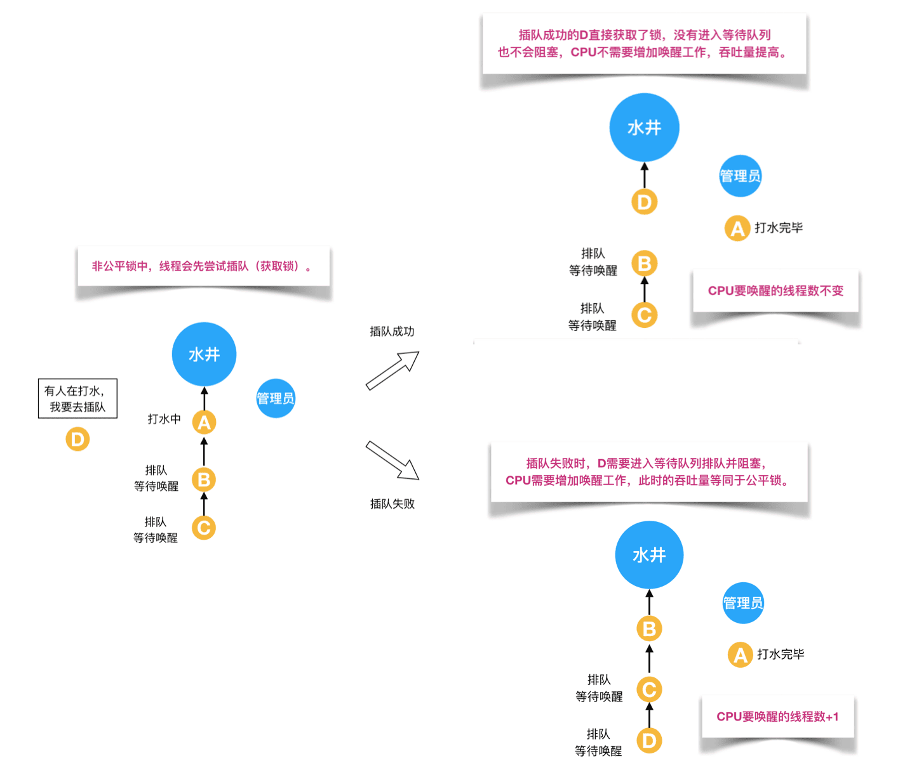
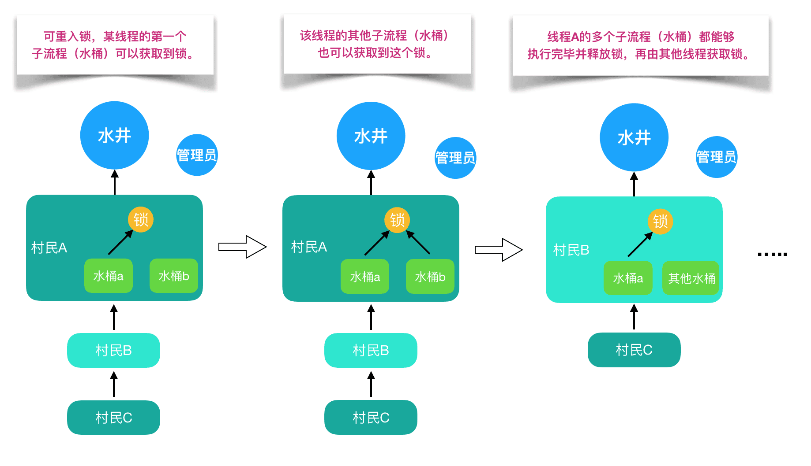
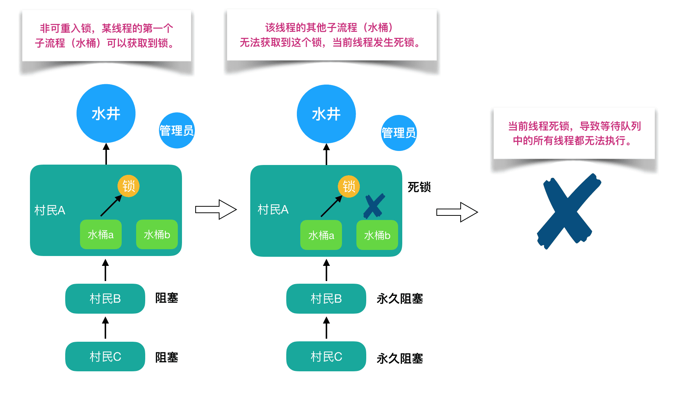

# java线程简介


* Java编写的程序都运行在在Java虚拟机（JVM）中
* 每用java命令启动一个java应用程序，就会启动一个JVM进程。在同一个JVM进程中，有且只有一个进程，就是它自己。
* 在这个JVM环境中，所有程序代码的运行都是以线程来运行的。
* JVM找到程序程序的入口点main()，然后运行main()方法，这样就产生了一个线程，这个线程称之为主线程。当main方法结束后，主线程运行完成。JVM进程也随即退出。
* 所以一个应用程序只对应着一个进程，但是可以包含多个线程，所以Java应用程序不存在多进程

## java内存模型



线程通信

* 线程 A 把本地内存 A 中更新过的共享变量刷新到主内存中去。
* 线程 B 到主内存中去读取线程 A 之前已更新过的共享变量。

执行程序时为了提高性能，编译器和处理器常常会对指令做重排序


* 编译器优化的重排序。编译器在不改变单线程程序语义的前提下，可以重新安排语句的执行顺序。
* 指令级并行的重排序。现代处理器采用了指令级并行技术（Instruction-Level Parallelism， ILP）来将多条指令重叠执行。如果不存在数据依赖性，处理器可以改变语句对应机器指令的执行顺序。
* 内存系统的重排序。由于处理器使用缓存和读 / 写缓冲区，这使得加载和存储操作看上去可能是在乱序执行

JMM(java内存模型)本质上可以理解为，Java 内存模型规范了 JVM 如何提供按需禁用缓存和编译优化的方法。具体来说，这些方法包括：

* volatile、synchronized 和 final 三个关键字
* Happens-Before 规则

## 线程基础




**新建(New)**：创建后尚未启动。

**可运行(Runnable)**：可能正在运行，也可能正在等待 CPU 时间片。包含了操作系统线程状态中的 Running 和 Ready。

**阻塞(Blocking)**：等待获取一个排它锁，如果其线程释放了锁就会结束此状态。

**无限期等待(Waiting)**：等待其它线程显式地唤醒，否则不会被分配 CPU 时间片。

**限期等待(Timed Waiting)：**

> 无需等待其它线程显式地唤醒，在一定时间之后会被系统自动唤醒。
>
> 调用 Thread.sleep() 方法使线程进入限期等待状态时，常常用“使一个线程睡眠”进行描述。调用 Object.wait() 方法使线程进入限期等待或者无限期等待时，常常用“挂起一个线程”进行描述。睡眠和挂起是用来描述行为，而阻塞和等待用来描述状态。阻塞和等待的区别在于，阻塞是被动的，它是在等待获取一个排它锁。而等待是主动的，通过调用 Thread.sleep() 和 Object.wait() 等方法进入。
>

| 进入方法                                   | 退出方法                                        | 是否为无限期等待 |
| ------------------------------------------ | ----------------------------------------------- | ---------------- |
| 没有设置 Timeout 参数的 Object.wait() 方法 | 时间结束 / Object.notify() / Object.notifyAll() | 是/可控制        |
| 没有设置 Timeout 参数的 Thread.join() 方法 | 时间结束 / 被调用的线程执行完毕                 | 是/可控制        |
| LockSupport.park() 方法                    |                                                 | 是               |
| Thread.sleep() 方法                        | 时间结束                                        | 可控制           |
| LockSupport.parkNanos() 方法               |                                                 |                  |
| LockSupport.parkUntil() 方法               |                                                 |                  |

**死亡(Terminated)**：可以是线程结束任务之后自己结束，或者产生了异常而结束


# 线程使用方式

## 实现

有三种使用线程的方法:

* 实现 **Runnable** 接口；需要实现 run() 方法；通过 Thread 调用 start() 方法来启动线程。
* 实现 **Callable** 接口；与 Runnable 相比，Callable 可以有返回值，返回值通过 FutureTask 进行封装。
* 继承 **Thread** 类；同样也是需要实现 run() 方法，因为 Thread 类也实现了 Runable 接口。

实现 Runnable 和 Callable 接口的类只能当做一个可以在线程中运行的任务，不是真正意义上的线程，因此**最后还需要通过 Thread** 来调用。可以说任务是通过线程驱动从而执行的。

> 实现接口会更好一些，因为:
>
> Java 不支持多重继承，因此继承了 Thread 类就无法继承其它类，但是可以实现多个接口
>
> 类可能只要求可执行就行，继承整个 Thread 类开销过大。


## 基础线程机制

### Executor

Executor 管理多个异步任务的执行，而无需程序员显式地管理线程的生命周期。这里的异步是指多个任务的执行互不干扰，不需要进行同步操作

主要有三种 Executor:

* CachedThreadPool: 一个任务创建一个线程；
* FixedThreadPool: 所有任务只能使用固定大小的线程；
* SingleThreadExecutor: 相当于大小为 1 的 FixedThreadPool。

### Daemon

守护线程是程序运行时在后台提供服务的线程，不属于程序中不可或缺的部分。

当所有非守护线程结束时，程序也就终止，同时会杀死所有守护线程。

main() 属于非守护线程。

使用 setDaemon() 方法将一个线程设置为守护线程。

### sleep()

Thread.sleep(millisec) 方法会**休眠**当前正在执行的线程，millisec 单位为毫秒。

sleep() 可能会抛出 InterruptedException，因为异常不能跨线程传播回 main() 中，因此必须在本地进行处理。线程中抛出的其它异常也同样需要在本地进行处理。

### yield()

对静态方法 Thread.yield() 的调用声明了当前线程已经完成了生命周期中最重要的部分，可以**切换**给其它线程来执行。该方法只是对线程调度器的一个建议，而且也只是建议具有相同优先级的其它线程可以运行。

## 线程异常和中断

### InterruptedException

通过调用一个线程的 interrupt() 来中断该线程，如果该线程处于阻塞、限期等待或者无限期等待状态，那么就会抛出 InterruptedException，从而提前结束该线程。但是不能中断 I/O 阻塞和 synchronized 锁阻塞。

对于以下代码，在 main() 中启动一个线程之后再中断它，由于线程中调用了 Thread.sleep() 方法，因此会抛出一个 InterruptedException，从而提前结束线程，不执行之后的语句。

### interrupted()

如果一个线程的 run() 方法执行一个无限循环，并且没有执行 sleep() 等会抛出 InterruptedException 的操作，那么调用线程的 interrupt() 方法就无法使线程提前结束。

但是调用 interrupt() 方法会设置线程的中断标记，此时调用 interrupted() 方法会返回 true。因此可以在循环体中使用 interrupted() 方法来判断线程是否处于中断状态，从而提前结束线程。

### Executor 的中断操作

调用 Executor 的 shutdown() 方法会等待线程都执行完毕之后再关闭，但是如果调用的是 shutdownNow() 方法，则相当于调用每个线程的 interrupt() 方法。

以下使用 Lambda 创建线程，相当于创建了一个匿名内部线程。


如果只想中断 Executor 中的一个线程，可以通过使用 submit() 方法来提交一个线程，它会返回一个 Future<?> 对象，通过调用该对象的 cancel(true) 方法就可以中断线程。

```java
Future<?> future = executorService.submit(() -> {
    // ..
});
future.cancel(true);
```


## 线程互斥同步


Java 提供了两种锁机制来控制多个线程对共享资源的互斥访问，第一个是 JVM 实现的 synchronized，而另一个是 JDK 实现的 ReentrantLock。

### synchronized

它只作用于同一个对象，如果调用两个对象上的同步代码块，就不会进行同步。

对于以下代码，使用 ExecutorService 执行了两个线程，由于调用的是同一个对象的同步代码块，因此这两个线程会进行同步，当一个线程进入同步语句块时，另一个线程就必须等待。


### ReentrantLock

ReentrantLock 类是 java.util.concurrent(J.U.C)包中的锁。

```java
Lock lock =new ReentrantLock();//创建锁

lock.lock();//上锁
```


### 总结

**1. 锁的实现**

synchronized 是 JVM 实现的，而 ReentrantLock 是 JDK 实现的。

**2. 性能**

新版本 Java 对 synchronized 进行了很多优化，例如自旋锁等，synchronized 与 ReentrantLock 大致相同。

**3. 等待可中断**

当持有锁的线程长期不释放锁的时候，正在等待的线程可以选择放弃等待，改为处理其他事情。

ReentrantLock 可中断，而 synchronized 不行。

**4. 公平锁**

公平锁是指多个线程在等待同一个锁时，必须按照申请锁的时间顺序来依次获得锁。

synchronized 中的锁是非公平的，ReentrantLock 默认情况下也是非公平的，但是也可以是公平的。

**5. 锁绑定多个条件**

一个 ReentrantLock 可以同时绑定多个 Condition 对象。

> 除非需要使用 ReentrantLock 的高级功能，否则优先使用 synchronized。这是因为 synchronized 是 JVM 实现的一种锁机制，JVM 原生地支持它，而 ReentrantLock 不是所有的 JDK 版本都支持。并且使用 synchronized 不用担心没有释放锁而导致死锁问题，因为 JVM 会确保锁的释放。

## 线程之间的协作

当多个线程可以一起工作去解决某个问题时，如果某些部分必须在其它部分之前完成，那么就需要对线程进行协调

### join()


在线程中调用另一个线程的 join() 方法，会将当前线程挂起，而不是忙等待，直到目标线程结束。

对于以下代码，虽然 b 线程先启动，但是因为在 b 线程中调用了 a 线程的 join() 方法，b 线程会等待 a 线程结束才继续执行，因此最后能够保证 a 线程的输出先于 b 线程的输出。


### wait() notify() notifyAll()

调用 wait() 使得线程等待某个条件满足，线程在等待时会被挂起，当其他线程的运行使得这个条件满足时，其它线程会调用 notify() 或者 notifyAll() 来唤醒挂起的线程。

它们都属于 Object 的一部分，而不属于 Thread。

只能用在同步方法或者同步控制块中使用，否则会在运行时抛出 IllegalMonitorStateExeception。

使用 wait() 挂起期间，线程会释放锁。这是因为，如果没有释放锁，那么其它线程就无法进入对象的同步方法或者同步控制块中，那么就无法执行 notify() 或者 notifyAll() 来唤醒挂起的线程，造成死锁。

**wait() 和 sleep() 的区别**

* wait() 是 Object 的方法，而 sleep() 是 Thread 的静态方法；
* wait() 会释放锁，sleep() 不会。

### await() signal() signalAll()

java.util.concurrent 类库中提供了 Condition 类来实现线程之间的协调，可以在 Condition 上调用 await() 方法使线程等待，其它线程调用 signal() 或 signalAll() 方法唤醒等待的线程。相比于 wait() 这种等待方式，await() 可以指定等待的条件，因此更加灵活。

使用 Lock 来获取一个 Condition 对象。


# Java中所有的锁


## 乐观锁 VS 悲观锁

乐观锁在Java中是通过使用无锁编程来实现，最常采用的是CAS算法，Java原子类中的递增操作就通过CAS自旋实现的。




* **悲观锁适合写操作多的场景** ，先加锁可以保证写操作时数据正确。
* **乐观锁适合读操作多的场景** ，不加锁的特点能够使其读操作的性能大幅提升。


## 自旋锁 VS 适应性自旋锁




## 无锁 VS 偏向锁 VS 轻量级锁 VS 重量级锁

偏向锁通过对比Mark Word解决加锁问题，避免执行CAS操作。

轻量级锁是通过用CAS操作和自旋来解决加锁问题，避免线程阻塞和唤醒而影响性能。

重量级锁是将除了拥有锁的线程以外的线程都阻塞


## 公平锁 VS 非公平锁

公平锁，多个线程按照申请锁的顺序来获取锁，线程直接进入队列中排队，队列中的第一个线程才能获得锁。确保了每个线程都可以执行，但是限制了吞吐率



非公平锁是多个线程加锁时直接尝试获取锁，获取不到才会到等待队列的队尾等待。

非公平锁的优点是可以减少唤起线程的开销，整体的吞吐效率高，因为线程有几率不阻塞直接获得锁，CPU不必唤醒所有线程。缺点是处于等待队列中的线程可能会饿死，或者等很久才会获得锁。




## 可重入锁 VS 非可重入锁

可重入锁又名递归锁，是指在同一个线程在外层方法获取锁的时候，再进入该线程的内层方法会**自动获取锁**（前提锁对象得是**同一个对象**或者class），ReentrantLock和synchronized都是重入锁



NonReentrantLock非可重入锁，



ReentrantLock和NonReentrantLock都继承父类AQS，其父类AQS中维护了一个同步状态status来计数重入次数，status初始值为0

ReentrantLock代码

可重入锁先尝试获取并更新status值，如果status == 0表示没有其他线程在执行同步代码，则把status置为1，当前线程开始执行。如果status != 0，则判断当前线程是否是获取到这个锁的线程，如果是的话执行status+1，且当前线程可以再次获取锁

```java
final boolean nonfairTryAcquire(int acquires) {
    final Thread current = Thread.currentThread();
    int c = getState();
    if (c == 0) {
        if (compareAndSetState(0, acquires)) {
            setExclusiveOwnerThread(current);
            return true;
}
    }
    else if (current == getExclusiveOwnerThread()) {
	//获取锁时先判断，如果当前线程就是已经占据锁的线程则status+1，并返回true
        int nextc = c + acquires;
        if (nextc < 0) // overflow
	throw new Error("Maximum lock count exceeded");
	setState(nextc);
        return true;
}
    return false;
}
//释放锁时也先判断当前线程是否是已经占有锁的线程，判断status为0释放锁
protected final boolean tryRelease(int releases) {
    int c = getState() - releases;
    if (Thread.currentThread() != getExclusiveOwnerThread())
        throw new IllegalMonitorStateException();
    boolean free = false;
    if (c == 0) {
        free = true;
setExclusiveOwnerThread(null);
}
    setState(c);
    return free;
}
```

NonReentrantLock，非可重入锁是直接去获取并尝试更新当前status的值，如果status != 0的话会导致其获取锁失败，当前线程阻塞

```java
protected boolean tryAcquire(int arg) {
            assert arg == 1;//如果state为0，则尝试获取锁
            if (compareAndSetState(0, 1)) {
                setExclusiveOwnerThread(Thread.currentThread());
                return true;
            }
            return false;
        }
protected boolean tryRelease(int arg) {
            assert arg == 1;//如果state为0，则尝试获取锁
            if (getState() == 0) {
                throw new IllegalMonitorStateException();
            }
            setExclusiveOwnerThread(null);
            setState(0);
            return true;
        }

```


## 独享锁(排他锁) VS 共享锁

 **独享锁也叫排他锁** ，是指该锁一次只能被一个线程所持有。如果线程T对数据A加上排它锁后，则其他线程不能再对A加任何类型的锁。获得排它锁的线程即**能读数据又能修改**数据。JDK中的synchronized和JUC中Lock的实现类就是互斥锁。

**共享锁**是指该锁可被多个线程所持有。如果线程T对数据A加上共享锁后，则其他线程只能对A再加共享锁，不能加排它锁。获得共享锁的线程**只读数据**，不能修改数据。

通过ReentrantReadWriteLock实现 有两把锁：ReadLock和WriteLock

```java
 public ReentrantReadWriteLock(boolean fair) {
        sync = fair ? new FairSync() : new NonfairSync();
	//初始化锁
        readerLock = new ReadLock(this);
        writerLock = new WriteLock(this);
    }
public ReentrantReadWriteLock.WriteLock writeLock() { return writerLock; }
public ReentrantReadWriteLock.ReadLock  readLock()  { return readerLock; }

读锁   Sync是AQS的一个子类
class ReadLock
protected ReadLock(ReentrantReadWriteLock lock) {
            sync = lock.sync;
        }
写锁
class WriteLock 
protected WriteLock(ReentrantReadWriteLock lock) {
            sync = lock.sync;
        }
```


读锁是共享锁，写锁是独享锁。读锁的共享锁可保证并发读非常高效，而读写、写读、写写的过程互斥，因为读锁和写锁是分离的。所以ReentrantReadWriteLock的并发性相比一般的互斥锁有了很大提升。


# 关键字: volatile、synchronized 和 final

## Synchronized

在应用Sychronized关键字时需要把握如下注意点：

* 一把锁只能同时被一个线程获取，没有获得锁的线程只能等待；
* 每个实例都对应有自己的一把锁(this),不同实例之间互不影响；例外：锁对象是*.class以及synchronized修饰的是static方法的时候，所有对象公用同一把锁
* synchronized修饰的方法，无论方法正常执行完毕还是抛出异常，都会释放锁

### 对象锁

包括方法锁(默认锁对象为this,当前实例对象)和同步代码块锁(自己指定锁对象)

代码块形式：手动指定锁定对象，也可是是this,也可以是自定义的锁

```java
 // 同步代码块形式——锁为this,两个线程使用的锁是一样的,线程1必须要等到线程0释放了该锁后，才能执行
        synchronized (this) {
            System.out.println("我是线程" + Thread.currentThread().getName());
            try {
                Thread.sleep(3000);
            } catch (InterruptedException e) {
                e.printStackTrace();
            }
            System.out.println(Thread.currentThread().getName() + "结束");
        }
```

方法锁形式：synchronized修饰普通方法，锁对象默认为this

### 类锁

指synchronize修饰静态的方法或指定锁对象为Class对象

synchronize修饰静态方法

## Synchronized原理分析


### 加锁和释放锁的原理

使用javap反编译查看.class文件的信息

```bash
>javap -verbose SynchronizedDemo.class
```

会看到文件里的 `monitorenter`和 `monitorexit`指令，会让对象在执行，使其锁计数器加1或者减1。每一个对象在同一时间只与一个monitor(锁)相关联，而一个monitor在同一时间只能被一个线程获得，在尝试获得与这个对象相关联的Monitor锁的所有权的时候，monitorenter指令会发生如下3中情况之一：

* monitor计数器为0，意味着目前还没有被获得，那这个线程就会立刻获得然后把锁计数器+1，一旦+1，别的线程再想获取，就需要等待
* 如果这个monitor已经拿到了这个锁的所有权，又重入了这把锁，那锁计数器就会累加，变成2，并且随着重入的次数，会一直累加
* 这把锁已经被别的线程获取了，等待锁释放

`monitorexit指令`：释放对于monitor的所有权，释放过程很简单，就是讲monitor的计数器减1，如果减完以后，计数器不是0，则代表刚才是重入进来的，当前线程还继续持有这把锁的所有权，如果计数器变成0，则代表当前线程不再拥有该monitor的所有权，即释放锁。


### 可重入原理：加锁次数计数器


 **可重入** ：（来源于维基百科）若一个程序或子程序可以“在任意时刻被中断然后操作系统调度执行另外一段代码，这段代码又调用了该子程序不会出错”，则称其为可重入（reentrant或re-entrant）的。即当该子程序正在运行时，执行线程可以再次进入并执行它，仍然获得符合设计时预期的结果。与多线程并发执行的线程安全不同，可重入强调对单个线程执行时重新进入同一个子程序仍然是安全的。

[ **可重入锁** ]()：又名递归锁，是指在同一个线程在外层方法获取锁的时候，再进入该线程的内层方法会自动获取锁（前提锁对象得是同一个对象或者class），不会因为之前已经获取过还没释放而阻塞。
