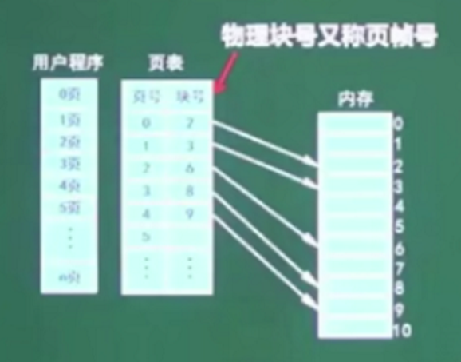
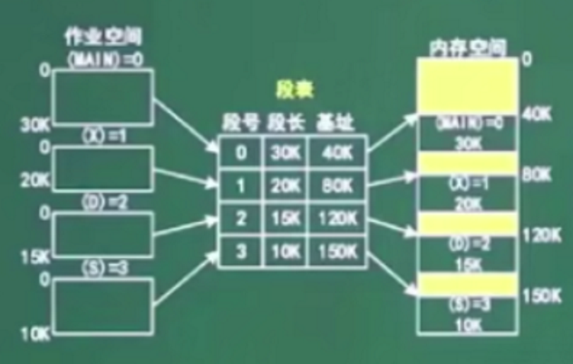
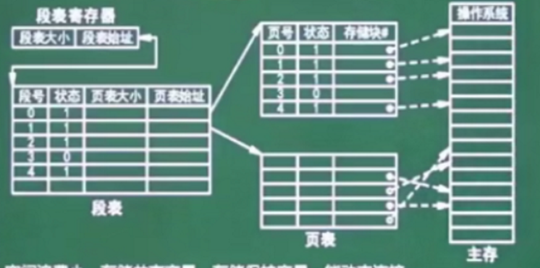

# 基础

## 进程

进程是程序的一次动态是执行
进程是程序在一次数据集合上运行的过程，它是系统进行资源分配和调度的一个独立单位。它分为程序、进程控制块（PCB）和数据块。

进程和程序的区别：

- 进程是程序的一次动态的执行，没有程序就没有进程。
- 程序是完成某个特定功能的一系列程序语句的集合，只要不是破坏它就永远都存在。
- 程序是静态的，进程是动态的。
- 进程由程序创建而产生，完成任务后因而消亡；
- 进程是系统进行资源分配和调度的独立单位，程序不是

死锁：

- 进程管理是操作系统的核心，但如果设计不当，就会出现死锁的问题。如果第一进程在等待一件不可能发生的事则进程死锁了。如果一个或多个进程产生死锁，就会造成系统死锁。
- 互斥条件
- 循环请求
- 不可中断
- 请求和保存条件

银行家算法：
分配原则

- 当一个进程对资源的最大需求量不超过系统中的资源数时可以接纳该进程。
- 进程可以分期请求资源，但请求的总数不能超过最大需求量
- 当系统现有资源不能满足进程尚需重要资源数时，对进程的请求可以推迟分配，但总能使进程在有限的时间里得到资源。

## 存储管理

页式存储：将程序与内存均划分为同样大小的块，以页为单位将程序调入内存。

逻辑地址=页号+页内地址
物理地址=页帧号+页内地址
优点：利用率，碎片小，分配及管理简单。
缺点：增加了系统开销；可能产生抖动现象

段式存储：按用户作业中的自然段来划分逻辑空间，然后调入内存，段的长度可以不一样

优点：多道程序共享，各段程序修改互不影响
缺点：内存利用率低，内存碎片浪费大

段页式存储：段式和页式的综合体，先分段，再分页。1个程序有若干个段，每个段中可以有若干个页，每页大小相同，但每段的大小不一样

优点：空间浪费小，存储共享容易，存储保护容易，能动态连接。
缺点：由于管理软件的增加，复杂性和开销也随之增加，需要的硬件以及占用的内容也有所增加，使得执行速度大大下降

**最优算法（OPT）**：淘汰不用的或最远的将来才用的页。
**随机算法（RAND）**：随机淘汰。
**先进先出算法**：可能产生抖动，（FIFO）选择最早调入的页。
**最近最少使用算法**：不会抖动。（LRU）选择离当前时刻最近的一段时间内使用最少的页
**时间局部性**：刚被访问的内容，立即又被访问
**空间局部性**：刚被访问的内容，临近的空间很快被访问

存取时间=寻道时间+等待时间，
**寻道时间**：是指磁头移动到磁道的所需时间
**等待时间**：为等待读写的扇区转到磁头下方所用时间

先来先到服务（FCFS）
最短寻道时间优先SSTF
扫描算法SCAM（电梯算法）
循环扫描算法CSCAN（单向电梯算法）
作业管理：
文件管理：
直接索引：直接存放内容
一级间接索引：

## 设备管理

**程序控制（查询）方式**：分为无条件和程序查询方式两种，方法简单，硬件开销小，但I/O能力不高，严重影响cpu的利用率。
**程序中断方式**：与程序控制方式相比，中断方式因为CPU无需等待而提高了传输请求的响应速度。与cpu并行，等待cpu的一个指令的最后一个总线周期结束后响应，指令周期结束。
**DMA方式**：DMA方式是为了在主存和外设之间实现高速，批量数据交换和设置的，DMA方式比程序控制方式与中断方式都高效，cpu响应需要在总线周期结束
通道方式
I/O处理机
