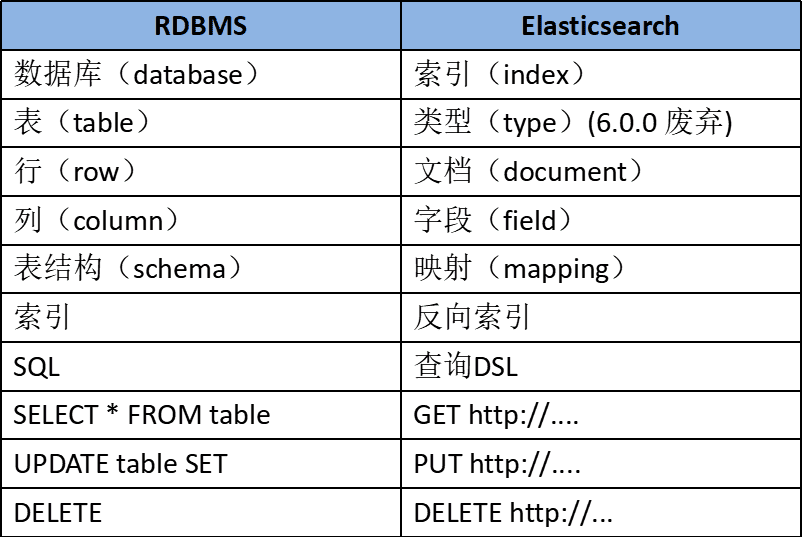

# ElasticSearch

## 基础

ElasticSearch是一款非常强大的、基于Lucene的开源搜索及分析引擎；它是一个实时的分布式搜索分析引擎，它能让你以前所未有的速度和规模，去探索你的数据。

Lucene 仅仅只是一个库。为了充分发挥其功能，你需要使用 Java 并将 Lucene 直接集成到应用程序中。 更糟糕的是，您可能需要获得信息检索学位才能了解其工作原理。Lucene 非常 复杂。Elasticsearch 也是使用 Java 编写的,它的内部使用 Lucene 做索引与搜索，但是它的目的是使全文检索变得简单， **通过隐藏 Lucene 的复杂性，取而代之的提供一套简单一致的 RESTful API** 。

Elastic Stack（简称ELK）还被广泛运用在大数据近实时分析领域，包括： **日志分析** 、 **指标监控** 、**信息安全**等。它可以帮助你 **探索海量结构化、非结构化数据，按需创建可视化报表，对监控数据设置报警阈值，通过使用机器学习，自动识别异常状况** .

ElasticSearch是基于Restful WebApi，使用Java语言开发的搜索引擎库类，并作为Apache许可条款下的开放源码发布，是当前流行的企业级搜索引擎。



* **Near Realtime（NRT）** 近实时。数据提交索引后，立马就可以搜索到。
* **Cluster 集群** ，一个集群由一个唯一的名字标识，默认为“elasticsearch”。集群名称非常重要，具有相同集群名的节点才会组成一个集群。集群名称可以在配置文件中指定。
* **Node 节点** ：存储集群的数据，参与集群的索引和搜索功能。像集群有名字，节点也有自己的名称，默认在启动时会以一个随机的UUID的前七个字符作为节点的名字，你可以为其指定任意的名字。通过集群名在网络中发现同伴组成集群。一个节点也可是集群。
* **Index 索引** : 一个索引是一个文档的集合（等同于solr中的集合）。每个索引有唯一的名字，通过这个名字来操作它。一个集群中可以有任意多个索引。
* **Type 类型** ：指在一个索引中，可以索引不同类型的文档，如用户数据、博客数据。从6.0.0 版本起已废弃，一个索引中只存放一类数据。
* **Document 文档** ：被索引的一条数据，索引的基本信息单元，以JSON格式来表示。
* **Shard 分片** ：在创建一个索引时可以指定分成多少个分片来存储。每个分片本身也是一个功能完善且独立的“索引”，可以被放置在集群的任意节点上。
* **Replication 备份** : 一个分片可以有多个备份（副本）

# DSL查询

```json
PUT /customer/_doc/1
{
  "name": "John Doe"
}
```

插入由 `PUT /index/type/id`

查询 `GET /index/type/id`

`match_all`表示查询所有的数据;`match`要在字段中搜索特定字词;`sort`即按照什么字段排序;使用 `match_phrase`只保留包含了所有字段的文档;多条件查询 `bool`可以使用多个条件;在 `bool`查询的子句中同时具备 `query/must` 和 `filter`

> 由于ES底层是按照分词索引的，所以 `match`查询结果是address 字段中包含 mill 或者 lane的数据

```json
GET /bank/_search
{
  "query": {
    "bool": {
        "must": [{ 
            "match_all": {} ,
            "match": { "address": "mill lane" },
            "match_phrase": { "address": "mill lane" } 
            }],
        "must_not": [
            { "match": { "state": "ID" } }
      ],
       "filter": [
        {
          "term": {
            "age": "40"
          }
        },
        {
          "range": {
            "balance": {
              "gte": 20000,
              "lte": 30000
            }
          }
        }
      ]
      },  
  "sort": [
    { "account_number": "asc" }
  ]
}
```

结果相关字段解释

* `took` – Elasticsearch运行查询所花费的时间（以毫秒为单位）
* `timed_out` –搜索请求是否超时
* `_shards` - 搜索了多少个碎片，以及成功，失败或跳过了多少个碎片的细目分类。
* `max_score` – 找到的最相关文档的分数
* `hits.total.value` - 找到了多少个匹配的文档
* `hits.sort` - 文档的排序位置（不按相关性得分排序时）
* `hits._score` - 文档的相关性得分（使用match_all时不适用）

分页查询(from+size)

```json
GET /bank/_search
{
  "query": { "match_all": {} },
  "sort": [
    { "account_number": "asc" }
  ],
  "from": 10,
  "size": 10
}
```

### 聚合查询

Aggregation

```json
GET /bank/_search
{
  "size": 0,
  "aggs": {
    "group_by_state": {
      "terms": {
        "field": "state.keyword"
      }
    }
  }
}
```

计算出account每个州的统计数量， 使用 `aggs`关键字对 `state`字段聚合，被聚合的字段无需对分词统计，所以使用 `state.keyword`对整个字段统计

## 复合查询
