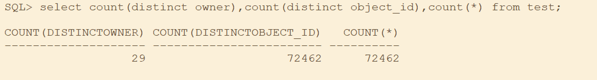

# 基数

基数（CARDINALITY）:某个列唯一建（Distinct keys）的数量叫作基数，基数的高低影响列的数据分布。

<当某个列的数值查询结果是返回表中5%以内的数据时，应该走索引；否则走全表描>



可能存在基数小，存在大量的重复值，导致数据的分布极其不均匀，存在二者都有可能

`Select 列，count(*) from 表 group by 列 order by 2 desc`

可查看列的数据分布

选择性（SELECTIVITY）：基数与总行数的比值再乘以100%基数某列的选择性

```sql
Select a.column_name,b.num_rows,a.num_distinct Cardinality,round(a.num_distinct / b.num_rows * 100, 2) selectivity,a.histogram,a.num_bucketsFrom dba_tab_col_statistics a, dba_tables bWhere a.owner = b.owner  and
a.table_name = b.table_nameAnd a.owner = ''And a.table_name = ''
```

查看表的选择性

```sql
procedure gather_table_stats(
ownname varchar2, 
tabname varchar2,
partname varchar2 default null,
estimate_percent number default DEFAULT_ESTIMATE_PERCENT,
block_sample boolean default FALSE,
method_opt varchar2 default
DEFAULT_METHOD_OPT,
degree number default to_degree_type(get_param('DEGREE')),   
granularity varchar2 default  DEFAULT_GRANULARITY,   
cascade boolean default DEFAULT_CASCADE,   
stattab varchar2 default null, 
statid varchar2 default null,   
statown varchar2 default null,   
no_invalidate boolean defaultto_no_invalidate_type(get_param('NO_INVALIDATE')),   
stattype varchar2 default 'DATA',   
force boolean default FALSE,     -- the context is intended for internal
use only.context dbms_stats.CContext default null);
```

录入表信息自动优化，返回需要添加索引，且存在

```sql
begin  
dbms_stats.flush_database_monitoring_info;  
end;
/  
select owner,
         column_name,
         num_rows,
         Cardinality,
         selectivity,
         'Need index' as notice
    from (select b.OWNER,
                 a.column_name,
                 b.NUM_ROWS,
                 a.num_distinct Cardinality,
                 round(a.num_distinct /b.NUM_ROWS * 100 , 2) selectivity
              from dba_tab_col_statistics a,dba_tables b
              where a.owner = b.OWNER
                and a.table_name = b.TABLE_NAME
                and a.owner = 'h2'
                and a.table_name ='S_FUNCTION_BASE')
   where selectivity >= 20
     and column_name not in (select column_name
                               from dba_ind_columns
                              where table_owner = 'h2'
                                and table_name = 'S_FUNCTION_BASE')
      and column_name in  (select c.name
     from sys.col_usage u,sys.obju,sys.obj o, sys.col$c,sys.user$ r
     where o.obj# = u.obj#
       and c.obj# = u.obj#
       and c.col# = u.intcol#
       and r.name = 'H2'
    and o.name = 'S_FUNCTION_BASE')
```

# 统计信息

## 一、统计信息的收集

Gather_stats_job 调用 dbms_stats.gather_database_stats_job_proc 过程来收集statistics的信息。该过程收集对象statistics 的条件如下：

  （1）对象的统计信息之前没有收集过。

  （2）当对象有超过10%的 rows 被修改，此时对象的统计信息也称为stale statistics。

```sql
select job_name,program_name,enabled,stop_on_window_close from dba_scheduler_jobs where job_name = 'gather_stats_job'; 
job_name              program_name           enabl  stop_on_window_close 
-------------------- --------------------    ----- -------------------- 
gather_stats_job      gather_stats_prog      true    true
```

  停止自动统计信息的收集

```sql
 BEGIN  DBMS_SCHEDULER.DISABLE('GATHER_STATS_JOB');  END;
```

  自动统计信息的收集参数可以查看DBA_TAB_STAT_PREFS，可以通过dbms_stats.set_XX_prefs设置

## 二、如何查看统计信息是否过期

查看表的数据变动情况请使用SQL语句：`select * from user_tab_modifications;`

  注意以及使用方法：

  1、但这张表不是实时更新的，默认情况15分钟更新一次，所以你更新一张表，可能在 user_tab_modifications里不能立刻体现出来。

  2、想要实时查看也有办法实现，那就是在执行select * from user_tab_modifications之前先执行

```sql
exec DBMS_STATS.FLUSH_DATABASE_MONITORING_INFO;
```

这个存储过程目的就是立刻刷新异动信息的

```sql
EXEC DBMS_STATS.FLUSH_DATABASE_MONITORING_INFO;
SELECT OWNER,TABLE_NAME,OBJECT_TYPE,STALE_STATS,LAST_ANALYZED FROMDBA_TAB_STATISTICS 
		WHERE(STALE_STATS='YES' OR LAST_ANALYZED IS NULL);
```

## 三、优化器收集的统计信息包括内容：

```sql
Table statistics  Number of rows  Number of blocks  Average row length  
Column statistics  Number of distinct values (NDV) in column  Number of nulls in column  Data distribution (histogram);
Index statistics  Number of leaf blocks  Levels  Clustering factor  
System statistics  I/O performance and utilization  CPU performance and utilization
```

1. 表的统计信息
2. 包含表行数，使用的块数，空的块数，块的使用率，行迁移和链接的数量，pctfree，pctused 的数据，行的平均大小：
3. SELECT NUM_ROWS, --表中的记录数
4. BLOCKS, --表中数据所占的数据块数
5. EMPTY_BLOCKS, --表中的空块数
6. AVG_SPACE, --数据块中平均的使用空间
7. CHAIN_CNT, --表中行连接和行迁移的数量
8. AVG_ROW_LEN --每条记录的平均长度
9. FROM USER_TABLES
10. 索引列的统计信息
11. 包含 索引的深度（ B-Tree 的级别），索引叶级的块数量，集群因子（clustering_factor),  唯一值的个数。
12. SELECT BLEVEL, --索引的层数
13. LEAF_BLOCKS, --叶子结点的个数
14. DISTINCT_KEYS, --唯一值的个数
15. AVG_LEAF_BLOCKS_PER_KEY, --每个 KEY 的平均叶块个数
16. AVG_DATA_BLOCKS_PER_KEY, --每个 KEY 的平均数据块个数
17. CLUSTERING_FACTOR --群集因子
18. FROM USER_INDEXES
19. 列的统计信息
20. 包含  唯一的值个数，列最大小值， 密度（选择率），数据分布（直方图信息），NUll 值个数
21. SELECT NUM_DISTINCT, --唯一值的个数
22. LOW_VALUE, --列上的最小值
23. HIGH_VALUE, --列上的最大值
24. DENSITY, --选择率因子（密度）
25. NUM_NULLS, --空值的个数
26. NUM_BUCKETS, --直方图的 BUCKET 个数
27. HISTOGRAM --直方图的类型
28. FROM USER_TAB_COLUMNS

## 四、DBMS_STATS.GATHER_TABLE_STATS详解

  作用:

DBMS_STATS.GATHER_TABLE_STATS统计表,列,索引的统计信息（默认参数下是对表进行直方图信息收集，包含该表的自身-表的行数、数据块数、行长等信息；列的分析--列值的重复数、列上的空值、数据在列上的分布情况；索引的分析-索引页块的数量、索引的深度、索引聚合因子）.

  DBMS_STATS.GATHER_TABLE_STATS的语法如下:

```
DBMS_STATS.GATHER_TABLE_STATS
 (ownname VARCHAR2, tabname  VARCHAR2, partname VARCHAR2,estimate_percent
 NUMBER,block_sample BOOLEAN,method_opt  VARCHAR2,degree  NUMBER,
 granularity VARCHAR2, cascade  BOOLEAN,stattab VARCHAR2,statid VARCHAR2,statown
 VARCHAR2,no_invalidate BOOLEAN, force BOOLEAN);
```

参数说明:

   ownname:要分析表的拥有者

   tabname:要分析的表名.

   partname:分区的名字,只对分区表或分区索引有用.

   estimate_percent:采样行的百分比,取值范围[0.000001,100],null为全部分析,不采样. 常量:DBMS_STATS.AUTO_SAMPLE_SIZE是默认值,由oracle决定最佳取采样值.

   block_sapmple:是否用块采样代替行采样.

   method_opt:决定histograms信息是怎样被统计的.method_opt的取值如下(默认值为FOR ALL COLUMNS SIZE AUTO):

   for all columns:统计所有列 的histograms.

   for all indexed columns:统计所有indexed列的histograms.

   for all hidden columns:统计你看不到列的histograms

   for columns `<list>` SIZE `<N>` | REPEAT | AUTO | SKEWONLY:统计指定列的histograms.N的取值范围[1,254];
 REPEAT上次统计过的histograms;AUTO由oracle决定N的大小;SKEWONLY 选项会耗费大量处理时间，因为它要检查每个索引中的每个列的值的分布情况。

   degree:决定并行度.默认值为null.

   granularity:Granularity of statistics to collect ,only pertinent if the table is partitioned.

   cascade:是收集索引的信息.默认为FALSE.

   stattab:指定要存储统计信息的表,statid如果多个表的统计信息存储在同一个stattab中用于进行区分.statown存储统计信息表的拥有者.以上三个参数若不指定,统计信息会直接更新到数据字典.

   no_invalidate: Does not invalidate the dependent cursors if set to TRUE. The procedure invalidates the dependent
 cursors immediately if set to FALSE.

   force:即使表锁住了也收集统计信息.

  例子:

   execute dbms_stats.gather_table_stats(ownname => 'owner',tabname => 'table_name' ,estimate_percent => null
 ,method_opt => 'for all indexed columns' ,cascade => true);

   如何使用dbms_stats分析统计信息？

   --创建统计信息历史保留表

  ` sql> exec dbms_stats.create_stat_table(ownname => 'scott',stattab => 'stat_t') ;`

   --导出整个scheme的统计信息

`   sql> exec dbms_stats.export_schema_stats(ownname => 'scott',stattab => 'stat_t') ;`

   --分析scheme

```sql
Exec dbms_stats.gather_schema_stats(   ownname => 'scott',  options => 'GATHER AUTO',   estimate_percent =>
 dbms_stats.auto_sample_size,   method_opt => 'for all indexed columns ',   degree => 6 )
```

   --分析表

   sql>

```sql
exec dbms_stats.gather_table_stats(ownname => 'scott',tabname =>
 'work_list',estimate_percent => 10,method_opt=> 'for all indexed columns') ;
```

   --分析索引

   SQL>

```sql
exec dbms_stats.gather_index_stats(ownname => 'crm2',indname =>
 'IDX_ADM_PERMISSION_PID_MID',estimate_percent => '10',degree => '4') ;
```

   --如果发现执行计划走错，删除表的统计信息

   SQL>

```sql
dbms_stats.delete_table_stats(ownname => 'scott',tabname => 'work_list') ;
```

   --导入表的历史统计信息

   sql>

```sql
exec dbms_stats.import_table_stats(ownname => 'scott',tabname => 'work_list',stattab => 'stat_table') ;
```

   --如果进行分析后，大部分表的执行计划都走错，需要导回整个scheme的统计信息

   sql>

```sql
exec dbms_stats.import_schema_stats(ownname => 'scott',stattab => 'stat_table');
```

   --导入索引的统计信息

   SQL>

```sql
 exec dbms_stats.import_index_stats(ownname => 'crm2',indname => 'IDX_ADM_PERMISSION_PID_MID',stattab => 'stat_table')
```

   --检查是否导入成功

   SQL>

```sql
select table_name,num_rows,a.blocks,a.last_analyzed from all_tables a where a.table_name='WORK_LIST';
```

  分析数据库（包括所有的用户对象和系统对象）：gather_database_stats

   分析用户所有的对象（包括表、索引、簇）：gather_schema_stats

   分析表：gather_table_stats

   分析索引：gather_index_stats

   删除数据库统计信息：delete_database_stats

   删除用户方案统计信息：delete_schema_stats

   删除表统计信息：delete_table_stats

   删除索引统计信息：delete_index_stats

   删除列统计信息：delete_column_stats

   设置表统计信息：set_table_stats

   设置索引统计信息：set_index_stats

   设置列统计信息：set_column_stats

#### 总结

  这是对命令与工具包的一些总结

   1、对于分区表，建议使用DBMS_STATS，而不是使用Analyze语句。

   a) 可以并行进行，对多个用户，多个Table

   b) 可以得到整个分区表的数据和单个分区的数据。

   c) 可以在不同级别上Compute Statistics：单个分区，子分区，全表，所有分区

   d) 可以倒出统计信息

   e) 可以用户自动收集统计信息

   2、DBMS_STATS的缺点

   a) 不能Validate Structure

   b) 不能收集CHAINED  ROWS, 不能收集CLUSTER TABLE的信息，这两个仍旧需要使用Analyze语句。

   c) DBMS_STATS 默认不对索引进行Analyze，因为默认Cascade是False，需要手工指定为True

   3、对于oracle 9里面的External Table，Analyze不能使用，只能使用DBMS_STATS来收集信息。

# 索引
