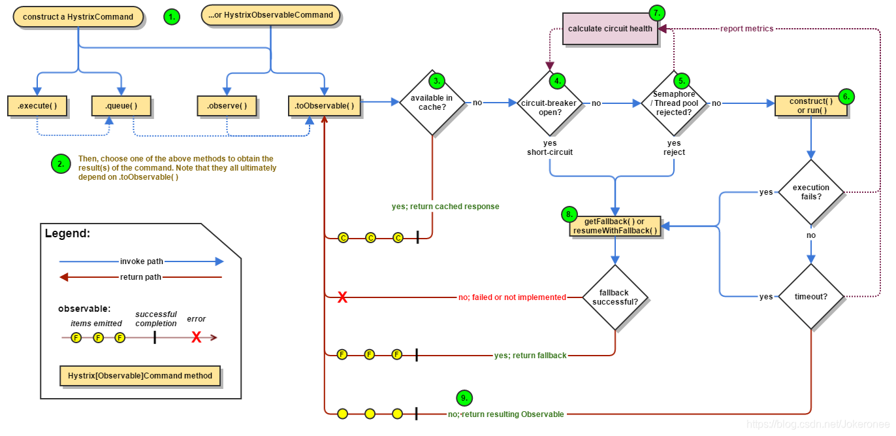
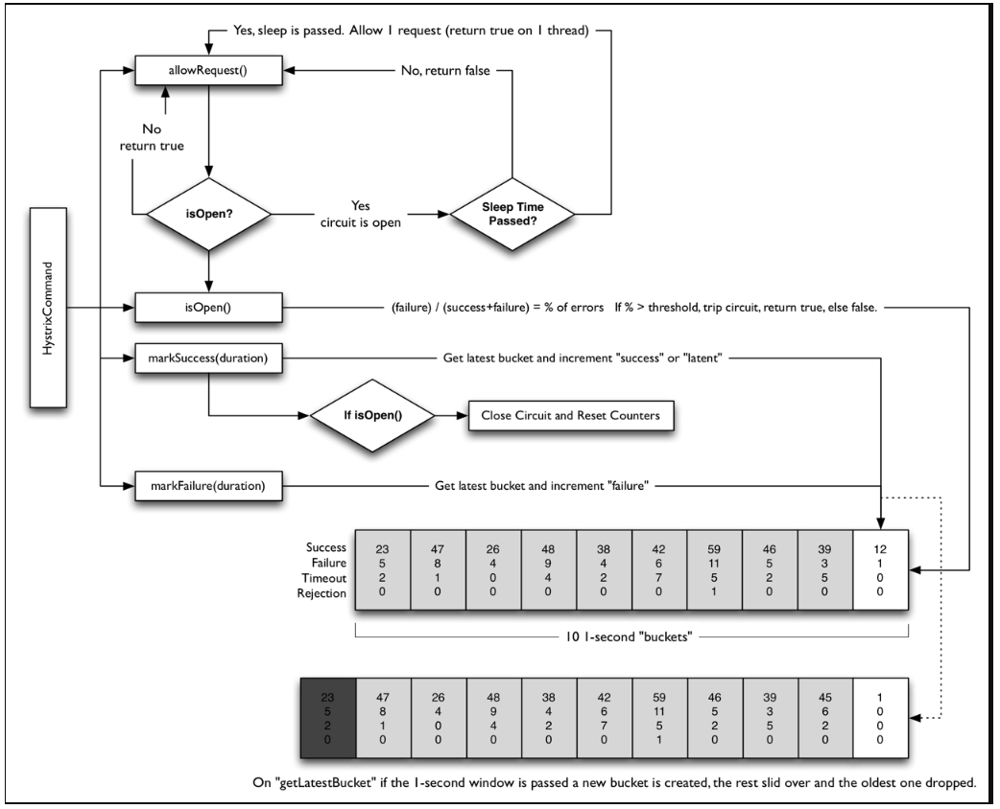

# Hystrix原理

## 工作流程



### 1.创建HystrixCommand或HystrixObservableCommand对象

对依赖服务的操作请求，同时传递所有需要的参数，它采用了“命令模式”来实现对服务调用操作的封装

* HystrixCommand ：用在依赖的服务返回单个操作结果的时候。
* HystrixObservableCommand ：用在依赖的服务返回多个操作结果的时候。

> 命令模式，将客户端的请求封装成对象，让你可以使用不同的请求对客户端进行参数化。它可以被用于实现“行为请求者”与“行为实现者”的解耦，以便使两者可以适应变化。

下面的示例是对命令模式的简单实现：

```java
//接收者
public class Receiver {
    public void action(){
    //真正的业务逻辑
    }
}
 //抽象命令
interface Command {
    void execute();
}
 //具体命令实现
public class ConcreteCommand implements Command {
    private Receiver receiver;
    public ConcreteCommand(Receiver receiver){
        this.receiver=receiver;
    }
    public void execute(){
        this.receiver.action();
    }
}
 //客户端调用者
public class Invoker {
    private Command command;
    public void setCommand(Command command){
        this.command=command;
    }
    public void action(){
        this.command.execute();
    }
}
 public class Client {
    public static void main(String[]args){
    Receiver receiver=new Receiver();
    Command command=new ConcreteCommand(receiver);
    Invoker invoker=new Invoker();
    invoker.setCommand(command);
    invoker.action(); //客户端通过调用者来执行命令
    }
 }
```

* Receiver：接收者，它知道如何处理具体的业务逻辑。
* Command：抽象命令，它定义了一个命令对象应具备的一系列命令操作，比如execute()、undo()、redo()等。当命令操作被调用的时候就会触发接收者去做具体命令对应的业务逻辑。
* ConcreteCommand：具体的命令实现，在这里它绑定了命令操作与接收者之间的关系，execute()命令的实现委托给了Receiver的action()函数。
* Invoker：调用者，它持有一个命令对象，并且可以在需要的时候通过命令对象完成具体的业务逻辑

> 调用者Invoker与操作者Receiver通过Command命令接口实现了解耦,调用者只需在需要的时候直接调用即可，而不需要知道这些操作命令实际是如何实现的

* 使用命令模式作为“回调(CallBack)”在面向对象系统中的替代。“CallBack”讲的便是先将一个函数登记上，然后在以后调用此函数
* 需要在不同的时间指定请求、将请求排队。一个命令对象和原先的请求发出者可以有不同的生命期。换言之，原先的请求发出者可能已经不在了，而命令对象本身仍然是活动的。这时命令的接收者可以是在本地，也可以在网络的另外一个地址。命令对象可以在序列化之后传送到另外一台机器上去。
* 系统需要支持命令的撤销。命令对象可以把状态存储起来，等到客户端需要撤销命令所产生的效果时，可以调用 undo()方法，把命令所产生的效果撤销掉。命令对象还可以提供redo()方法，以供客户端在需要时再重新实施命令效果。
* 命令日志。如果要将系统中所有的数据更新到日志里，以便在系统崩溃时，可以根据日志读回所有的数据更新命令，重新调用 Execute()方法一条一条执行这些命令，从而恢复系统在崩溃前所做的数据更新。

### 2.命令执行

共存在4种命令的执行方式，Hystrix在执行时会根据创建的Command对象以及具体的情况来选择一个执行。

HystrixCommand实现

* execute()：同步执行，从依赖的服务返回一个单一的结果对象，或是在发生错误的时候抛出异常。
* queue()：异步执行，直接返回一个Future对象，其中包含了服务执行结束时要返回的单一结果对象。

```java
R value=command.execute();
Future<R> fValue=command.queue();
```

HystrixObservableCommand实现

* observe()：返回 Observable 对象，它代表了操作的多个结果，它是一个 Hot Observable。
* toObservable()：同样会返回Observable对象，也代表了操作的多个结果，但它返回的是一个Cold Observable。

```java
Observable<R> ohValue=command.observe();
Observable<R> ocValue=command.toObservable();
```

**两种概念**
Hot Observable 和 Cold Observable，分别对应了上面command.observe()和command.toObservable()的返回对象.

* Hot Observable，它不论“事件源”是否有“订阅者”，都会在创建后对事件进行发布，所以对于Hot Observable的每一个“订阅者”都有可能是从“事件源”的中途开始的，并可能只是看到了整个操作的局部过程;
* Cold Observable在没有“订阅者”的时候并不会发布事件，而是进行等待，直到有“订阅者”之后才发布事件，所以对于Cold Observable的订阅者，它可以保证从一开始看到整个操作的全部过程

> observe()返回的是一个 Hot Observable，该命令会在调用的时候立即执行，当Observable每次被订阅的时候会重放它的行为；
> toObservable()返回的是一个Cold Observable，命令不会被立即执行，只有当所有订阅者都订阅它之后才会执行。

* execute()是通过 queue()返回的异步对象`Future<R>`的get()方法来实现同步执行的。该方法会等待任务执行结束，然后获得R类型的结果进行返回。

```java
//execute()就是直接使用了 queue()返回的 Future 中的阻塞方法 get()来实现同步操作的
public R execute(){
    try {
        return queue().get();
    } catch(Exception e){
        throw decomposeException(e);
    }
 }
 //queue()则是通过 toObservable()来获得一个 Cold Observable
 public Future<R> queue(){
    final Observable<R> o=toObservable();
    //toBlocking()将该 Observable 转换成 BlockingObservable ，它可以把数据以阻塞的方式发射出来。
    //toFuture方法则是把 BlockingObservable 转换为一个Future，该方法只是创建一个Future返回，并不会阻塞，这使得消费者可以自己决定如何处理异步操作。
    final Future<R> f=o.toBlocking().toFuture();
    if(f.isDone()){
        //处理立即抛出的错误
        ...
    }
    return f;
 }
```

#### RxJava

Hystrix 的底层实现中大量地使用了 RxJava,RxJava的观察者-订阅者模式介绍

* Observable 对象，理解是“事件源”或是“被观察者”
* Subscriber对象，可以理解为“订阅者”或是“观察者”

* Observable用来向订阅者Subscriber对象发布事件，Subscriber对象则在接收到事件后对其进行处理，这里事件就是对依赖服务的调用。
* 一个Observable可以发出多个事件，直到结束或是发生异常。
* Observable 对象每发出一个事件，就会调用对应观察者Subscriber 对象的onNext()方法。
* 每一个Observable 的执行 ，最后必须调用Subscriber.onCompleted()或者Subscriber.onError()来结束该事件的操作流。

```java
//创建事件源observable
Observable<String> observable = Observable.create( new Observable.OnSubscribe<String>(){
    @Override
    public void call(Subscriber<? super String> subscriber){
        subscriber.onNext("Hello RxJava");
        subscriber.onNext("I am 程序猿DD");
        subscriber.onCompleted();
    }
});
//创建订阅者subscriber
Subscriber<String> subscriber=new Subscriber<String>(){
    @Override
    public void onCompleted(){}
    @Override
    public void onError(Throwable e){}
    @Override
    public void onNext(String s){
        System.out.println("Subscriber : "+s);
    }
};
//订阅
observable.subscribe(subscriber);
```

创建了一个简单的事件源observable，一个对事件传递内容输出的订阅者subscriber，通过observable.subscribe(subscriber)

### 3.结果是否被缓存

若当前命令的请求缓存功能是被启用的，并且该命令缓存命中，那么缓存的结果会立即以 Observable 对象的形式返回。

### 4.断路器是否打开

在命令结果没有缓存命中的时候，Hystrix在执行命令前需要检查断路器是否为打开状态：

* 如果断路器是打开的，那么Hystrix不会执行命令(跳到第8步)，而是转接到fallback处理逻辑
* 如果断路器是关闭的，那么Hystrix跳到第5步，检查是否有可用资源来执行命令。

### 5.线程池/请求队列/信号量是否占满

如果与命令相关的线程池和请求队列，或者信号量(不使用线程池的时候)已经被占满，那么Hystrix也不会执行命令，而是转接到fallback处理逻辑(对应下面第8步)。
Hystrix所判断的线程池并非容器的线程池，而是每个依赖服务的专有线程池。
> Hystrix为了保证不会因为某个依赖服务的问题影响到其他依赖服务而采用了“舱壁模式”(Bulkhead Pattern)来隔离每个依赖的服务。

关于依赖服务的隔离与线程池相关的内容见后续详细介绍。

### 6.HystrixObservableCommand.construct ()或HystrixCommand.run()

Hystrix会根据方法来决定采取不同的方式去请求依赖服务。

* HystrixCommand.run()：返回一个单一的结果，或者抛出异常。
* HystrixObservableCommand.construct()：返回一个Observable对象来发射多个结果，或通过onError发送错误通知。

如果run()或construct()方法的执行时间超过了命令设置的超时阈值，当前处理线程将会抛出 TimeoutException(如果该命令不在其自身的线程中执行，则会通过单独的计时线程来抛出)。Hystrix会转接到fallback处理逻辑(第8步)。
> 如果当前命令没有被取消或中断，那么它最终会忽略run()或者construct()方法的返回。

Hystrix 在记录一些日志并采集监控报告之后将该结果返回。
run()，Hystrix 会返回一个 Observable，它发射单个结果并产生onCompleted的结束通知；
construct()，Hystrix会直接返回该方法产生的Observable对象。

### 7.计算断路器的健康度

Hystrix会将“成功”、“失败”、“拒绝”、“超时”等信息报告给断路器，而断路器会维护一组计数器来统计这些数据。

断路器会使用这些统计数据来决定是否要将断路器打开，来对某个依赖服务的请求进行“熔断/短路”，直到恢复期结束。若在恢复期结束后，根据统计数据判断如果还是未达到健康指标，就再次“熔断/短路”。

### 8.fallback处理

命令执行失败的时候，Hystrix会进入fallback尝试回退处理,称该操作为“服务降级”

* 第4步，当前命令处于“熔断/短路”状态，断路器是打开的时候。
* 第5步，当前命令的线程池、请求队列或者信号量被占满的时候。
* 第6步，HystrixObservableCommand.construct ( ) 或HystrixCommand.run()抛出异常的时候。

以上情况会进入该处理

* 当使用 HystrixCommand 的时候 ，通过实现HystrixCommand.getFallback()来实现服务降级逻辑。
* 当使用 HystrixObservableCommand 的时候,通过HystrixObservableCommand.resumeWithFallback()实现服务降级逻辑，该方法会返回一个Observable对象来发射一个或多个降级结果

当命令的降级逻辑返回结果之后，Hystrix 就将该结果返回给调用者。

* HystrixCommand.getFallback()的时候，它会返回一个Observable对象，该对象会发射 getFallback()的处理结果。
* HystrixObservableCommand.resumeWithFallback()实现的时候，它会将Observable对象直接返回。

> 没有为命令实现降级逻辑或者降级处理逻辑中抛出了异常，Hystrix依然会返回一个Observable对象，但是它不会发射任何结果数据，而是通过onError方法通知命令立即中断请求，并通过onError()方法将引起命令失败的异常发送给调用者。实现一个有可能失败的降级逻辑是一种非常糟糕的做法，我们应该在实现降级策略时尽可能避免失败的情况。

当然完全不可能出现失败的完美策略是不存在的，如果降级执行发现失败的时候，Hystrix会根据不同的执行方法做出不同的处理。

* execute()：抛出异常。
* queue()：正常返回Future对象，但是当调用get()来获取结果的时候会抛出异常。
* observe()：正常返回Observable对象，当订阅它的时候，将立即通过调用订阅者的onError方法来通知中止请求。
* toObservable()：正常返回Observable对象，当订阅它的时候，将通过调用订阅者的onError方法来通知中止请求

### 9.返回成功的响应

当Hystrix命令执行成功之后，它会将处理结果直接返回或是以Observable的形式返回。
而具体以哪种方式返回取决于之前第2步中我们所提到的对命令的4种不同执行方式，下图中总结了这4种调用方式之间的依赖关系。我们可以将此图与在第2步中对前两者源码的分析联系起来，并且从源头toObservable()来开始分析。
对于Hystrix命令的响应虽然总是以 Observable 的形式来返回，但是它可以被转换成你需要的使用方式来进行命令调用。

* toObservable()：返回最原始的 Observable，必须通过订阅它才会真正触发命令的执行流程。
* observe()：在 toObservable()产生原始 Observable 之后立即订阅它，让命令能够马上开始异步执行，并返回一个 Observable 对象，当调用它的subscribe时，将重新产生结果和通知给订阅者。
* queue()：将toObservable()产生的原始Observable通过toBlocking()方法转换成 BlockingObservable 对象，并调用它的toFuture()方法返回异步的Future对象。
* execute()：在queue()产生异步结果Future对象之后，通过调用get()方法阻塞并等待结果的返回。

## 断路器原理

Hystrix的核心部件

```java
public interface HystrixCircuitBreaker {
    public static class Factory {...}
    static class HystrixCircuitBreakerImpl implements HystrixCircuitBreaker {...}
    static class NoOpCircuitBreaker  implements HystrixCircuitBreaker {...}
    
    public boolean allowRequest();
    public boolean isOpen();
    void markSuccess();
}
```

* allowRequest()：每个Hystrix命令的请求都通过它判断是否被执行。
* isOpen()：返回当前断路器是否打开。
* markSuccess()：用来闭合断路器。

三个静态类

* 静态类**Factory**中维护了一个Hystrix命令与HystrixCircuitBreaker的关系集合 ConcurrentHashMap<String,HystrixCircuitBreaker> circuitBreakersByCommand ， 其中String类型的key通过HystrixCommandKey定义，每一个Hystrix命令需要有一个key来标识，同时一个Hystrix命令也会在该集合中找到它对应的断路器HystrixCircuitBreaker实例
* 静态类**NoOpCircuitBreaker**定义了一个什么都不做的断路器实现，它允许所有请求，并且断路器状态始终闭合
* 静态类**HystrixCircuitBreakerImpl**在该类中定义了断路器的4个核心对象
  * HystrixCommandProperties properties 断路器对应 HystrixCommand 实例的属性对象
  * HystrixCommandMetrics metrics 用来让 HystrixCommand 记录各类度量指标的对象
  * AtomicBoolean circuitOpen 断路器是否打开的标志，默认为false。
  * AtomicLong circuitOpenedOrLastTestedTime 断路器打开或是上一次测试的时间戳

### isOpen()：判断断路器的打开/关闭状态

```java
public boolean isOpen(){
    //如果断路器打开标识为true，则直接返回true，表示断路器处于打开状态
    if(circuitOpen.get()){
        return true;
    }
    //从度量指标对象metrics中获取HealthCounts统计对象做进一步判断(该对象记录了一个滚动时间窗内的请求信息快照，默认时间窗为10秒)
    HealthCounts health=metrics.getHealthCounts();

    //请求总数(QPS)在预设的阈值范围内就返回false,该阈值的配置参数为 circuitBreakerRequestVolumeThreshold=20
    if(health.getTotalRequests() < properties.circuitBreakerRequestVolumeThreshold().get()){
        //表示断路器处于未打开状态
        return false;
    }
    //错误百分比在阈值范围内就返回false,该阈值的配置参数为 circuitBreakerErrorThresholdPercentage=50
    if(health.getErrorPercentage() < properties.circuitBreakerErrorThresholdPercentage().get())
    {   
        //表示断路器处于未打开状态
        return false;
    } else {
        //上面的两个条件都不满足，则将断路器设置为打开状态(熔断/短路)。
        if(circuitOpen.compareAndSet(false,true)){
            //将当前时间记录到上面提到的circuitOpenedOrLastTestedTime对象中
            circuitOpenedOrLastTestedTime.set(System.currentTimeMillis());
            return true;
        } else {
            return true;
        }
    }
}
```

### allowRequest()：判断请求是否被允许

```java
@Override
public boolean allowRequest(){
    //先根据配置对象properties中的断路器判断强制打开或关闭属性是否被设置。如果强制打开，就直接返回false，拒绝请求。
    if(properties.circuitBreakerForceOpen().get()){
        return false;
    }
    //如果强制关闭，它会允许所有请求，但是同时也会调用isOpen()来执行断路器的计算逻辑，用来模拟断路器打开/关闭的行为
    if(properties.circuitBreakerForceClosed().get()){
        isOpen();
        return true;
    }
    //在默认情况下，断路器并不会进入这两个强制打开或关闭的分支中去，而是通过！isOpen()||allowSingleTest()来判断是否允许请求访问。
    return !isOpen()|| allowSingleTest();
}
```

```java
//当断路器在打开状态的时候
public boolean allowSingleTest(){
    //在isOpen()函数中当断路器从闭合到打开时候所记录的时间戳
    long timeCircuitOpenedOrWasLastTested=circuitOpenedOrLastTestedTime.get();
    //判断断开时的时间戳+配置中的circuitBreakerSleepWindowInMilliseconds时间是否小于当前时间
    if(circuitOpen.get()&& System.currentTimeMillis()> timeCircuitOpenedOrWasLastTested+ properties.circuitBreakerSleepWindowInMilliseconds().get()){
        //将当前时间更新到记录断路器打开的时间对象circuitOpenedOrLastTestedTime 中，并且允许此次请求
        if(circuitOpenedOrLastTestedTime.compareAndSet(timeCircuitOpenedOrWasLastTested,System.currentTimeMillis())){
            return true;
        }
}
    return false;
}
```

通过 circuitBreakerSleepWindowInMilliseconds 属性设置了一个断路器打开之后的休眠时间(默认为5秒)，在该休眠时间到达之后，将再次允许请求尝试访问，此时断路器处于“半开”状态，若此时请求继续失败，断路器又进入打开状态，并继续等待下一个休眠窗口过去之后再次尝试；若请求成功，则将断路器重新置于关闭状态。所以通过allowSingleTest()与isOpen()方法的配合，实现了断路器打开和关闭状态的切换。

### markSuccess()

该函数用来在“半开路”状态时使用。若Hystrix命令调用成功，通过调用它将打开的断路器关闭，并重置度量指标对象。

```java
public void markSuccess(){
    if(circuitOpen.get()){
        if(circuitOpen.compareAndSet(true,false)){
            metrics.resetStream();
        }
    }
}
```



## 依赖隔离(舱壁模式)

Hystrix则使用该模式实现线程池的隔离，它会为每一个依赖服务创建一个独立的线程池，这样就算某个依赖服务出现延迟过高的情况，也只是对该依赖服务的调用产生影响，而不会拖慢其他的依赖服务。

* 应用自身得到**完全保护**，不会受不可控的依赖服务影响。(即便给依赖服务分配的线程池被填满，也不会影响应用自身的其余部分。)
* 可以有效降低接入**新服务**的风险。(如果新服务接入后运行不稳定或存在问题，完全不会影响应用其他的请求。)
* 当依赖的服务从**失效恢复正常**后，它的线程池会被清理并且能够马上恢复健康的服务，相比之下，容器级别的清理恢复速度要慢得多。
* 当依赖的服务出现**配置错误**的时候，线程池会快速反映出此问题（通过失败次数、延迟、超时、拒绝等指标的增加情况）。同时，我们可以在不影响应用功能的情况下通过实时的**动态属性刷新**（Spring Cloud Config与Spring Cloud Bus的联合使用来介绍）来处理它。
* 当依赖的服务因实现机制调整等原因造成其**性能出现很大变化**的时候，可以通过实时动态刷新自身应用对依赖服务的阈值进行调整以适应依赖方的改变。(线程池的监控指标信息会反映出这样的变化)
* 每个专有线程池都提供了内置的并发实现，可以利用它为同步的依赖服务**构建异步访问**

Hystrix 中除了可使用线程池之外，还可以使用信号量来控制单个依赖服务的并发度，信号量的开销远比线程池的开销小，但是它不能设置超时和实现异步访问。

在 HystrixCommand 和HystrixObservableCommand中有两处支持信号量的使用。

* 命令执行： 如果将隔离策略参数 execution.isolation.strategy 设置为SEMAPHORE,Hystrix会使用信号量替代线程池来控制依赖服务的并发。
* 降级逻辑： 当Hystrix尝试降级逻辑时，它会在调用线程中使用信号量。

仅访问内存数据的请求一般耗时在1ms以内，性能可以达到5000rps（rps指每秒的请求数）

