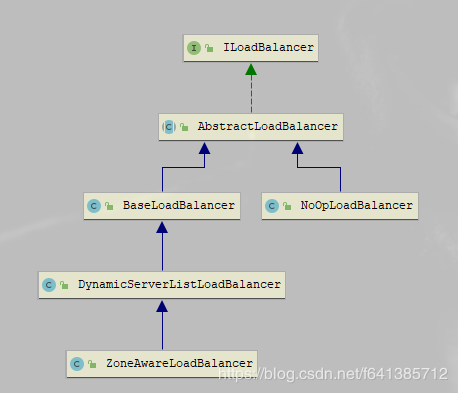

# 负载均衡器
Spring Cloud 中定义了 **LoadBalancerClient** 作为负载均衡器的通用接口并且针对 Ribbon 实现了**RibbonLoadBalancerClient**，但是它在具体实现客户端负载均衡时，是通过 Ribbon 的 ILoadBalancer 接口实现的。

## ILoadBalancer接口

### AbstractLoadBalancer抽象类
AbstractLoadBalancer是ILoadBalancer接口的抽象实现。
```java
public abstract class AbstractLoadBalancer implements ILoadBalancer {
  public enum ServerGroup{
 ALL,
 STATUS_UP,
 STATUS_NOT_UP
 }
/** 
* ALL：所有服务实例。
* STATUS_UP：正常服务的实例。
* STATUS_NOT_UP：停止服务的实例。
**/
 public Server chooseServer(){
 return chooseServer(null);
 }
 //chooseServer()函数通过接口chooseServer(Object key)实现，key为null，表示在选择具体服务实例时忽略key的条件判断
 public abstract List<Server> getServerList (ServerGroup serverGroup);
 //定义了根据分组类型来获取不同的服务实例的列表。
 public abstract LoadBalancerStats getLoadBalancerStats();
 //获取LoadBalancerStats对象,用来存储负载均衡器中各个服务实例当前的属性和统计信息。
 }
```

### BaseLoadBalancer类
BaseLoadBalancer类是Ribbon负载均衡器的基础实现类，在该类中定义了很多关于负载均衡器相关的基础内容
```java
protected IPing ping = null;
//检查服务实例是否正常服务的IPing对象,需要在构造时注入它的具体实现

@Monitor(name = PREFIX + "AllServerList", type = DataSourceType.INFORMATIONAL)
protected volatile List<Server> allServerList = Collections.synchronizedList(new ArrayList<Server>());
//用于存储所有服务实例的清单
@Monitor(name = PREFIX + "UpServerList", type = DataSourceType.INFORMATIONAL)
protected volatile List<Server> upServerList = Collections.synchronizedList(new ArrayList<Server>());
//用于存储正常服务的实例清单

protected LoadBalancerStats lbStats;
//存储负载均衡器各服务实例属性和统计信息的 LoadBalanceStatus

@Override
public List<Server> getReachableServers() {
    return Collections.unmodifiableList(upServerList);
}

@Override
public List<Server> getAllServers() {
    return Collections.unmodifiableList(allServerList);
}

private final static SerialPingStrategy DEFAULT_PING_STRATEGY = new SerialPingStrategy();

private final static IRule DEFAULT_RULE = new RoundRobinRule();
    
//默认初始化了RoundRobinRule为IRule的实现对象。 RoundRobinRule 实现了最基本且常用的线性负载均衡规则。
protected IRule rule = DEFAULT_RULE;

protected IPingStrategy pingStrategy = DEFAULT_PING_STRATEGY;
//检查服务实例操作的执行策略对象 IPingStrategy

private static class SerialPingStrategy implements IPingStrategy {
//该策略采用线性遍历ping 服务实例的方式实现检查
//该策略在当IPing的实现速度不理想，或是Server列表过大时，可能会影响系统性能，
//这时候需要通过实现IPingStrategy 接口并重写 pingServers（IPing ping,Server[]servers）函数去扩展ping的执行策略
  @Override
  public boolean[] pingServers(IPing ping, Server[] servers) {
    int numCandidates = servers.length;
    boolean[] results = new boolean[numCandidates];

    logger.debug("LoadBalancer:  PingTask executing [{}] servers configured", numCandidates);

    for (int i = 0; i < numCandidates; i++) {
        results[i] = false; /* Default answer is DEAD. */
        try {
            if (ping != null) {
                results[i] = ping.isAlive(servers[i]);
            }
        } catch (Exception e) {
            logger.error("Exception while pinging Server: '{}'", servers[i], e);
        }
    }
    return results;
  }
}
```
负载均衡的处理规则 IRule 对象，从 BaseLoadBalancer 中 chooseServer（Object key）的实现源码
```java
public Server chooseServer(Object key){
  if(counter==null){
    counter=createCounter();
  }
  counter.increment();
  if(rule==null){
    return null;
  } else {
    try {
      //负载均衡器实际将服务实例选择任务委托给了 IRule 实例中的 choose 函数来实现。
      return rule.choose(key);
    } catch(Throwable t){
      return null;
    }
  }
}
```
在BaseLoadBalancer的构造函数种，还会启动一个用于检查Server是否健康的定时任务，该任务默认执行时间间隔为10秒
```java
public BaseLoadBalancer(String name, IRule rule, LoadBalancerStats stats,
            IPing ping, IPingStrategy pingStrategy) {
    logger.debug("LoadBalancer [{}]:  initialized", name);
    
    this.name = name;
    this.ping = ping;
    this.pingStrategy = pingStrategy;
    setRule(rule);
    setupPingTask();
    lbStats = stats;
    init();
}

void setupPingTask() {
    if (canSkipPing()) {
        return;
    }
    if (lbTimer != null) {
        lbTimer.cancel();
    }
    lbTimer = new ShutdownEnabledTimer("NFLoadBalancer-PingTimer-" + name,true);
    lbTimer.schedule(new PingTask(), 0, pingIntervalSeconds * 1000);
    forceQuickPing();
}
```
添加Serve
```java
@Override
public void addServers(List<Server> newServers) {
  if (newServers != null && newServers.size() > 0) {
    try {
        ArrayList<Server> newList = new ArrayList<Server>();
        newList.addAll(allServerList);
        newList.addAll(newServers);
        setServersList(newList);
    } catch (Exception e) {
        logger.error("LoadBalancer [{}]: Exception while adding Servers", name, e);
    }
  }
}
```
标记某个服务实例暂停服务
```java
public void markServerDown(Server server) {
    if (server == null || !server.isAlive()) {
        return;
    }

    logger.error("LoadBalancer [{}]:  markServerDown called on [{}]", name, server.getId());
    server.setAlive(false);
    // forceQuickPing();

    notifyServerStatusChangeListener(singleton(server));
}
```

### DynamicServerListLoadBalancer类
DynamicServerListLoadBalancer继承于**BaseLoadBalancer**类，它是对于基础负载均衡器的扩展，实现了服务实例清单在运行期的动态更新能力；同时，它还具备了对服务实例清单的过滤功能。

DynamicServerListLoadBalancer 对于基础负载均衡器BaseLoadBalancer多了三个内容：ServerList、ServerListFilter、ServerListUpdater
```java
volatile ServerList<T> serverListImpl;

volatile ServerListFilter<T> filter;

protected final ServerListUpdater.UpdateAction updateAction = new ServerListUpdater.UpdateAction() {
    @Override
    public void doUpdate() {
        updateListOfServers();
    }
};

protected volatile ServerListUpdater serverListUpdater;

public DynamicServerListLoadBalancer() {
    super();
}
```
待续