# 简介

在表现层它提供了 Spring MVC 以及与Struts 框架的整合功能;在业务逻辑层可以管理事务、记录日志等;在持久层可以整合 MyBatis、 Hibernate、 JdbcTemplate 等技术。

优点

* **非侵入式设计**
  * Spring 是一种非侵入式框架，它可以使应用程序代码对框架的依赖最小化。
* **方便解耦**、简化开发（依赖注入）
  * Spring 就是一个大工厂，可以将所有对象的创建和依赖关系的维护工作都交给Spring容器管理，大大地降低了组件之间的耦合性。
* **支持AOP** （切面编程）
  * Spring 提供了对AOP的支持，它允许将一些通用任务，如安全、事务、曰志等进行集中式处理，从而提高了程序的复用性。
* 支持声明式事务处理
  * 只需要通过配置就可以完成对事务的管理，而无须手动编程。
* 方便程序的测试
  * Spring 提供了对Junit4的支持，可以通过注解方便地测试Spring 程序。
* **集成各种优秀框架**
  * Spring 不排斥各种优秀的开源框架，其内部提供了对各种优秀框架(如 Struts、 Hibernate、 MyBatis、 Quartz 等)的直接支持。
* 降低 Java EE API 的使用难度
  * Spring 对 Java EE 开发中非常难用的一些 API (如 JDBC、 JavaMail 等)，都提供了封装，使这些 API 应用难度大大降低。

## 体系结构

spring框架采用分层结构，它一系列的功能要素被分成20个模块

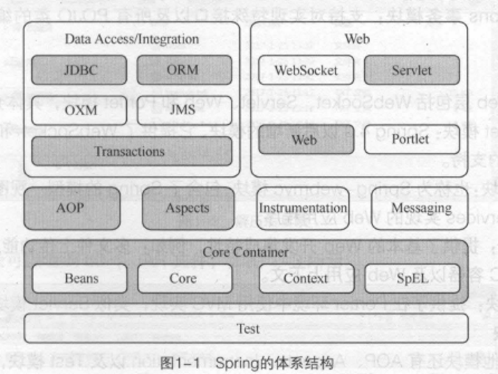

Beans：提供了BeanFactory，spring将管理对象称为Bean

Core: 提供了spring框架的基本组成部分，包括IOC和DI功能

Context：建立在Core和Beans模块的基础之上，它是访问定义和配置的任何对象的媒介

spEL:spring3.0后新增的模块，是运行时查询和操作对象图的强大的表达式语句

JDBC：提供了一个JDBC的抽象层，大幅度的减少开发过程中对数据库操作的编码

ORM：通过使用描述对象和数据库之间映射的元数据,在我们想到描述的时候自然就想到了xml和特性(Attribute).目前的ORM框架中,Hibernate就是典型的使用xml文件作为描述实体对象的映射框架,而大名鼎鼎的Linq则是使用特性(Attribute)来描述的

transactions：支持对实现特殊接口以及所有POJO类的编程和声明式的事务管理。

servlet：也称Spring-webmvc模块， 包含Spring模型-视图-控制器(MVC)和REST Web Services实现的Web程序

web：提供了基本的Web开发集成特性，如:多文件上传、使用Servlet监听器来初始化IoC容器以及Web应用上下文。

## 依赖注入

依赖注入( Dependency Injection ，简称 DI) 与控制反转 (loC) 的含义相同，只不过这两个称呼是从两个角度描述的同一个概念。

在传统模式下，调用者通常会采用 "new 被调用者"的代码方式来创建对象。

Spring 容器负责将被依赖对象赋值给调用者的成员变量，这相当于为调用者注入了它依赖的实例，这就是Spring的依赖注入。

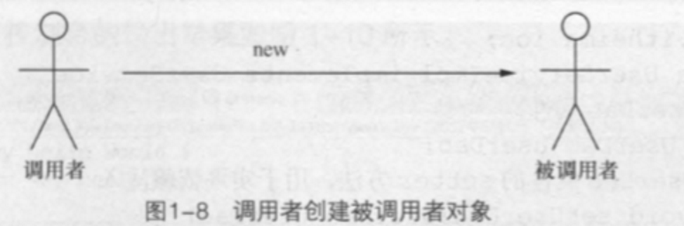

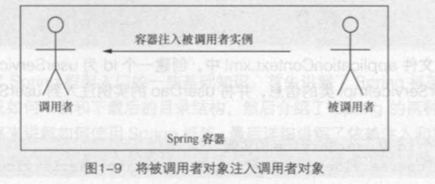

实现方式

* 属性 setter 方法注入 :指 loC 容器使用 setter 方法注入被依赖的实例。通过调用无参构造器或无参静态工厂方法实例化 Bean 后，调用该 Bean 的 setter 方法，即可实现基于 setter 方法的依赖注入。
* 构造方法注入:指 loC 容器使用构造方法注入被依赖的实例。基于构造方法的依赖注入通过调用带参数的构造方法来实现，每个参数代表着一个依赖。

# Bean

Bean是什么

Bean是IoC的基本类型

1、凡是子类及带属性、方法的类都注册Bean到Spring中，交给它管理；

2、@Bean用在方法上，告诉Spring容器，你可以从下面这个方法中拿到一个Bean

### 实例化

 实例化 Bean 有三种方式，分别为构造器实例化、静态工厂方式实例化和实例工厂方式实例化(其中最常用的是构造器实例化)。

1. 构造器实例化

在实例化类是使用类原本的构造器来初始化类

```xml
<bean id="bean1" class="com.itheima.">
```

1. 静态工厂方式实例化

在额外创建工厂类，通过工厂方法静态的实例化类


1. 实例工厂方式实例化

首先实例化工厂，然后通过工厂实例化类


### Bean的配置

主要使用XML和Properties两种格式的配置文件，一般使用XML，通过它来注册和管理Bean之间的依赖关系。

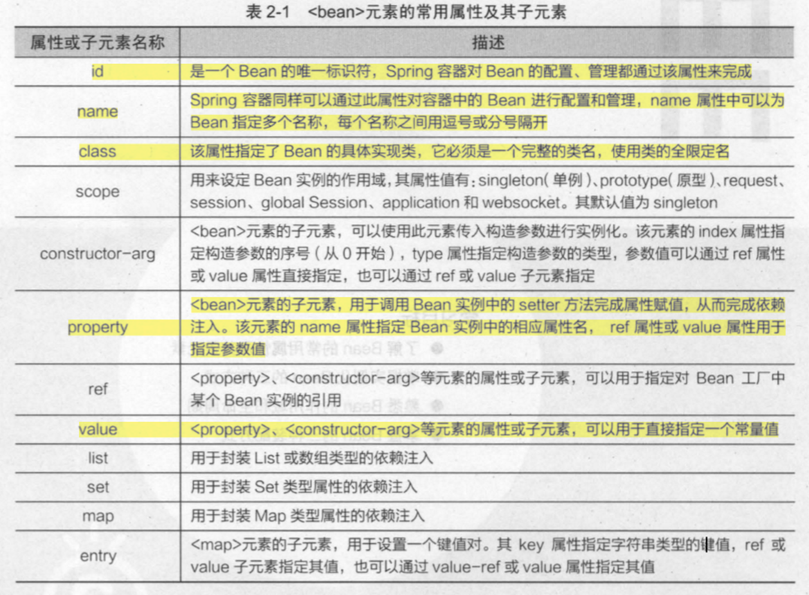

Bean的生命周期

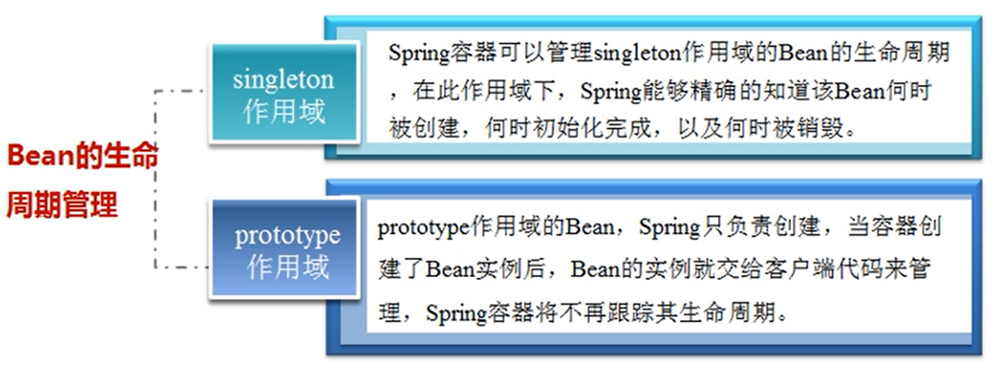

创建Bean

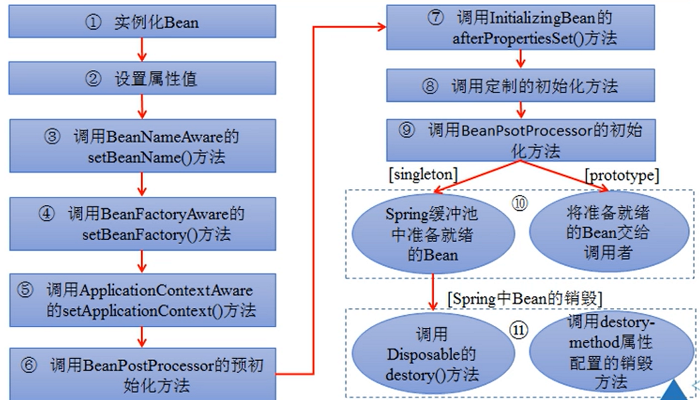

bean的作用域

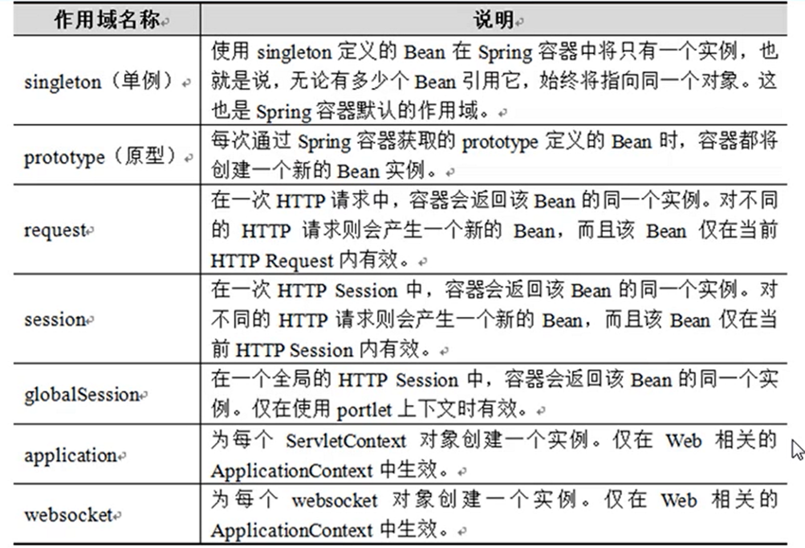

Bean设置

XML装配

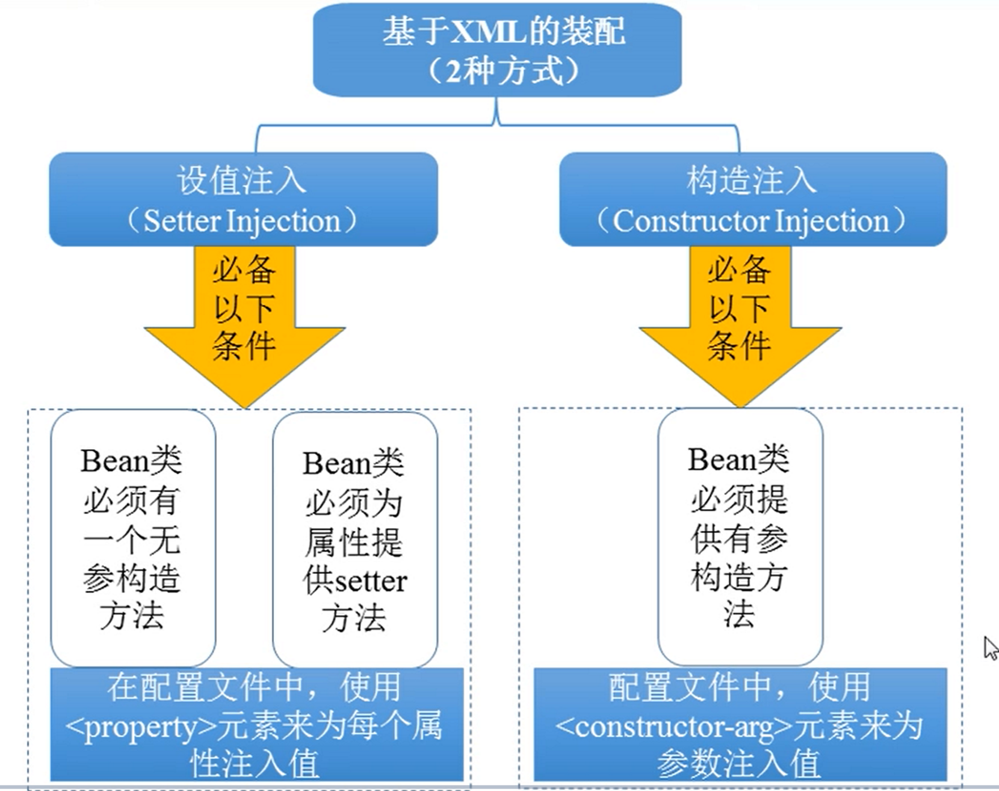

所有配置均在XML过于臃肿出现了注解

Annotation的装配

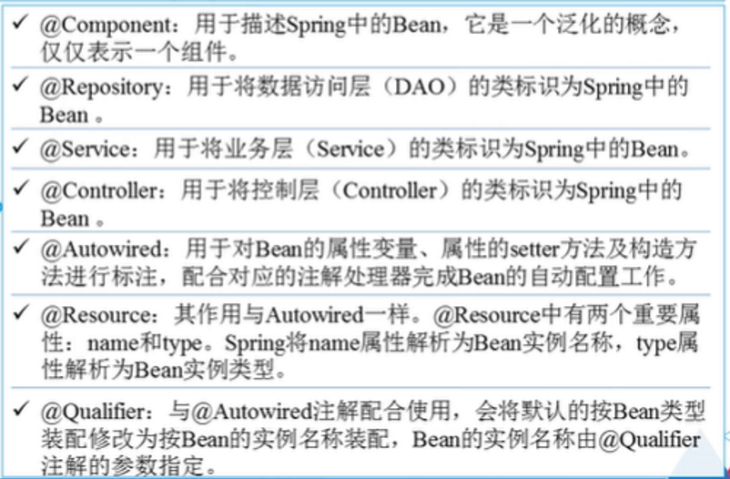

# AOP

AOP概念和作用及术语

AOP采用横向抽取机制，将分散在各个方法中的重复代码提取出来，然后在程序编译或运行时，再将这些提取出来的代码应用到需要执行的地方。

AOP是一种新的思想，但却不是OOP的替代，是它的扩展和延伸。

AOP可以使开发人员专心于核心业务，而不用关注其他业务逻辑，

术语：

* Aspect(切面)：指封装的用于横向插入系统功能的类
* Joinpoint(连接点):对象的一个操作
* Pointcut(切入点):指切面与程序流程的交叉点，即那些需要处理的连接点。
* Advice(通知/增强处理):切面类中的方法，它是切面的具体实现
* Target Object(目标对象):指所有被通知的对象
* Proxy(代理):通知应用到目标对象后，被动态创建的对象
* Weaving(织入):切面代码插入到目标对象上,从而生成代理对象的过程

## 代理应用

Spring 中的 AOP 代理默认就是使用 JDK 动态代理的方式来实现的。在Spring中，使用 Proxy FactoryBean 是创建 AOP 代理的最基本方式。

通知类型

* org. aopall iance. intercept. Method Interceptor
* (环绕通知) 在目标方法执行前后实施增强，可以应用于曰志、事务管理等功能。
* org.springframework.aop.MethodBeforeAdvice
  (前置通知) 在目标方法执行前实施增强，可以应用于权限管理等功能。
* org.springframework.aop.AfterReturningAdvice
  (后置通知) 在目标方法执行后实施增强，可以应用于关闭流、上传文件、删除临时文件等功能。
* org.springframework.aop.ThrowsAdvice
  (异常通知) 在方法抛出异常后实施增强，可以应用于处理异常记录曰志等功能。
* org .springframework.aop.1 ntroduction Interceptor
* (引介通知) 在目标类中添加一些新的方法和属性，可以应用于修改老版本程序(增强类)。

ProxyFactoryBean是 FactoryBean 接口的实现类， FactoryBean 负责实例化一个Bean ，而ProxyFactoryBean 负责为其他 Bean 创建代理实例。

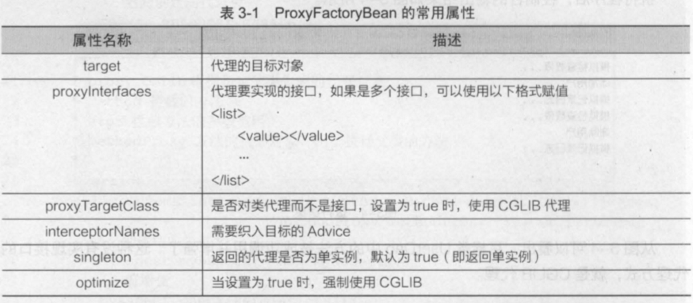

```java
public class MyAspectimplementsMethodlnterceptor {
    @Override  
    publicObjectinvoke(Methodlnvocation  mi)throwsThrowable{ 
        checkPermissions();  //执行目标方法 Object
        obj=mi.proceed();  
        log();  
        return obj;  
    } 
    public voidcheckPermissions(){ 
        System.out.println("模拟检查权限. . . ");
        } 
    public voidlog(){ 
        System.out.println("模拟记录日志. . . ");
    } 
}
```

## 配置

### XML

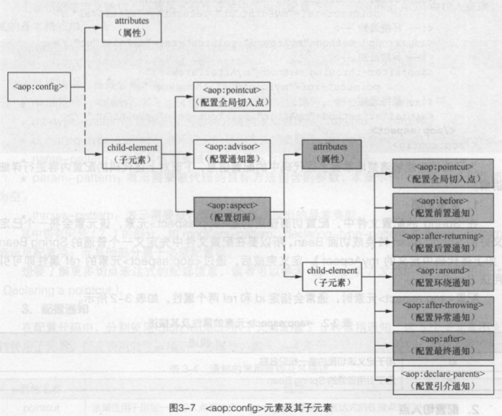


Spring
配置文件中的`<beans>`元素下可以包含多个[aop:config](aop:config)元素

配置切面使用的是[aop:aspect](aop:aspect)元素。

`<beans>`元素下可以包含多个[aop:config](aop:config)元素,配置[aop:aspect](aop:aspect)元素时，
通常会指定 id 和 ref 两个属性.

id=用于定义该切面的唯一标识名称

ref=用于引用普通的 Spring
Bean

切入点是通过[aop:pointcut](aop:pointcut)元素来定义的。

当 [aop:pointcut](aop:pointcut) 元素作[aop:config](aop:config)元素的子元素定义时，表示该切入点是全局切入点，它可被多个切面所共享；

当 [aop:pointcut](aop:pointcut)元素作为 [aop:aspect](aop:aspect)元素的子元素时，表示该切入点只对当前切面有效。

指定 id 和 expresslon 两个属性

id=用于指定切入点的唯一标识名称

expression=用于指导切入点关联的切入点表达式

[aop:aspect](aop:aspect)的子元素配置了 5 种常用通知。

* pointcut=该属性用于指定一个切入点表达式， Spring将在匹配该表达式的连接点时织入该通知
* pointcut-ref=该属性指定一个已经存在的切入点名称,如配置代码中的myPointCut。通常pointcut和Pointcut-ref两个属性只需要使用冥中之一
* method=该属性指定一个方法名，指定将切面 Bean中的该方法转换为增强处理
* throwing=该属性只对 `<after-throwing>`元素有效,它用于指定一个形参名,异常通知方法可以通过该形参访问目标方法所抛出的异常。
* returning=该属性只对 `<after-returning>`元素有效,它用于指定一个形参名,后置通知方法可以通过该形 参访问目标方法的返回值

### AspectJ的注解

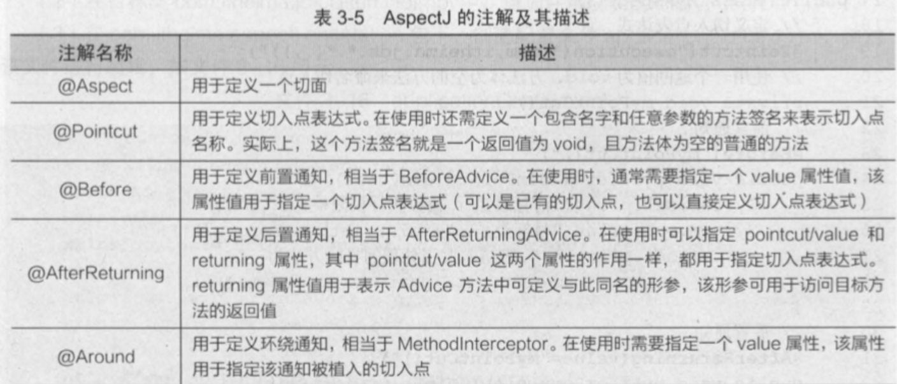


<!-指定需要扫描的包，使注解生效-〉

<context:component-scan base-package="com.itheima" />

< !-启动基于注解的声明式 AspectJ 支持-〉

<aop:aspectj-autoproxy />

## AOP切面实现

AOP的实现方式有三种：

* XML配置
* Cglib代理实现
* JDK代理实现

共同之处在于，最后都通过BeanPostProcessor的两个核心方法：postProcessBeforeInstantiation和postProcessAfterInitialization

首先AOP是基于IOC的Bean加载来实现的，所以在InstantiationAwareBeanPostProcessor和 BeanPostProcessor 这两个接口实现

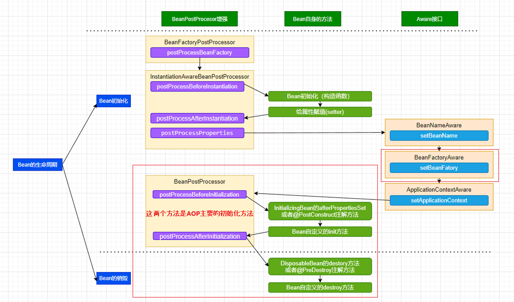

AopNamespaceHandler方法，用于解aop配置标签的解析,如下方法解析aop的xml元素（使用xml方式调用到这里）

```java
@Override
        public void init() {
                // In 2.0 XSD as well as in 2.5+ XSDs
	            // 注册解析<aop:config> 配置
                registerBeanDefinitionParser("config", new ConfigBeanDefinitionParser());
	            // 注册解析<aop:aspectj-autoproxy> 配置
                registerBeanDefinitionParser("aspectj-autoproxy", new AspectJAutoProxyBeanDefinitionParser());
                registerBeanDefinitionDecorator("scoped-proxy", new ScopedProxyBeanDefinitionDecorator());
                // Only in 2.0 XSD: moved to context namespace in 2.5+
                registerBeanDefinitionParser("spring-configured", new SpringConfiguredBeanDefinitionParser());
        }
```

* 由IOC Bean加载方法栈中找到parseCustomElement方法，找到parse aop:aspectj-autoproxy的handler(org.springframework.aop.config.AopNamespaceHandler)
* AopNamespaceHandler注册了<aop:aspectj-autoproxy />的解析类是AspectJAutoProxyBeanDefinitionParser
* AspectJAutoProxyBeanDefinitionParser的parse 方法 通过AspectJAwareAdvisorAutoProxyCreator类去创建
* AspectJAwareAdvisorAutoProxyCreator实现了两类接口，BeanFactoryAware和BeanPostProcessor；根据Bean生命周期方法找到两个核心方法：postProcessBeforeInstantiation和postProcessAfterInitialization
  1. postProcessBeforeInstantiation：主要是处理使用了@Aspect注解的切面类，然后将切面类的所有切面方法根据使用的注解生成对应Advice，并将Advice连同切入点匹配器和切面类等信息一并封装到Advisor
  2. postProcessAfterInitialization：主要负责将Advisor注入到合适的位置，创建代理（cglib或jdk)，为后面给代理进行增强实现做准备。

postProcessAfterInitialization方法，即Spring
AOP的代理（cglib或jdk)的创建过程

* 如果bean被子类标识为代理，则使用配置的拦截器创建一个代理（调用wrapIfNecessary方法）
* wrapIfNecessary方法主要用于判断是否需要创建代理，如果Bean能够获取到advisor才需要创建代理
  * 该方法将会判断该bean是通过TargetSource接口获取
  * 判断Bean是切面类
  * 判断是否为AOP基础类，是否跳过
  * 再获取所有advisor，如果没有获取到，那说明不要进行增强，也就不需要代理了
    * getAdvicesAndAdvisorsForBean该方法为获取所有advisor
    * 通过findEligibleAdvisors，如果获取不到返回DO_NOT_PROXY，其中最关键的方法为
      * findCandidateAdvisors方法用于获取所有切面类的切面方法生成Advisor
      * findAdvisorsThatCanApply方法用于找到这些Advisor中能够应用于beanClass的
        * 遍历获取到的所有Advisor，返回通过Introduction实现的advice和是否能够应用于clazz的Advice
  * 获取成功后创建代理

wrapIfNecessary重点

```java
// 重点：获取所有advisor，如果没有获取到，那说明不要进行增强，也就不需要代理了。
  Object[] specificInterceptors = getAdvicesAndAdvisorsForBean(bean.getClass(), beanName, null);
  if (specificInterceptors != DO_NOT_PROXY) {
    this.advisedBeans.put(cacheKey, Boolean.TRUE);
    // 重点：创建代理
    Object proxy = createProxy(
        bean.getClass(), beanName, specificInterceptors, new SingletonTargetSource(bean));
    this.proxyTypes.put(cacheKey, proxy.getClass());
    return proxy;
  }
```


* 获取成功后createProxy
* 调用proxyFactory.getProxy
* 依据条件创建代理，调用DefaultAopProxyFactory.createAopProxy

Spring默认在目标类实现接口时是通过JDK代理实现的，只有非接口的是通过Cglib代理实现的。当设置proxy-target-class为true时在目标类不是接口或者代理类时优先使用cglib代理实现。

```java
@Override
public AopProxy createAopProxy(AdvisedSupport config) throws AopConfigException {
  if (!NativeDetector.inNativeImage() &&
      (config.isOptimize() || config.isProxyTargetClass() || hasNoUserSuppliedProxyInterfaces(config))) {
    Class<?> targetClass = config.getTargetClass();
    if (targetClass == null) {
      throw new AopConfigException("TargetSource cannot determine target class: " +
          "Either an interface or a target is required for proxy creation.");
    }
    if (targetClass.isInterface() || Proxy.isProxyClass(targetClass)) {
      return new JdkDynamicAopProxy(config);
    }
    return new ObjenesisCglibAopProxy(config);
  }
  else {
    return new JdkDynamicAopProxy(config);
  }
}
```

### (AOP)cglib代理

代理模式(Proxypattern): 为另一个对象提供一个替身或占位符以控制对这个对象的访问.

动态代理：在程序运行期，创建目标对象的代理对象，并对目标对象中的方法进行功能性增强的一种技术.

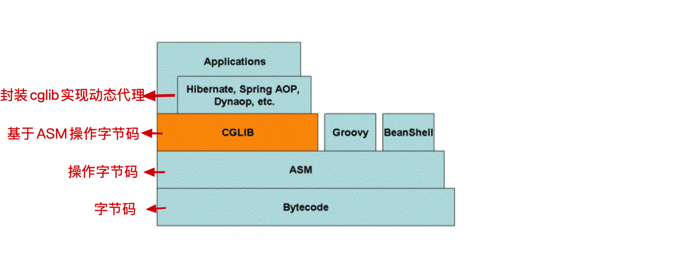

Cglib是一个强大的、高性能的代码生成包，它广泛被许多AOP框架使用，为他们提供方法的拦截。

* 最底层是字节码，字节码相关的知识请参考
  JVM基础 - 类字节码详解
* ASM是操作字节码的工具
* cglib基于ASM字节码工具操作字节码（即动态生成代理，对方法进行增强）
* SpringAOP基于cglib进行封装，实现cglib方式的动态代理

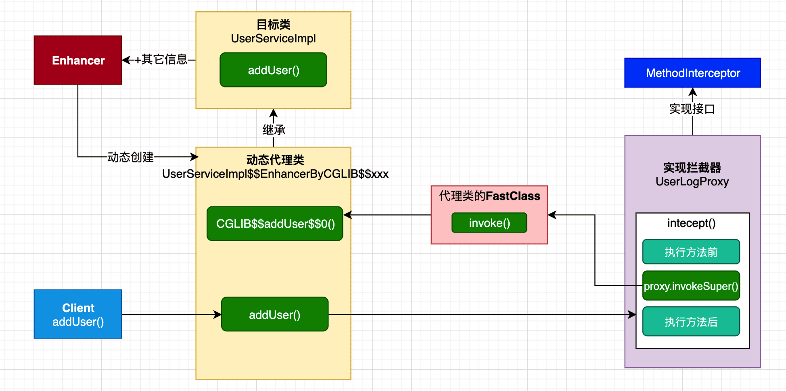


CglibAopProxy的getProxy方法

获取callback的方法如下，提几个理解的要点吧

* rootClass:即目标代理类(Class<?>rootClass = this.advised.getTargetClass();)
* advised:包含上文中我们获取到的advisor增强器的集合

//设置callback回调接口，即方法的增强点

    Callback[] callbacks =getCallbacks(rootClass);

* exposeProxy:
  在xml配置文件中配置的，背景就是如果在事务A中使用了代理，事务A调用了目标类的的方法a，在方法a中又调用目标类的方法b，方法a，b同时都是要被增强的方法，如果不配置exposeProxy属性，方法b的增强将会失效，如果配置exposeProxy，方法b在方法a的执行中也会被增强了(booleanexposeProxy = this.advised.isExposeProxy();)
* DynamicAdvisedInterceptor:
  拦截器将advised(包含上文中我们获取到的advisor增强器)构建配置的AOP的callback（第一个callback(Callback aopInterceptor = newDynamicAdvisedInterceptor(this.advised);))
* targetInterceptor:xml配置的optimize属性使用的（第二个callback)
* 最后连同其它5个默认的Interceptor返回作为cglib的拦截器链，之后通过CallbackFilter的accpet方法返回的索引从这个集合中返回对应的拦截增强器执行增强操作。

CGLIB代理案例：

CGLIB是一个高性能开源的代码生成包，它采用非常底层的字节码技术，对指定的目标类生成一个子类，并对子类进行增强。

 代理类

```java
public class Cglibproxy implements Methodlnterceptor{  
        //代理方法
        public Object createProxy(Object target) 
                //创建一个动态类对象 
                Enhancer enhancer = new Enhancer(); 
                //确定需要增强的类，设置其父类 
                enhancer.setSuperclass(target.getClass());
                //添加回调函数
                enhancer.setCallback(this); 
                //返回创建的代理类
                return enhancer.create();
}
/**
* proxy CGlib 根据指定父类生成的代理对象
* method 拦截的方法
* args 拦截方法的参数数组
* methodProxy 方法的代理对象，用于执行父类的方法 
*/
@Override 
public Object intercept(Object proxy, Method method, Object[] args, 
        MethodProxy methodProxy) throws Throwable { 
        //创建切面类对象 
        MyAspect myAspect = new MyAspect(); 
        //前增强 
        myAspect.check Permissions(); 
        //目标方法执行 
        Object obj = methodProxy.invokeSuper(proxy, args); 
        //后增强 
        myAspect.log(); 
        return obj; 
        }
}

```

### (AOP)JDK代理


JDK动态代理是有JDK提供的工具类Proxy实现的，动态代理类是在运行时生成指定接口的代理类，每个代理实例（实现需要代理的接口）都有一个关联的调用处理程序对象，此对象实现了InvocationHandler，最终的业务逻辑是在InvocationHandler实现类的invoke方法上。

JDK代理的流程

* JDK代理自动生成的class是由sun.misc.ProxyGenerator来生成的。
* 调用了（gen.generateClassFile()）生成
  * 第一步：准备工作，将所有方法包装成ProxyMethod对象，包括Object类中hashCode、equals、toString方法，以及被代理的接口中的方法
  * 第二步：为代理类组装字段，构造函数，方法，static初始化块等
  * 第三步：写入class文件
* ProxyGenerator创建Proxy的具体类$Proxy0
* 由static初始化块初始化接口方法：2个接口中的方法，3个Object中的接口方法
* 由构造函数注入InvocationHandler
* 执行的时候，通过ProxyGenerator创建的Proxy，调用InvocationHandler的invoke方法，执行我们自定义的invoke方法

JDK动态代理

JDK 动态代理是通过java.lang.reflect. Proxy类来实现的,我们可以调用Proxy类的
newProxylnstanceO方法来创建代理对象。8

JDK代理
