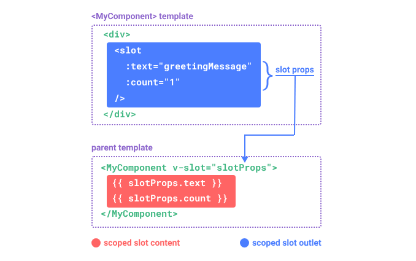

# 组件化

组件之间是独立的实例，相同组件创建的多个实例相互独立

## Props和Emits

一个组件需要显式声明它所接受的 props,这样 Vue 才能知道外部传入的哪些是 props

`<script setup>`的单文件组件中，props 可以使用 defineProps() 宏来声明

Vue 3 中推荐的方式，适用于 `<script setup>` 语法

```js
<script setup>
import { defineProps } from 'vue';

// 使用 defineProps 声明 props
defineProps({
  title: {
    type: String,
    required: true, // 必须传递
  },
  count: {
    type: Number,
    default: 0, // 默认值
  },
});
</script>
```

在普通 `<script>` 中使用 props 选项

```js
<script>
export default {
  props: {
    title: {
      type: String,
      required: true, // 必须传递
    },
    count: {
      type: Number,
      default: 0, // 默认值
    },
  },
};
</script>
```

简单声明方式

```js
<script>
export default {
  props: ['title', 'count'],
};
</script>
```

使用 PropType（Vue 3）
PropType 用于声明复杂类型（如对象、数组、自定义类型等）。
通过 Object as PropType<类型> 的方式指定类型。

```js
<script setup>
import { defineProps, PropType } from 'vue';

defineProps({
  user: {
    type: Object as PropType<{ name: string; age: number }>,
    required: true,
  },
});
</script>
```

### Props

所有的 props 都遵循着单向绑定原则，props 因父组件的更新而变化，自然地将新的状态向下流往子组件，而不会逆向传递。

每次父组件更新后，所有的子组件中的 props 都会被更新到最新值

* 所有 prop 默认都是【可选】的，除非声明了 required: true。
* Boolean 类型的未传递 prop 将被转换为 false。
* 未传递的可选 prop 将会有一个默认值 undefined。
* 可以声明了 default 值

父

```js
<template>
  <div>
    <h1>父组件</h1>
    <ChildComponent :count="42" />
  </div>
</template>

<script setup>
import ChildComponent from './ChildComponent.vue';
</script>
```

子

```js
<template>
  <div>
    <h2>子组件</h2>
    <p>计数：{{ count }}</p>
  </div>
</template>

<script setup>
defineProps({
    count: {
      type: Number, // 验证类型
      default: 0, // 默认值
    },
});
</script>
```

### Emits事件

组件可以显式地通过 defineEmits() 宏来声明它要触发的事件

`<template>` 中使用的 $emit 方法不能在组件的 `<script setup>` 部分中使用，但 defineEmits() 会返回一个emit函数供使用

语法emit(事件名,数据1,数据2,....)

子MyComponent

```js
<script setup>
const emit = defineEmits(['someEvent'])

function buttonClick() {
    count.++
  emit('someEvent',count.value)//触发事件
}
</script>
```

defineEmits() 宏不能在子函数中使用。如上所示，它必须直接放置在 `<script setup>` 的顶级作用域下

使用 $emit 方法触发自定义事件，或者@，v-on触发。

父

```js
<script setup>
const callback = ()=>{
    console.log("helle");
}
</script>
<template>
<button @click="$emit('someEvent')">Click Me</button>
<!-- 缩写 -->
<MyComponent @someEvent="callback" />
</template>
```

1. 子组件调用emit('事件名',date)
2. vue触发事件
3. 父组件的触发事件函数处理数据

emit约定，推荐使用kebab-case（短横线命名法）

### v-model双向绑定

v-model 可以在组件上使用以实现双向绑定。

#### defineModel方式

Vue 3.4 开始，推荐的实现方式是使用 defineModel() 宏

子组件Child

```js
<script setup>
//defineModel宏编译可以直接和父组件的v-model双向绑定
const model = defineModel()
</script>

<template>
  <div>Parent bound v-model is: {{ model }}</div>
</template>
```

父组件
v-model会直接绑定子组件的defineModel()

```js
<Child v-model="countModel" />
```

#### 传统方式

一个名为 modelValue 的 prop，本地 ref 的值与其同步；
一个名为 update:modelValue 的事件，当本地 ref 的值发生变更时触发。

子组件MyInput

```js
<script setup>
import { defineProps, defineEmits } from 'vue';
// 接收父组件传递的值
defineProps({
  modelValue: String, // 绑定的值类型,必须是modelValue名称。
});

// 定义事件，用于更新父组件的值，事件也必须是该事件名
const emit = defineEmits(['update:modelValue']);

//也可以用computed计算属性实现
const localValue = computed({
    get:() => modelValue,
    set:() => {
        emit('update:modelValue',value)
    }
})
</script>

<template>
  <input :value="modelValue" @input="emit('update:modelValue', $event.target.value)" placeholder="请输入内容" />
  <input v-model="localValue" placeholder="请输入内容" />
</template>
```

父

```js
    <!-- 使用 v-model 实现双向绑定 -->
     <MyInput v-model="inputValue"/>
```

inputValue就和modelValue绑定完成
如果需要多个属性绑定就需要重命名

```js
<UserName
  v-model:first-name="first"
  v-model:last-name="last"
/>
```

```js
<script setup>
const firstName = defineModel('firstName')
const lastName = defineModel('lastName')
</script>
```

## 插槽Slots

默认`v-slot="props"`有名称的插槽`v-slot:别名="props"`同`#别名="props"`

想要为子组件传递一些模板片段，让子组件在它们的组件中渲染这些片段

`<slot>` 元素是一个插槽出口 (slot outlet)，标示了父元素提供的插槽内容 (slot content) 将在何处被渲染。

```js
<!-- 子组件 -->
<button>
  <slot>
  这里可以的内容就是插槽的默认内容，父组件没有传递如何模板时显示。
  </slot> <!-- 插槽出口 -->
</button>
```

### 具名插槽

一个组件中包含多个插槽出口是很有用

```js
<!-- BaseLayout.vue -->
<template>
  <header>
    <!-- 插槽内容无法访问子组件的数据 -->
    <slot name="header"></slot>
  </header>
  <main>
    <slot></slot>
  </main>
  <footer>
    <slot name="footer"></slot>
  </footer>
</template>
```

```js
<!-- 父组件 -->
<BaseLayout>
  <template v-slot:header>
    <!-- header 插槽的内容放这里 -->
    <!-- 可以简写为#:header -->
  </template>
</BaseLayout>
```

v-slot 有对应的简写 #
`<template v-slot:header>` 可以简写为 `<template #header>`

### 作用域

默认插槽：父组件传入模板，子组件直接渲染。

作用域插槽：父组件定义模板，子组件向模板传递数据（通过插槽属性），使父组件能访问子组件内部的数据。

> 父组件模板中的表达式只能访问父组件的作用域；子组件模板中的表达式只能访问子组件的作用域。

通过子组件标签上的 v-slot 指令，直接接收到了一个插槽 props 对象



子组件传入插槽的 props 作为了 v-slot 指令的值，可以在插槽内的表达式中访问

## 动态组件

vue通过`<component :is=""></component>` 来实现

```vue
<!-- currentTab 改变时组件也改变 -->
<component :is="tabs[currentTab]"></component>
```

在上面的例子中，被传给 :is 的值可以是被注册的组件名或者导入的组件对象

当使用 `<component :is="...">` 来在多个组件间作切换时，被切换掉的组件会被卸载。我们可以通过 `<KeepAlive>` 组件强制被切换掉的组件仍然保持“存活”的状态。

### 条件渲染vs动态组件

|特性|条件渲染 (v-if / v-show)|动态组件 (`<component>`)|
| ---| ---|----|
| 组件的创建和销毁|`v-if` 条件为 false 时，组件会被销毁;`v-show` 只是通过 CSS 的 display: none 隐藏|动态组件默认会销毁，结合 `<keep-alive>` 可缓存|
|适用场景|`v-if`适合组件切换频率较低;`v-show`适合频繁切换显示/隐藏|适合需要动态切换多个组件|
|性能|v-if 性能较高;v-show 性能较低|动态组件性能取决于是否使用缓存|
|状态保留|v-if 会丢失状态;v-show 保留状态|可通过 `<keep-alive>` 保留状态|

### 异步组件
