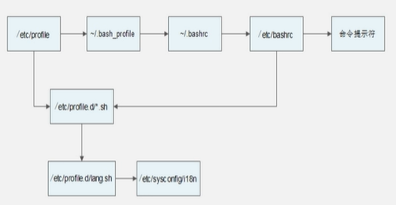

# shell基础

## shell脚本的执行方式

1、echo输出命令
[root@localhost ~]# echo [选项] [输出内容]
选项:
-e：支持反斜线控制的字符转换

2、第一个脚本

```shell
[root@localhost sh]# vi hello.sh
#!/bin/Bash
#The first program
#Author: shenchao ( E-mail: shenchao@lampbrother.net)
echo -e "Mr. Shen Chao is the most honest man in LampBrother"
```

3、脚本执行
赋予执行权限，直接运行
chmod 755 hello.sh
./hello.sh 
通过Bash调用执行脚本
bash hello.sh

win的回车是^M，linux中是$
可用dos2unix(dos to unix)可解决

## Bash的变量

Bash 是一种 Shell 程序,Bash 是sh的扩充

### 变量分类

1. 用户自定义变量
2. 环境变量:这种变量中主要保存的是和系统操作环境相关的数据。
3. 位置参数变量:这种变量主要是用来向脚本当中传递参数或数据的，变量名不能自定义，变量作用是固定的。
4. 预定义变量:是Bash中已经定义好的变量，变量名不能自定义，变量作用也是固定的。

### 自定义变量

1. 变量名称可以由字母、数字和下划线组成， 但是不能以数字开头。如果变量名是“2name”则是错误的。
2. 在Bash中，变量的默认类型都是字符串型，如果要进行数值运算，则必修指定变量类型为数值型。
3. 变量用等号连接值，等号左右两侧不能有空格。
4. 变量的值如果有空格，需要使用单引号或双引号包括。
5. 在变量的值中，可以使用“\”转义符。
6. 如果需要增加变量的值，那么可以进行变量值的叠加。不过变量需要用双引号包含“$变量名”或用${变量名}包含。
• 变量调用
    [root@localhost ~]# echo $name
• 变量查看
    [root@localhost ~]# set
• 变量删除
    [root@localhost ~]# unset name

### 环境变量

用户自定义变量只在当前的ShellI中生效,而环境变量会在当前Shell和这个Shell的所有子Shell当中生效。如果把环境变量写入相应的配置文件，那么这个环境变量就会在所有的Shell中生效。

```shell
export  变量名=变量值。
#申明变量

env
#查询变量

unset  变量名
#删除变量

PATH:系统查找命令的路径
    [root@localhost ~]# echo $PATH
    /usr/lib/qt-3.3/bin:/usr/local/sbin:/usr/local/bin:/sbin:/bin:/usr/sbin:/usr/bin:/root/bin
    PATH= "$PATH":/root/sh
    #PATH变量叠加
```

> PS1:定义系统提示符的变量
> 
> - \d: 显示日期，格式为“星期月日
> - \h: 显示简写主机名。如默认主机名“localhost”
> - \t: 显示24小时制时间，格式为“HH:MM:SS”
> - \T: 显示12小时制时间，格式为“HH:MM:SS"
> - \A: 显示24小时制时间，格式为“HH:MM”
> - \u: 显示当前用户名
> - \w: 显示当前所在目录的完整名称
> - \W: 显示当前所在目录的最后一个目录
> - \#:执行的第几个命令
> - \$: 提示符。如果是root用户会显示提示符为“#”，如果是普通用户会显示提示符为“$”

### 位置参数变量

| 位置参数变量 | 作用                                                                                          |
| :----------: | --------------------------------------------------------------------------------------------- |
|      $n      | 为数字，`$0`代表命令本身，`$1-$9`代表第一到第九个参数，十以上的参数需要用大括号包含，如${10}. |
|      $*      | 这个变量代表命令行中所有的参数，$*把所有的参数看成一个整体                                  |
|      $@      | 这个变量也代表命令行中所有的参数，不过$@把每个参数区分对待                                    |
|      $#      | 这个变量代表命令行中所有参数的个数                                                            |

### 预定义变量

| 预定义变量 | 作用                                                                                                                                                               |
| :--------: | ------------------------------------------------------------------------------------------------------------------------------------------------------------------ |
|     $?     | 最后一次执行的命令的返回状态。如果这个变量的值为0，证明上一个命令正确执行；如果这个变量的值为非0（具体是哪个数，由命令自己来决定），则证明上一个命令执行不正确了。 |
|     $$     | 当前进程的进程号（PID）                                                                                                                                            |
|     $!     | 后台运行的最后一个进程的进程号（PID）                                                                                                                              |

## read命令获取输入

`[root@localhost ~]# read [选项] [变量名]`
选项:
-p：“提示信息”在等待read输入时,输出提示信息
-t：秒数: read命 令会一直等待用户输入, 使用此选项可以指定等待时间
-n：字符数:read命令只接受指定的字符数，就会执行
-S：隐藏输入的数据，适用于机密信息的输入

## declare命令声明变量类型

`[root@localhost ~]# declare [+/-][选项]变量名`
选项：
-：给变量设定类型属性.
+：取消变量的类型属性.
-i：将变量声明为整数型( integer)
-X：将变量声明为环境变量
-P：显示指定变量的被声明的类型

## 数值运行方法

方法一：使用declare定义变量类型
    [root@localhost ~]# aa=11
    [root@localhost ~]# bb=22
    #给变量aa和bb赋值
    [root@localhost ~ ]# declare -i cc=$aa+$bb
方法二：expr或let数值运算工具
    [root@localhost ~]# aa=11
    [root@localhost ~]# bb=22
    #给变量aa和变量bb赋值
    [root@localhost ~]# dd=$(expr $aa + $bb)
    #dd的值是aa和bb的和。注意“+”号左右两侧必须有空格
方法三：
    [root@localhost ~]# aa=11
    [root@localhost ~]# bb=22
    [root@localhost ~]# ff= $(( $aa+$bb ))
    [root@localhost ~]# gg=$[ $aa+$bb]

## 运算符

| 优先级 | 运算符                                   | 说明                               |
| ------ | ---------------------------------------- | ---------------------------------- |
| 13     | -,+                                      | 单目负、单目正                     |
| 12     | !,~                                      | 逻辑非、按位取反或补码             |
| 11     | *,/,%                                    | 乘、除、取模                       |
| 10     | +,-                                      | 加、减                             |
| 9      | <<,>>                                    | 按位左移、按位右移                 |
| 8      | <=，>=，>，<                             | 小于或等于、大于或等于、小于、大于 |
| 7      | ==,!=                                    | 等于、不等于                       |
| 6      | &                                        | 按位与                             |
| 5      | ^                                        | 按位异或                           |
| 4      | &#124;                                   | 按位或                             |
| 3      | &&                                       | 逻辑与                             |
| 2      | &#124;&#124;                             | 逻辑或                             |
| 1      | '=,+=,-=,*=,/=,%=,&=,^=, &#124;=,<<=,>=' | 赋值、运算且赋值                   |

## 变量测试与置换

| 变量置换方式 | 变量y没有设置                    | 变量y为空值            | 变量y设置值  |
| ------------ | -------------------------------- | ---------------------- | ------------ |
| x=${y-新值}  | x=新值                           | x为空                  | x=$y         |
| x=${y:-新值} | x=新值                           | x=新值                 | x=$y         |
| x=${y+新值}  | x为空                            | x=新值                 | x=新值       |
| x=${y:+新值} | x为空                            | x为空                  | x=新值       |
| x=${y=新值}  | x=新值 y=新值                    | x为空 y值不变          | x=$y y值不变 |
| x=${y:=新值} | x=新值 y=新值                    | x=新值 y=新值          | x=$y y值不变 |
| x=${y?新值}  | 新值输出到标准错误 输出(就是屏幕) | x为空                  | x=$y         |
| x=${y:?新值} | 新值输出到标准错误 输出           | 新值输出到标准错误 输出 | x=$y         |

## Bash的基本功能

### 历史

1、历史命令
`[root@localhost ~]# history [选项] [历史命令保存文件]`
选项:
-C：清空历史命令
-W：把缓存中的历史命令写入历史命令保存文件
    ~/.bash_history

历史命令默认会保存1000条，可以在环境变量配置文件/etc/profile中进行修改

历史命令的调用
使用上、下箭头调用以前的历史命令
使用"!n”重复执行第n条历史命令
使用“!!” 重复执行上一条命令
使用“!字串”重复执行最后一 条以该字串开头的命令

2、命令与文件补全
在Bash中，命令与文件补全是非常方便与常用的功能，我们只要在输入命令或文件时，按“Tab” 键就会自动进行补全

### 别名

1、命令别名

```bash
[root@localhost ~]# alias 别名='原命令'
#设定命令别名
[root@localhost ~ ]# alias
#查询命令别名
```

命令执行时顺序
    1. 第一顺位执行用绝对路径或相对路径执行的命令。
    2. 第二顺位执行别名。
    3. 第三顺位执行Bash的内部命令。
    4. 第四顺位执行按照$PATH环境变量定义的目录查找顺序找到的第一一个命令。

让别名永久生效
`[root@localhost ~]# vi /root/. bashrc`

删除别名
`[root@localhost ~]# unalias 别名`

### 输出与输入重定向

1. 输出重定向

| 类型                       | 符号                 | 作用                                                       |
| -------------------------- | -------------------- | ---------------------------------------------------------- |
| 标准输出重定向             | 命令>文件            | 以覆盖的方式，把命令的正确输出输出到指定的文件或设备当中。 |
|                            | 命令>>文件           | 以追加的方式，把命令的正确输出输出到指定的文件或设备当中。 |
| 标准错误输出重定向         | 错误命令2>文件       | 以覆盖的方式，把命令的错误输出输出到指定的文件或设备当中。 |
|                            | 错误命令2>>文件      | 以追加的方式，把命令的错误输出输出到指定的文件或设备当中。 |
| 正确输出和错误输出同时保存 | 命令>文件2>&1        | 以覆盖的方式，把正确输出和错误输出都保存到同一个文件当中。 |
|                            | 命令>>文件2>&1       | 以追加的方式，把正确输出和错误输出都保存到同一个文件当中。 |
|                            | 命令&>文件           | 以覆盖的方式，把正确输出和错误输出都保存到同一个文件当中。 |
|                            | 命令&>>文件          | 以追加的方式，把正确输出和错误输出都保存到同一个文件当中。 |
|                            | 命令>>文件1 2>>文件2 | 把正确的输出追加到文件1中，把错误的输出追加到文件2中。     |

2. 输入重定向

|符号 | 说明|
| ---- | ---- |
| `command <file` | 将 file 文件中的内容作为 command 的输入。|
| `command <<END` | 从标准输入（键盘）中读取数据，直到遇见分界符 END 才停止（分界符可以是任意的字符串，用户自己定义）。|
| `command <file1 >file2` | 将 file1 作为 command 的输入，并将 command 的处理结果输出到 file2。|

### 多命令顺序执行

| 多命令执行符 | 格式             | 作用                                                                       |
| :----------: | ---------------- | -------------------------------------------------------------------------- |
|      :       | 命令1:命令2      | 多个命令顺序执行，命令之间没有任何逻辑联系                                 |
|      &&      | 命令1&&命令2     | 逻辑与 当命令1正确执行，则命令2才会执行 当命令1执行不正确，则命令2不会执行 |
| &#124;&#124; | 命令1&#124;命令2 | 逻辑或 当命令1执行不正确，则命令2才会执行当命令1正确执行，则命令2不会执行  |

`[root@localhost ~]# dd if=输入文件of=输出文件bs=字节数count=个数`
选项:
    if-输入文件     指定源文件或源设备
    of=输出文件   指定目标文件或目标设备
    bs=字节数      指定一次输入/输出多少字节，即把这些字节看做一个数据块
    count=个数     指定输入/输出多少个数据块;
例子:
    `[root@localhost ~]# date ; dd if=/dev/zero of=/root/testfile bs= 1k count 100000 ;`
date

### 管道符号

命令格式:
`[root@localhost ~]#命令1 | 命令2`
#命令1的正确输出作为命令2的操作对象

### 颜色显示

`[root@localhost ~]# grep [选项] "搜索内容"  文件名`
选项:
    -i：忽略大小写
    -n：输出行号
    -V：反向查找
    --color= auto：搜索出的关键字用颜色显示

### 通配符

| 通配符 | 作用                                                                                   |
| ------ | -------------------------------------------------------------------------------------- |
| ?      | 匹配一个任意字符                                                                       |
| *      | 匹配0个或任意多个任意字符，也就是可以匹配任何内容                                      |
| []     | 匹配中括号中任意一个字符。例如：[abc]代表一定匹配一个字符，或者是a，或者是b，或者是c。 |
| [-]    | 匹配中括号中任意一个字符，-代表一个范围。例如：[a—z]代表匹配一个小写字母。             |
| [^]    | 逻辑非，表示匹配不是中括号内的一个字符。例如：[^0—9]代表匹配一个不是数字的字符。       |

### Bash中其他特殊符号

| 符号  | 作用                                                                                                                    |
| :---: | ----------------------------------------------------------------------------------------------------------------------- |
|  ''   | 单引号。在单引号中所有的特殊符号，如“$”和“`”（反引号）都没有特殊含义。                                                  |
|  ""   | 双引号。在双引号中特殊符号都没有特殊含义，但是“$”、“`”和“\”是例外，拥有“调用变量的值”、“引用命令”和“转义符”的特殊含义。 |
|  ``   | 反引号。反引号括起来的内容是系统命令，在Bash中会先执行它。和$()作用一样，不过推荐使用$()，因为反引号非常容易看错。      |
|  $()  | 和反引号作用一样，用来引用系统命令。                                                                                    |
|   #   | 在Shell脚本中，#开头的行代表注释。                                                                                      |
|   $   | 用于调用变量的值，如需要调用变量name的值时，需要用$name的方式得到变量的值。                                             |
|   \   | 转义符，跟在\之后的特殊符号将失去特殊含义，变为普通字符。如$将输出“$”符号，而不当做是变量引用。                         |

## 环境变量配置文件

### 简介

环境变量配置文件中主要是定义对系统的操作环境生效的系统默认环境变量，比如PATH、HISTSIZE、 PS1、 HOSTNAME等默认环境变量。

### 文件

/etc/profile
/etc/profile.d/*.sh
~/.bash profile
~/.bashrc
/etc/bashrc

**执行顺序**


**作用**
`/etc/profile`是永久性的环境变量，是全局变量
配置
    USER变量:
    LOGNAME变量:
    MAIL变量:
    PATH变量:
    HOSTNAME变量:
    HISTSIZE变量: 
    umask:
    调用`/etc/prfile.d/*.sh`文件

- `/etc/profile.d/*.sh`存在大量sh文件并一并读取出来,最主要的是`/etc/profile.d/lang.sh`定义系统语言的脚本又调用了`/etc/sysconfig/il8n`，该文件是定义了当前系统的语言。
- `~/.bash_profile`只对当前用户生效调用了`~/.bashrc`文件。在PATH变量后面加入了`:$HOME/bin`这个目录
- `~/.bashrc`同上定义默认别名调用/etc/bashrc
- `/etc/bashrc`PS1变量umask:PATH变量调用`/etc/profile.d/*.sh`文件和第一文件差不多但是定义的是没有登录用户和密码的

### source命令——使配置文件生效

`[root@localhost ~]# source 配置文件`或`[root@localhost ~]# . 配置文件`其他配置文件
`~/.bash_logout`注销时生效的，作用注销时执行
`~/bash_history`历史命令保存文件

### shell登录信息

本地终端欢迎信息：/etc/issue

| 转义符 | 作用                             |
| :------: | -------------------------------- |
| \d     | 显示当前系统日期                 |
| \s     | 显示操作系统名称                 |
| \l     | 显示登录的终端号，这个比较常用。 |
| \m     | 显示硬件体系结构，如i386、i686等 |
| \n      | 显示主机名                       |
| \o     | 显示域名                         |
| \r      | 显示内核版本                     |
| \t     | 显示当前系统时间                 |
| \u      | 显示当前登录用户的序列号         |

远程终端欢迎信息: `/etc/issue.net`
    - 转义符在`/etc/issue.net`文件中不能使用.
    - 是否显示此欢迎信息，由ssh的配置文件`/etc/ssh/sshd config`决定， 加入“Banner/etc/issue.net"行才能显示( 记得重启SSH服务)
登陆后欢迎信息: `/etc/motd`
不管是本地登录，还是远程登录，都可以显示此欢迎信息
