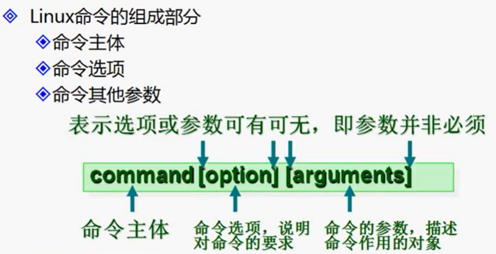
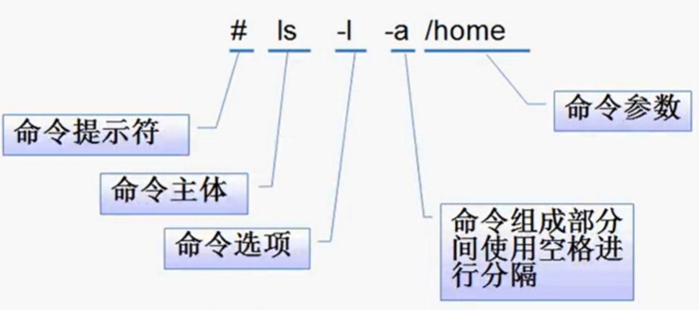
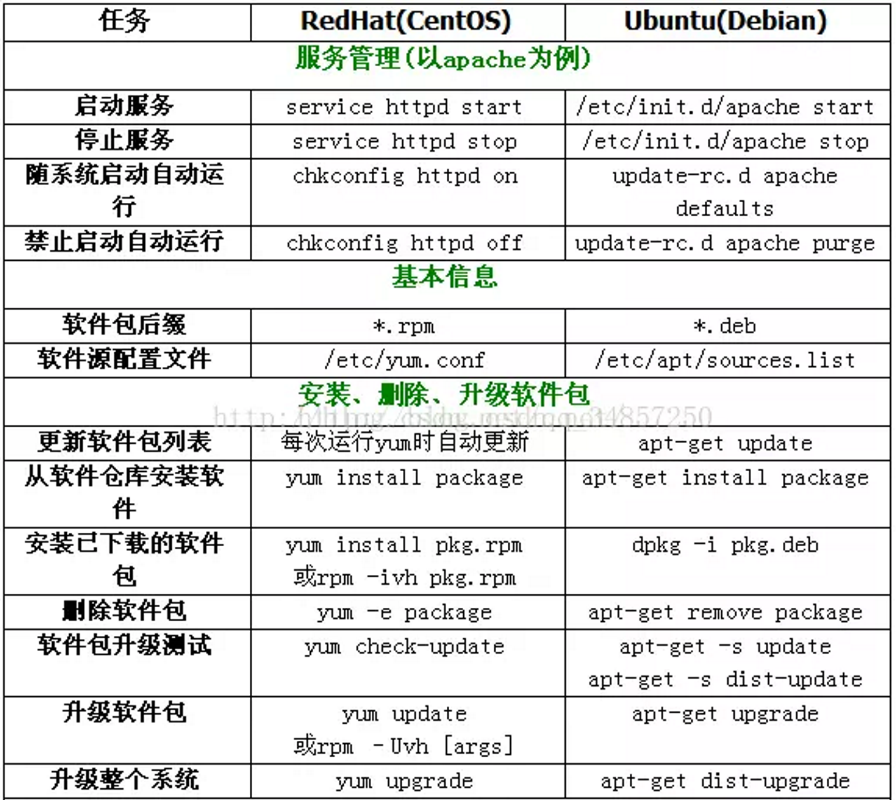
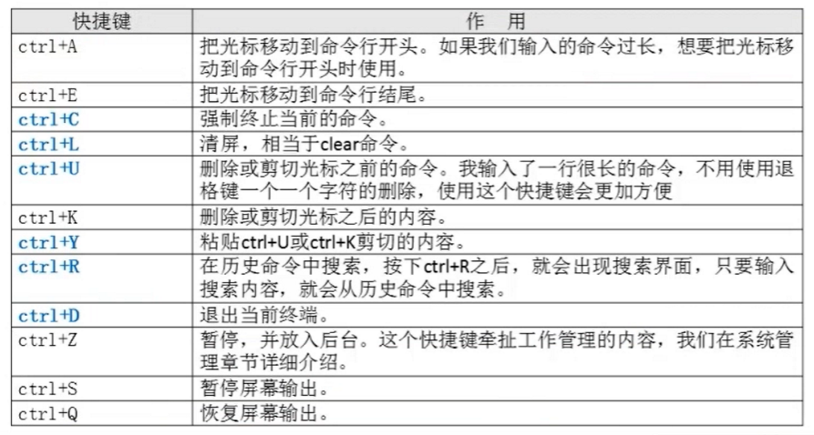

# Liunx基础

## 基本命令

补全命令：`Tob` 按键

帮助手册：命令 --help/-h  （内置命令可行）

分页查看： |more（跟在其他命令后面）

过滤： | grep

强制退出命令：ctrl+c（前端命令）

退出当前用户：ctrl+d

sudo
su是当前用户暂时申请root权限，所以输入的不是root用户密码，而是当前用户的密码。su是申请切换root用户，需要申请root用户密码。

|管道符：将命令的结果输出给另一个命令作为输入命令每组成部分之间必须用空格隔开以回车结束

> linux下不要打空格不要用中文

"~"也表示为 home 目录 的意思，"." 则是表示目前所在的目录，".." 则表示目前目录位置的上一层目录。

### CentOS和ubuntu

## 系统文件

* etc/inittab
* 修改系统默认运行级别
* id:3:initdefault:

## 快捷键

## 输入输出

| 设备   | 设备文件名  | 文件描述符 | 类型         |
| ------ | ----------- | ---------- | ------------ |
| 键盘   | /dev/stdin  | 0          | 标准输入     |
| 显示器 | /dev/sdtout | 1          | 标准输出     |
| 显示器 | /dev/sdterr | 2          | 标准错误输出 |

## 文件和目录的权限

| 代表字符 | 权限     | 对文件的含义     | 对目录的含义               |
| -------- | -------- | ---------------- | -------------------------- |
| r        | 读权限   | 可以查看文件内容 | 可以列出目录中的内容       |
| W        | 写权限   | 可以修改文件内容 | 可以在目录中创建、删除文件 |
| X        | 执行权限 | 可以执行文件     | 可以进入目录               |

* r和x在目录中会同时存在

| 代表字符  | R                           | W                       | X               |
| --------- | --------------------------- | ----------------------- | --------------- |
| file      | cat、more、head、tail、less | vim                     | script、command |
| directory | ls                          | touch、mkdir、rmdir、rm | cd              |

* 对文件进行更改是文件的权限而对文件进行创建和删除则需要文件所在目录的权限
* 缺省创建的文件是没有可执行文件的
* 目录权限rw-r--r--
* 文件权限rwxr-xr-x

> 文件所有权限:文件的默认的所有者和所有者的默认组是创建文件是用户

## 文件及目录命令

### 目录命令

`ls 选项[-ald][文件或目录]`命令用于显示指定工作目录下之内容（列出目前工作目录所含之文件及子目录)
选项与参数：

* -a 全部的文件，连同隐藏文件( 开头为 . 的文件) 一起列出来(常用)
* -d 仅列出目录本身，而不是列出目录内的文件数据(常用)
* -l 长数据串列出，包含文件的属性与权限等等数据；(常用)

`pwd`命令用于显示工作目录。执行pwd指令可立刻得知您目前所在的工作目录的绝对路径名称。
选项与参数：

* -P ：显示出确实的路径，而非使用连结 (link) 路径。

`cd [目录]`命令用于切换当前工作目录至目标目录。
其中**目标目录** 表示法可为绝对路径或相对路径。若目录名称省略，则变换至使用者的 home 目录 (也就是刚 login 时所在的目录)。

`mkdir [-p] [目录名]`命令用于建新目录。
选项与参数：

* -m 配置文件的权限喔！直接配置，不需要看默认权限 (umask) 的脸色
* -p 帮助你直接将所需要的目录(包含上一级目录)递归创建起来！

`rmdir [目录名]`命令删除空的目录。
选项与参数：

* -p ：连同上一级『空的』目录也一起删除

### 文件命令

`cp [原目录或文件] [目标目录]`命令主要用于复制文件或目录。
选项与参数：

* -a：相当於 -pdr 的意思，至於 pdr 请参考下列说明；(常用)
* -d：若来源档为连结档的属性(link file)，则复制连结档属性而非文件本身；
* -f：为强制(force)的意思，若目标文件已经存在且无法开启，则移除后再尝试一次；
* -i：若目标档(destination)已经存在时，在覆盖时会先询问动作的进行(常用)
* -l：进行硬式连结(hard link)的连结档创建，而非复制文件本身；
* -p：连同文件的属性一起复制过去，而非使用默认属性(备份常用)；
* -r：递归持续复制，用于目录的复制行为；(常用)
* -s：复制成为符号连结档 (symbolic link)，亦即『捷径』文件；
* -u：若 destination 比 source 旧才升级destination

`rm -rf [文件或目录]`命令用于删除一个文件或者目录。
选项与参数：

* -f 就是 force的意思，忽略不存在的文件，不会出现警告信息；
* -i 互动模式，在删除前会询问使用者是否动作
* -r 递归删除啊！最常用在目录的删除了！这是非常危险的选项

`mv [原目录或文件][目标目录]`命令用来为文件或目录改名、或将文件或目录移入其它位置。
选项与参数：

* -f force 强制的意思，如果目标文件已经存在，不会询问而直接覆盖；
* -i 若目标文件 (destination) 已经存在时，就会询问是否覆盖！
* -u 若目标文件已经存在，且 source 比较新，才会升级 update

### 文件权限管理命令

`chmod  [{ugoa}{+-=}{rwx}] [文件或目录] 或者 [mode=421] [文件或目录]`改变文件或目录权限

* -R 递归修改

`chown [用户][文件或目录]`改变文件或目录的所有者（该命令需要root权限）

`chgrp [用户组][文件或目录]`改变文件或目录的所属组

`umask [-s]`显示、设置文件的缺省权限

* -s 以rwx形式显示新建文件缺省权限

### 文件文本命令

`find [搜索范围][匹配条件]`命令用来在指定目录下查找文件。
任何位于参数之前的字符串都将被视为欲查找的目录名。如果使用该命令时，不设置任何参数，则find命令将在当前目录下查找子目录与文件。并且将查找到的子目录和文件全部进行显示。

* -name name, -iname name : 文件名称符合 name 的文件。iname 会忽略大小写
* -size n : 文件大小 是 n 单位，b 代表 512 位元组的区块，c 表示字元数，k 表示 kilo bytes，w是二个位元组。+n大于 -n小于 n等于
* -type c : 文件类型是 c 的文件。f文件 d目录 l链接
* -user u：所有者是u的文件
* -cmi n (n : 在过去 n 分钟内被修改过属性)
* -ami n (n : 在过去 n 分钟内被读取过时间)
* -mmin n：在过去n分钟内内容被修改过
* -a 两个条件同时满足
* -o 两个条件满足任意一个即可
* -exec/-ok 命令 {} \；对搜索结果执行操作
* -inum：根据i节点查找

`cat [文件名]`命令用于连接文件并打印到标准输出设备上。
查看文件。`tail` 从尾到头`head` 从头到尾
选项与参数：

* -A 相当於 -vET 的整合选项，可列出一些特殊字符而不是空白而已；
* -b 列出行号，仅针对非空白行做行号显示，空白行不标行号！
* -E 将结尾的断行字节 $ 显示出来；
* -n 列印出行号，连同空白行也会有行号，与 -b 的选项不同；
* -T 将 [tab] 按键以 ^I 显示出来；
* -v 列出一些看不出来的特殊字符

`more`命令类似 cat，不过会以一页一页的形式显示，更方便使用者逐页阅读，而最基本的指令就是按空白键（space）就往下一页显示，按 b键就会往回（back）一页显示，而且还有搜寻字串的功能（与 vi 相似），使用中的说明文件，请按 h 。

在 more这个程序的运行过程中，你有几个按键可以按的：

* 空白键(space)：代表向下翻一页；
* Enter：代表向下翻『一行』；
* /字串：代表在这个显示的内容当中，向下搜寻『字串』这个关键字；
* :f：立刻显示出档名以及目前显示的行数；
* q：代表立刻离开 more ，不再显示该文件内容。
* b 或 [ctrl]-b ：代表往回翻页，不过这动作只对文件有用，对管线无用。

`less`与 more 类似，但使用 less 可以随意浏览文件，而 more 仅能向前移动，却不能向后移动，而且 less在查看之前不会加载整个文件。

less运行时可以输入的命令有：

* 空白键    ：向下翻动一页；
* [pagedown]：向下翻动一页；
* [pageup]  ：向上翻动一页；
* /字串     ：向下搜寻『字串』的功能；
* ?字串     ：向上搜寻『字串』的功能；
* n：重复前一个搜寻 (与 / 或 ? 有关！)
* N：反向的重复前一个搜寻 (与 / 或 ? 有关！)
* q 离开 less 这个程序

`head`取出文件前面几行
选项与参数：

* -n 后面接数字，代表显示几行的意思

`tail`取出文件后面几行
选项与参数：

* -n 后面接数字，代表显示几行的意思
* -f 表示持续侦测后面所接的档名，要等到按下[ctrl]-c才会结束tail的侦测

`Touch [文件名]`创建空文件

## 压缩格式

* .gzip 压缩文件
* .tar 打包目录
* .tar.gz 压缩目录
* .zip 压缩文件或文件
* .bz2 压缩文件
* .tar.bz2 压缩目录

### 压缩文件命令

`tar [-zcf][压缩后文件名][目录]`打包目录

* -c打包
* -v显示详细信息
* -f指定文件名
* -z打包同时压缩
* -x解包
* -j解压bz2格式

`gzip [文件]`压缩文件（只能压缩文件不能压缩目录且不会保留源文件）

`gunzip [压缩文件]`解压缩.gz的压缩文件

`zip [-r][压缩后文件名][文件或目录]`压缩文件或目录

* -r压缩目录

`unzip[压缩文件]`解压缩

`bzip2 [-k] [文件]`压缩文件

* -k 产生压缩文件后保留原文件

`bunzip2 [-k][压缩文件]`解压缩

* -k解压缩后保留原文件

## 软件安装

### RPM包命名规则

[包名] - [版本号] - [软件发布的次数] . [适合的Linux平台] . [适合软件平台] . [rpm包扩展名]
`httpd-2.2.15-15.e16.centos.1.i686.rpm`（包全名）

* httpd：软件包名              2.2.15：软件版本
* 15：软件发布的次数　　e16.centos：适合的Linux平台
* i686：适合的软件平台　rpm：rpm包扩展名
* RPM包依赖性：a -> b -> c -> d   装 a 包先装 b 包，装 b 先装 c 包，装 c 包先装 d 包；依赖性很麻烦。

RPM包管理

包全名：  操作的包是没有安装的软件包时，使用包全名。而且要注意路径
包名  ： 操作已经安装的软件包时，使用包名是搜索 /var/lib/rpm 中的数据库

rpm -ivh  包全名
RPM软件包安装  

* -i（install）：安装
* -v（verbose）：显示详细信息
* -h（hash）：显示进度
* -U（upgrade）：升级
* -e（erase）：卸载
libdb_cxx-4.7.so库文件依赖，只需要去[Rpmfind mirror](http://www.rpmfind.net)搜索对应的安装文件安装即可。

RPM包升级`rpm  -Uvh  包全名`

包卸载`rpm -e 包名`（体现全报名和包名区别）

RPM 包查询`rpm  -q 包名` （用 rpm 查询）

* -q（query）：查询
* -qa（all）：所有
* -qi（information）：查询已安装过软件包的信息
* -qip（package）：查询未安装过软件包的信息（需要包全名，用处不多）
* -ql（list）：列表
* -qlp：查询未安装包信息
* -f（file）：反向查询系统文件属于哪个软件包
* -qR（requires）：查询软件包的依赖性
* -qRp：查询为安装包的信息
  
例如：rpm -qa |grep httpd  查询所有关于httpd的安装包

查询包软件安装位置`rpm -ql  包名`

查询系统文件属于哪个RPM包`rpm -qf 系统文件名`

查询软件包的依赖性`rpm -qR  包名`

RPM包校验`rpm  -V  已安装的文件`

验证内容中的8个信息的具体内容下：

* S：文件大小是否改变
* M：文件的类型或者文件的权限（rwx）是否被改变
* 5：文件MD5校验和是否改变（可以看成是文件内容是否改变）
* D：设备的中，从代码是都改变
* L：文件路径是都被改变
* U：文件的属主（所有者）是否改变
* G：文件的属组是否改变
* T：文件的修改时间是够改变
文件类型：
* c（config file）：配置文件
* d（documentation）：普通文件
* g（ghost file）：“鬼”文件，很少见，就是文件不应该被这个RPM包包含
* l（license file）：授权文件
* r（read file）：描述文件

RPM包中文件提取`rpm2cpio  包全名  |\  cpio -idv. 文件绝对路径`（\：代表一行没有输完换行；.把指定的文件提取到当前文件下）

* rpm2cpio：将rpm包转换为cpio格式的命令
* cpio ：是一个标准工具，它用于创建软件档案文件和从档案文件中提取文件
* cpio  选项 < [ 文件 | 设备 ]
* -i：copy-in模式，。还原
* -d：还原时自动化新建目录
* -v：显示还原过程

### yum在线包管理

`yum [options] [command] [package ...]`

* options：可选，选项包括-h（帮助），-y（当安装过程提示选择全部为"yes"），-q（不显示安装的过程）等等。
* command：要进行的操作。
* package操作的对象。

yum常用命令

1. 列出所有可更新的软件清单命令：`yum check-update`
2. 更新所有软件命令：`yum update`
3. 仅安装指定的软件命令：`yum install <package_name>`
4. 仅更新指定的软件命令：`yum update <package_name>`
5. 列出所有可安裝的软件清单命令：`yum list`
6. 删除软件包命令：`yum remove <package_name>`
7. 查找软件包 命令：`yum search <keyword>`
8. 清除缓存命令:
    * `yum clean packages`: 清除缓存目录下的软件包
    * `yum clean headers`: 清除缓存目录下的 headers
    * `yum clean oldheaders`: 清除缓存目录下旧的 headers
    * `yum clean, yum clean all` (= `yum clean packages`; `yum clean oldheaders`) :清除缓存目录下的软件包及旧的headers

## 帮助命令

`man [命令或配置文件]`获取帮助信息

`whatis [命令]`获取简单功能信息

`apropos [配置文件]`获取简单作用信息

## 用户管理  

`useradd 用户名`添加新用户

`passwd 用户名`给用户添加密码（root更改密码没有限制，普通用户更改不可以过于简单且只能改自己的密码）

`who`查看登录用户信息
格式：登录用户名。
登录终端，tty本地终端，pts远程终端。时间。

`W`获取跟详细的登录信息

## 网络命令

`write <用户名>`给在线用户发信息，以ctrl+D保存结束

`wall [message]`发广播信息

`ping 地址`测试网络连通性

* -c指定发生次数

`ifconfig 网卡名称 ip地址`查看和设置网卡信息

`last`列出目前与过去登入系统的用户信息

`traceroute`显示数据包到主机间的路径

`netstat [选项]`显示网络相关信息

* -t：tcp协议
* -u：UDP协议
* -l：监听
* -r：路由
* -n：显示IP地址和端口号
* -an显示所有信息

`setup`配置网络窗口化配置 Redhat系列专业命令

`mount [-t 文件系统]` 设备文件名挂载点

`umount  设备文件名` 取消挂载点

## 关机重启命令

`shutdown [选项] 时间`

* -c：取消
* -h：关机
* -r：重启

`runlevel`查看运行级别

`logout`退出登录

`ln -s [原文件] [目标文件]`生成链接文件

* -s 创建软链接
