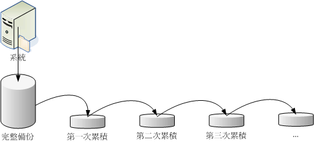

# 备份与恢复

## 备份

### 备份的数据

| 目录             | 说明                                                               |
| ---------------- | ------------------------------------------------------------------ |
| /root            | 超级用户家目录                                                     |
| /home            | 普通用户的家目录                                                   |
| /var/spool/mail  | 系统邮件目录                                                       |
| /etc             | 配置文件目录                                                       |
| /boot            | 系统启动相关目录                                                   |
| /var/log         | 系统日志发(用于事故调查)                                           |
| /var/spool/cron/ | 存储每个用户的定时任务文件                                         |
| /var/spool/at/   | 保存定时任务的文件夹                                               |
| /var/lib/        | 程序执行过程中使用到的一些数据文件、在该目录下各个软件有各自的目录 |

### 备份的种类

#### 完整备份之累积备份

相当重要的服务主机，需要在最短的时间内复原系统。
累积备份的原则:日积月累的数据会导致完全备份困难，就有了**累积备份**和**差异备份**。


累积备份使用的备份软件

```shell
# 1\. 用 dd 来将 /dev/sda 备份到完全一模一样的 /dev/sdb 硬盘上：
[root@study ~]# dd if=/dev/sda of=/dev/sdb
# 由于 dd 是读取扇区，所以 /dev/sdb 这颗磁盘可以不必格式化！非常的方便！
# 只是你会等非常非常久！因为 dd 的速度比较慢！

# 2\. 使用 cpio 来备份与还原整个系统，假设储存媒体为 SATA 磁带机：
[root@study ~]# find / -print &#124; cpio -covB &gt; /dev/st0  &lt;==备份到磁带机
[root@study ~]# cpio -iduv &lt; /dev/st0                  &lt;==还原
```

