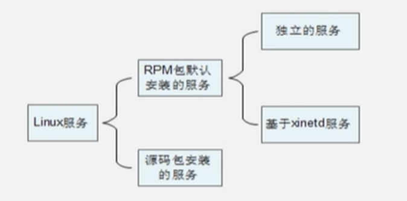

# 服务管理

## 服务的结构



查询已安装的服务
RPM包安装的服务

```shell
    chkconfig --list
#查看服务自启动状态，可以看到所有RPM包安装的服务
```

源码包安装的服务
    查看服务安装位置，一般是/usr/local/下
RPM安装服务和源码包安装服务的区别就是安装位置的不同
    源码包安装在指定位置，一般是/usr/local/
RPM包安装在默认位置中

### 独立服务

启动

```shell
/etc/init.d/[绝对路径]独立服务名  startistop|statuslrestart|
service  独立服务名 start|stoplrestart|status
```

自启动
`chkconfig [--level 运行级别] [独立服务名] [on|off]`
修改`/etc/rc.d/rc.local`文件
使用ntsysv命令管理自启动[red hat]

### 基于xinetd服务

1、安装xinetd与telnet

```shell
[root@localhost ~]# yum  -y  install xinetd

[root@localhost ~ ]# yum -y install telnet -server
```

## 源码包管理

1、源码包安装服务的启动，
使用绝对路径，调用启动脚本来启动。不同的源码包的启动脚本不同。可以查看源码包的安装说明，查看启动脚本的方法。
`/usr/local/apache2/bin/apachectl startlstop`

2、源码包服务的自启动
`[root@localhost ~]# vi /etc/rc.d/rc.local`
加入
`/usr/local/ apache2/bin/apachectl start`

3、让源码包服务被服务管理命令识别
让源码包的apache服务能被service命令管理启动
`In -s /usr/local/apache2/bin/apachectl /etc/init.d/apache`

