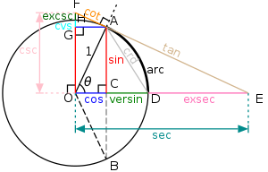

# 微积分

## 导数

$y=f(x),\triangle y=\triangle f$

$f'$为牛顿表述法,=$\frac{d f}{dx}$=$\frac{d y}{dx}$=$\frac{d}{dx}f$=$\frac{d}{dx}y$为莱布尼茨表达法
导数的重要性：应用访问涵盖了科学、工程、经济、政治、商业等活动

### 几何解释

$y=f(x)$的切点$p=(x_0,y_0)$

$y-y_0=m(x-x_0)$ 斜率为m

点p $y_0=f(x_0)$

斜率 $m=f'(x_0)$属于微积分问题

$f'(x_0)$定义$f$在$x_0$处的导数，也是$y=f(x)$在点P的斜率

切线其实是一种极限，是Q趋近于P时，切割PQ的极限（P点不变，Q点变化）

$\triangle x$为P点到Q点变化距离

$$
m= \lim\limits_{\triangle x\to 0}\frac {\triangle f}{\triangle x}
$$

$$
Q=(x_0+\triangle x  ,f(x_0+\triangle x))
$$
差商：
$$
f'(x_0)=\lim\limits_{\triangle x\to 0}\frac{f(x_0+\triangle x)-f(x_0)}{\triangle x}
$$

Example 1 $f(x)=\frac{1}{x}$

$$
\frac {\triangle f}{\triangle x}=\frac{\frac{1}{x_0+\triangle x}-\frac{1}{x_0}}{\triangle x}
$$

$$
=\frac{1}{\triangle x}(\frac{x_0-(x_0+\triangle x)}{(x_0+\triangle x)x_0})
$$

$$
=\frac{1}{\triangle x}(\frac{-\triangle x}{(x_0+\triangle x)x_0})
$$

$$
=\frac{-1}{(x_0+\triangle x)x_0}
$$

$$
f'(x) = \frac{-1}{x_0^2}=-x_0^{-2}
$$

Example 1 $f(x)=x^n,n=1,2,3...$

x为固定，$\triangle x$为变化

$$
\frac{d}{dx}x^n=nx^{n-1}
$$

$$
\frac{\triangle f}{\triangle x} =\frac{(x+\triangle x)^n-x^n}{\triangle x}
$$

$$
(x+\triangle x)^n=x^n+nx^{n-1}\triangle x+junk
$$

$junk=o((\triangle x)^2) $代表$\triangle x^2,\triangle x^3,\triangle x^4...$

$$
=\frac{1}{\triangle x}(x^n+nx^{n-1}\triangle x+o((\triangle x)^2)-x^n)
$$

$$
=nx^{n-1}+o((\triangle x))
$$
$\triangle x$趋近于0时
$$
=nx^{n-1}
$$

### 变化率

变化率： 平均变化率  瞬时变化率

Examples

q=电荷 $\frac{d q}{dt}$=电流

s=距离 $\frac{d s}{dt}$=速度

T=温度 $\frac{d T}{dx}$=温度梯度

测量灵敏度

### 极限

1 简单极限

$$
\lim\limits_{ x\to 4}\frac {x+3}{x^2+1}
$$

$$
=\frac{4+3}{4^2+1} =\frac{7}{17}
$$

2 导数情况

$$
\lim\limits_{ x\to x_0}\frac {f(x_0+\triangle x)-f(x_0)}{x-x_0}
$$

不能简单代入x，考虑左右极限

$\lim\limits_{ x\to x_0^+}f(x)$ 表示求右极限 $x>x_0$

$\lim\limits_{ x\to x_0^-}f(x)$ 表示求左极限 $x<x_0$

Examples

$$
f(x)=\begin{cases}x+1&x>0\\-x+2&x<0\end{cases}
$$

$\lim\limits_{ x\to x_0^+}f(x) = \lim\limits_{ x\to 0^+}x+1 = 1$

$\lim\limits_{ x\to x_0^+}f(x) = \lim\limits_{ x\to 0^-}-x+2 = 2$

求极限不需要知道x=0的值

### 连续

定义连续 f在$x_0$点连续，定义为$x->x_0$时f(x)的极限等于$f(x_0)$

$\lim\limits_{ x\to x_0}f(x) =f(x_0)$ 该方法适应简单极限

1. 极限必须存在$\lim\limits_{ x\to x_0}f(x)$ 左右极限存在且相等
2. $f(x_0)$ 必须有定义
3. 二者相等

不连续函数

* 跳跃间断函数 左右极限均存在，但不相等
* 可取间断 左右极限存在且相等，
  * $g(x)=\frac{\sin x}{x}$ x趋近0时 g(x)=1无定义$\lim\limits_{ x\to 0}\frac{\sin x}{x} =1$
  * $h(x)=\frac{1-\cos x}{x}$ x趋近0时 h(x)=0无定义$\lim\limits_{ x\to 0}\frac{1-\cos x}{x} =0$
* 无穷间断
  * $\lim\limits_{ x\to 0^+}\frac{1}{x} =\infin$
  * $\lim\limits_{ x\to 0^-}\frac{1}{x} =-\infin$
  * $\lim\limits_{ x\to 0}-\frac{1}{x^2} =-\infin$
  * 无穷属于极限不存在
* 另类间断
  * $y=\sin\frac{1}{x}$

可导必连续：
如果f可导于x0或者在x0处存在导数，则f在x0处连续。

证明
$\lim\limits_{ x\to x_0}f(x)-f(x_0) =0$
$\lim\limits_{ x\to x_0}\frac{f(x)-f(x_0)}{x-x_0}(x-x_0) =f'(x_0)*0=0$

### 求导法则

1. 对特定函数的求导，
2. 求导法则
   1. 加法$(u+v)'=u'+v'$
   2. 乘法$(cu)'=cu' 其中c是常数 或者 (uv)'=u'v+uv'$ 每次只改变一个函数
   3. 除法$(u/v)'=\frac{u'v-uv'}{v^2}$ 当$v\not =0$时

乘法证明$(uv)'=\lim\limits_{\triangle x \to 0}\frac{\triangle(uv)}{\triangle x}$

$$
\triangle(uv) =u(x+\triangle x)v(x+\triangle x)-u(x)v(x)
$$

$$
=(u(x+\triangle x)-u(x))v(x+\triangle x)+u(x)(v(x+\triangle x)-v(x))
$$

$$
=(\triangle u)v(x+\triangle x)+u(x)\triangle v
$$

$$
\lim\limits_{\triangle x \to 0}\frac{\triangle(uv)}{\triangle x}=\frac{\triangle u}{\triangle x}v(x+\triangle x)+u(x)\frac{\triangle v}{\triangle x}
$$

$$
=u'v+uv'
$$

商证明$(\frac{u}{v})'=\lim\limits_{\triangle x \to 0}\frac{\frac{u(x+\triangle x)}{v(x+\triangle x)}-(\frac{u(x)}{v(x)})}{\triangle x}$

$$
\triangle(\frac{u}{v})=\frac{u+\triangle u}{v+\triangle v}
$$

### 三角函数

求$\frac{d}{dx}\sin x$导数

$$
\lim\limits_{ \triangle x \to 0}\frac {\sin(x+\triangle x)-\sin(x)}{\triangle x}
$$

$$
=\frac {\sin x\cos\triangle x+\cos x\sin\triangle x-\sin(x)}{\triangle x}
$$

$$
=\sin x\frac {\cos\triangle x-1}{\triangle x}+\cos x\frac{\sin(\triangle x)}{\triangle x}
$$

$$
\frac{d}{dx}\sin x=\cos x
$$

求$\frac{d}{dx}\cos x$导数

$$
\lim\limits_{ \triangle x \to 0}\frac {\cos(x+\triangle x)-\cos(x)}{\triangle x}
$$

$$
=\frac {\cos x\cos\triangle x-\sin x\sin\triangle x-\cos(x)}{\triangle x}
$$

$$
=\cos x\frac {\cos\triangle x-1}{\triangle x}-\sin x\frac{\sin(\triangle x)}{\triangle x}
$$

$$
\frac{d}{dx}\cos x=-\sin x
$$

#### 可以用割圆术来证明(采用弧度制)

 圆O的半径为1

取弧长AD 和 DB长为$\theta$ AC 和 BD垂线长为$\sin\theta$

当$\theta$趋近于0时 AO和BO向中间趋近于直线 $\sin\theta=\theta$

当x=0时$\lim\limits_{\triangle x \to 0}\frac{\sin(\triangle x)}{\triangle x}=1$

$\lim\limits_{\theta \to 0}\frac{2\sin\theta}{2\theta}=\frac{\sin\theta}{\theta}=1$

当 x=0时$\lim\limits_{\triangle x \to 0}\frac{\cos(\triangle x)-1}{\triangle x}=0$

$\frac{1-\cos\theta}{\theta}$中$1-\cos\theta$=点CD线段当$\theta \to 0$时$1-\cos\theta=0$，比$\theta$更快趋近0

证明sinx和cosx中x=0时导数$\frac{d}{dx}\sin x 和\frac{d}{dx}\cos x$可以推到其他值的导数

#### 几何证明

$$
\frac{d}{dx}\sin x=\cos x (x=0)
$$

$$
y=\sin \theta
$$

圆周运动的纵坐标 P点移动到Q点 圆周运动距离为$\triangle \theta$
点P做线到R在垂直于RQ

$$
PQ\approx \triangle \theta  
$$

$PQ \bot OP$ PR为直线

$$ \angle QPR=\theta$$

$$\therefore\frac{\triangle y}{\triangle \theta}\approx \cos \theta$$

$$\lim \limits_{\triangle \theta \to 0}\frac{\triangle y}{\triangle \theta}= \cos \theta$$

## 求导方法（求导任意函数）

学习求导该

$$\frac{d}{d x}e^{x\arctan(x)} = ？$$

