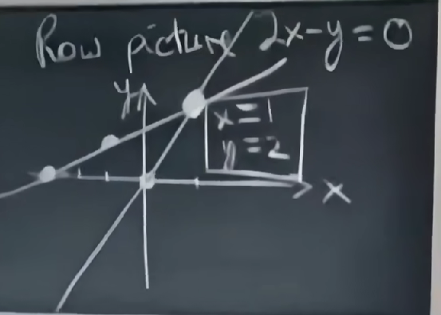
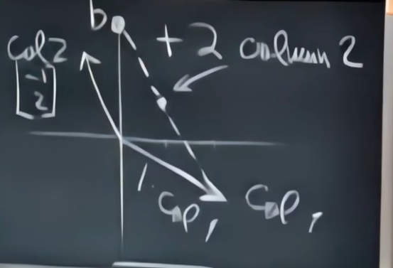
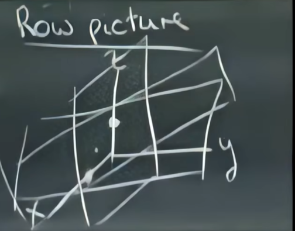
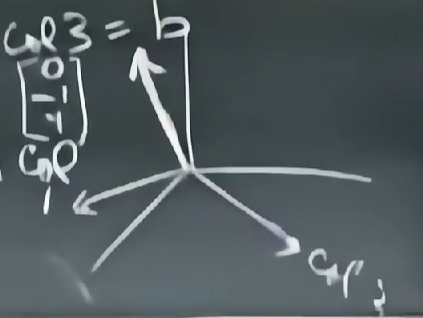

# 线性代数

## 一、方程组的几何解释

$$
\begin{cases}
2x-y=0\\
-x+2y=3\\
\end{cases}\\
\begin{bmatrix}
2 & -1\\
-1&2
\end{bmatrix}
\begin{bmatrix}
x\\
y
\end{bmatrix}=
\begin{bmatrix}
0\\3
\end{bmatrix}\\
Ax=b
$$

$$
x\begin{bmatrix}
2\\-1
\end{bmatrix}+
y\begin{bmatrix}
-1\\2
\end{bmatrix}=
\begin{bmatrix}
0\\3
\end{bmatrix}\\
$$

### 列向量的线性组合

1倍col1+2倍的col2

方程式
$$
\begin{cases}2x-y=0\\-x+2y-z=-1\\-3y+4z=4\end{cases}\\
\begin{bmatrix}2&-1&0\\-1&2&-1\\0&-3&4\end{bmatrix}\begin{bmatrix}x\\y\\z\end{bmatrix}=\begin{bmatrix}0\\-1\\4\end{bmatrix}
$$

这个行图像由三个平面构成，三个平面必然相交于一点，这就是解

### 几何解释

$$
x\begin{bmatrix}
2\\-1\\0
\end{bmatrix}+
y\begin{bmatrix}
0\\2\\-3
\end{bmatrix}+z
\begin{bmatrix}
0\\-1\\4
\end{bmatrix}=
\begin{bmatrix}
0\\-1\\4
\end{bmatrix}\\
$$

左侧为三个向量的线性组合

对任意b，是否都有方程解？相当于问，列的线性组合是否能覆盖整个三维空间？

答：yes

这个矩阵是非奇异矩阵，是可逆矩阵

如果三个矩阵都存在同一平面时答案就是否定，这种情况称为奇异矩阵，非可逆矩阵

## 二、矩阵消元

矩阵乘以向量

## 三、乘法和逆矩阵

## 四、矩阵A的LU分解

## 五、转置、置换、空间向量

## 六、列空间和零空间

## 七、求解Ax=0：主变量，特解
